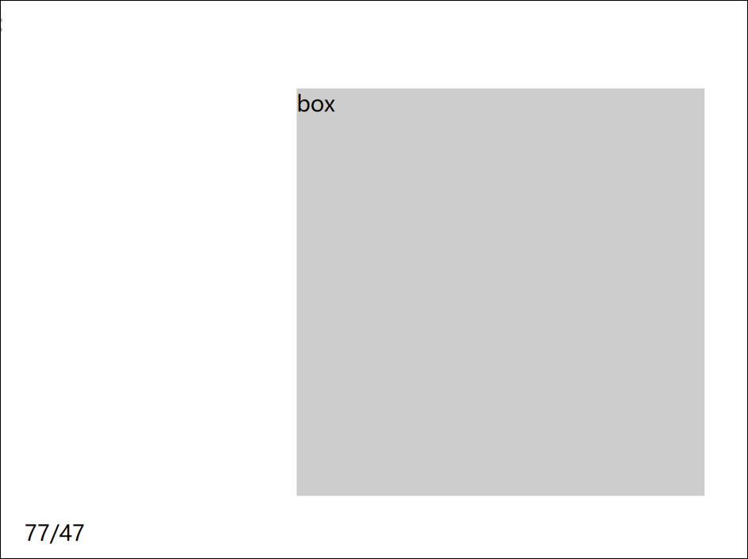
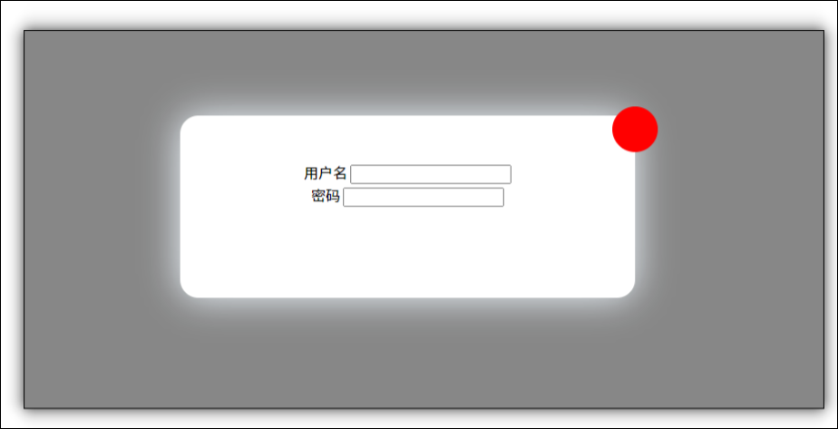
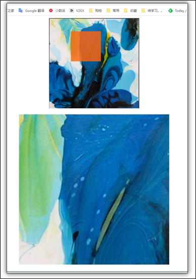
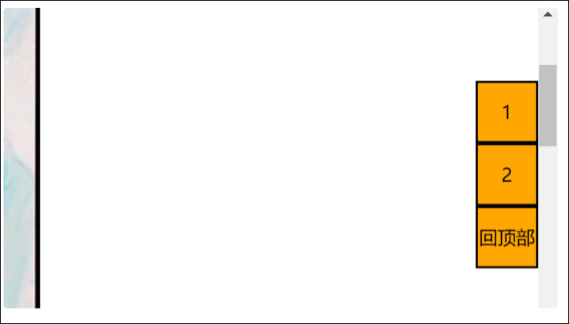
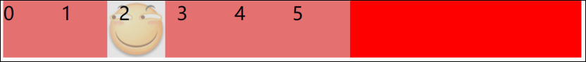

# 案例

获取在盒子内的鼠标坐标[^1]

可以拖动的模态框 (登录框)[^2]

京东放大镜效果[^3]

淘宝侧边栏效果[^4]

网页轮播图[^5]

筋斗云效果[^6]

触摸拖动[^7]

移动端触摸轮播图[^8]

‍

[^1]: # 获取在盒子内的鼠标坐标

    效果:

    

    在盒子内部点击时, 获取鼠标在盒子内部的坐标值

    思路: 先获取鼠标在页面内的坐标, 然后用offset属性获取盒子在页面内的坐标,然后用鼠标坐标减盒子坐标即可

    代码:

    ```JavaScript
    <!DOCTYPE html>
    <html lang="en">
        <head>
            <meta charset="UTF-8" />
            <meta http-equiv="X-UA-Compatible" content="IE=edge" />
            <meta name="viewport" content="width=device-width, initial-scale=1.0" />
            <title>Document</title>

            <style>
                .box {
                    width: 300px;
                    height: 300px;
                    background-color: #ccc;
                    margin-left: 200px;
                    margin-top: 100px;
                }
            </style>
        </head>
        <body>
            <div class="box">box</div>
            <p></p>
            <script>
                var div = document.querySelector(".box");
                var p = document.querySelector("p");
                div.addEventListener("click", function (e) {
                    x = e.pageX;
                    y = e.pageY;
                    box_x = div.offsetLeft;
                    box_y = div.offsetTop;
                    x -= box_x;
                    y -= box_y;
                    p.innerHTML = "" + x + "/" + y;
                });
            </script>
        </body>
    </html>

    ```

[^2]: # 可以拖动的模态框 (登录框)

    

    效果: 鼠标可以拖动模态框进行移动

    思路: 要实现鼠标拖拽, 需要三个事件: 1 鼠标按下按下, 2 鼠标移动, 3 鼠标按钮抬起

    * 注册鼠标按钮按下事件, mousedown , 获取鼠标在盒子内部的坐标 获取在盒子内的鼠标坐标
    * 在mousedown内注册鼠标移动事件

      * 模态框的位置计算: 模态框的位置= 鼠标的文档坐标 - 鼠标在盒子内的坐标
    * 注册鼠标按钮抬起的事件 mouseup, 在其中移除鼠标移动的事件,

    ```JavaScript
    <!DOCTYPE html>
    <html lang="en">
        <head>
            <meta charset="UTF-8" />
            <meta http-equiv="X-UA-Compatible" content="IE=edge" />
            <meta name="viewport" content="width=device-width, initial-scale=1.0" />
            <title>Document</title>
            <style>
                html,
                body {
                    width: 100%;
                    height: 100%;
                }
                .login {
                    display: none;
                    position: absolute;
                    top: 0;
                    left: 0;
                    width: 100%;
                    height: 100%;
                    background-color: rgba(0, 0, 0, 0.475);
                }
                .login_area {
                    position: relative;
                    top: 50px;
                    left: 100px;
                    width: 500px;
                    height: 200px;

                    background-color: #fff;
                    text-align: center;
                    border-radius: 20px;
                    box-shadow: aliceblue 0px 00px 40px;
                }
                .drag_bar {
                    width: 100%;
                    height: 50px;
                    /* background-color: red; */
                    cursor: move;
                }
                .close {
                    position: absolute;
                    top: -5%;
                    left: 95%;
                    width: 50px;
                    height: 50px;
                    border-radius: 25px;
                    background-color: red;
                    cursor: grab;
                }
            </style>
        </head>
        <body>
            <input type="button" value="login" class="btn_login" />
            <div class="login">
                <div class="login_area">
                    <div class="drag_bar"></div>
                    <div class="close"></div>
                    用户名
                    <input type="text" />
                    <br />
                    密码
                    <input type="text" />
                </div>
            </div>
            <script>
                var btn_login = document.querySelector(".btn_login");
                var btn_close = document.querySelector(".close");
                var login = document.querySelector(".login");
                var drag_bar = document.querySelector(".drag_bar");
                var login_area = document.querySelector(".login_area");

                btn_login.addEventListener("click", function (e) {
                    //显示登陆框
                    login.style.display = "block";
                });
                btn_close.addEventListener("click", function (e) {
                    //关闭登录框
                    login.style.display = "none";
                });
                //要实现拖拽, 需要三个事件, 鼠标按下, 鼠标移动, 鼠标放开

                drag_bar.addEventListener("mousedown", function (e) {
                    x = e.pageX - login_area.offsetLeft; //获取鼠标在盒子内部的坐标 ,注意这个只需要获取一次
                    y = e.pageY - login_area.offsetTop;
                    console.log(x);
                    console.log(y);

                    // 鼠标移动事件, 注意鼠标移动要写在鼠标按钮按下之内

                    document.addEventListener("mousemove", fun);
                });
                //鼠标按钮松开, 就移除移动事件
                drag_bar.addEventListener("mouseup", function (e) {
                    document.removeEventListener("mousemove", fun);
                });
                function fun(e) {
                    //登陆框的位置等于鼠标位置减去鼠标在盒子内的坐标
                    login_area.style.left = e.pageX - x + "px";
                    login_area.style.top = e.pageY - y + "px";
                }
            </script>
        </body>
    </html>

    ```

[^3]: # 京东放大镜效果

    

    效果:  当鼠标在小图中的时候, 显示一个遮罩, 同时在下面显示一个放大的图片 ;

    思路:

    * 分为两个部分: 遮罩层的移动 和 下方预览大图的移动

      * 遮罩层的移动 : 给遮罩层设置浮动，先获取鼠标的坐标, 计算出鼠标在盒子内的坐标 , 把这个坐标减去遮罩层的一半 ，设置给遮罩层的top和left  ，即可完成遮罩层的移动

        * 防止遮罩层移动出盒子边框： 检测遮罩层在盒子内的位置， 如果 <0或者 >盒子高度-遮罩层高度 那么就把数值设置为0 或者 盒子高度-遮罩层高度
      * 预览大图的移动: 大图的background-position等于-(遮罩层位置*放大倍数)

        * 倍数的计算方法 background-size的倍数 * 预览图比实际图片大的倍数

    ```JavaScript
    <!DOCTYPE html>
    <html lang="en">
        <head>
            <meta charset="UTF-8" />
            <meta http-equiv="X-UA-Compatible" content="IE=edge" />
            <meta
                name="viewport"
                content="width=device-width, initial-scale=1.0, maximum-scale=1.0, user-scalable=0;"
            />
            <title>Document</title>

            <style>
                body {
                    overflow: hidden;
                }
                .box {
                    position: relative;
                    width: 300px;
                    height: 300px;
                    margin: 0 auto;
                    background-color: #ccc;
                    background-image: url(./img/2.jfif);
                    background-size: cover;
                    background-repeat: no-repeat;
                }
                .mask {
                    position: absolute;
                    top: 0;
                    left: 0;
                    display: none;
                    width: 100px;
                    height: 100px;
                    background-color: rgba(255, 100, 17, 0.821);
                }
                .preview {
                    display: none;
                    width: 500px;
                    height: 500px;
                    margin: 0 auto;
                    margin-top: 20px;
                    background-color: #ccc;
                    background-image: url(./img/2.jfif);

                    background-repeat: no-repeat;
                }
            </style>
        </head>
        <body>
            <div class="box">
                <div class="mask"></div>
            </div>
            <div class="preview"></div>
            <p></p>
            <script>
                var img_box = document.querySelector(".box");
                var mask = img_box.children[0];
                var preview = document.querySelector(".preview");
                var p = document.querySelector("p");

                // 设置预览图的放大倍数
                var preview_multiple = 3;
                preview.style.backgroundSize = preview_multiple * 100 + "%";

                box_x = img_box.offsetLeft;
                box_y = img_box.offsetTop; //获取盒子位置

                document.addEventListener("touchmove", move);
                document.addEventListener("mousemove", move);

                function move(e) {
                    // console.log("log");
                    var x = e.pageX ? e.pageX : e.touches[0].clientX;
                    var y = e.pageY ? e.pageY : e.touches[0].clientY;
                    // x = e.pageX;
                    // y = e.pageY; //获取鼠标位置
                    mask.style.display = "block";
                    preview.style.display = "block";

                    cu_x = x - box_x; //获取鼠标在盒子内的位置 cu_x 鼠标坐标
                    cu_y = y - box_y;

                    if (
                        cu_x > img_box.offsetWidth - 10 || //出界隐蔽 为什么要-10: 因为事件触发的时候鼠标可能已经移出了盒子, 所以要留一点余量
                        cu_x < 10 ||
                        cu_y > img_box.offsetHeight - 10 ||
                        cu_y < 10
                    ) {
                        mask.style.display = "none";
                        preview.style.display = "none";
                    }

                    mask_x = cu_x - 50; //mask_x 遮罩层的坐标
                    mask_y = cu_y - 50;
                    //防止遮罩层超出盒子, 如果坐标超出盒子, 就设置在边缘
                    mask_x = mask_x < 0 ? 0 : mask_x;
                    mask_x =
                        mask_x > img_box.offsetWidth - mask.offsetWidth
                            ? img_box.offsetWidth - mask.offsetWidth
                            : mask_x;
                    mask_y = mask_y < 0 ? 0 : mask_y;
                    mask_y =
                        mask_y > img_box.offsetHeight - mask.offsetHeight
                            ? img_box.offsetHeight - mask.offsetHeight
                            : mask_y;

                    mask.style.left = mask_x + "px";
                    mask.style.top = mask_y + "px";

                    // 更新预览区域位置, 因为预览图放大了, 所以需要乘一个倍数
                    //倍数的计算方法 background-size的倍数 * 预览图比实际图片大的倍数
                    multiple = preview_multiple * (preview.offsetWidth / img_box.offsetWidth);
                    preview.style.backgroundPosition = `-${mask.offsetLeft * multiple}px -${
                        mask.offsetTop * multiple
                    }px`;
                }
            </script>
        </body>
    </html>

    ```

[^4]: # 淘宝侧边栏效果

    

    效果:  刚开始滚动时, 侧边栏随着页面一起滚动, 当到达一定阈值, 侧边栏变成固定定位, 显示回到顶部按钮

    思路: 用window.scrollY获取页面滚动的长度, 当到达一定阈值, 修改侧边栏的定位方式并且显示回到顶部按钮

    代码:

    ```JavaScript
    <!DOCTYPE html>
    <html lang="en">
        <head>
            <meta charset="UTF-8" />
            <meta http-equiv="X-UA-Compatible" content="IE=edge" />
            <meta name="viewport" content="width=device-width, initial-scale=1.0" />
            <title>Document</title>
            <style>
                .aside {
                    position: absolute;
                    top: 300px;
                    right: 0;
                }
                .aside ul {
                    list-style: none;
                }
                .aside li {
                    width: 50px;
                    height: 50px;
                    background-color: orange;
                    border: black solid 2px;
                    text-align: center;
                    line-height: 50px;
                }
            </style>
        </head>
        <body>
            <div class="content">
                
                
                
                
                
                
                
            </div>
            <div class="aside">
                <ul>
                    <li>1</li>
                    <li>2</li>
                    <li class="feedback">反馈</li>
                    <li class="back2top">回顶部</li>
                </ul>
            </div>
            <script>
                /** @type{HTMLElement} */
                var asidebar = document.querySelector(".aside");
                /** @type{HTMLElement} */
                var feedback = document.querySelector(".feedback");
                /** @type{HTMLElement} */
                var back2top = document.querySelector(".back2top");

                back2top.style.display="none"
                document.addEventListener("scroll", function (e) {
                    // var scroll_top = document.documentElement.scrollTop;
                    var scroll_top = window.pageYOffset;

                    console.log(document.documentElement.scrollTop);
                    console.log(window.pageYOffset);
                    console.log(window.scrollY);
                    if (scroll_top > 250) {
                        console.log("设置为固定定位");
                        asidebar.style.position = "fixed";
                        asidebar.style.top = 50 + "px";
                        asidebar.style.right = 0 + "px";
                        // 显示回到顶部按钮
                        feedback.style.display="none"
                        back2top.style.display="block"
                    } else {
                        // 设置回固定定位
                        asidebar.style.position = "absolute";
                        asidebar.style.top = 300 + "px";
                        asidebar.style.right = 0 + "px";
                        // 隐蔽回到顶部按钮
                        feedback.style.display="block"
                        back2top.style.display="none"
                    }
                });
                back2top.addEventListener("click",function () {
                    window.scrollTo(0,0)
                })
            </script>
        </body>
    </html>


    ```

[^5]: # 网页轮播图

    功能需求

    * 鼠标经过轮播图模块, 左右按钮显示, 离开隐蔽
    * 点击按钮进行图片的切换
    * 图片切换的同时, 下方小圆圈也同步进行切换
    * 点击小圆圈, 图片进行相应切换
    * 鼠标不经过轮播图, 每隔一段时间自动进行切换
    * 鼠标经过轮播图, 自动切换停止

    思路:

    * 给轮播图模块添加mouseenter事件,  添加函数控制按钮的显示隐藏
    * 左右按钮切换图片的思路:

      * 先设置一个变量index=0作为当前的第几张图片
      * 点击右侧按钮后, index++, 然后计算移动的距离,  移动距离=- index*小图片的宽度 , 调用animate动画函数进行移动
      * 左侧按钮同理, index—, 移动距离还是等于-index*图片宽度

        * **无缝滚动的实现: **

          * 利用克隆节点, 复制第一张图到最后,当在第一张图点击了左侧按钮时, 不带动画的移动到最后一张克隆的图, 然后再执行左移的动画, 当在最后一张图点击了右侧按钮, 先不带动画移动到第一张图, 然后再右移
          * 当index=0的时候,此时点击左侧按钮, 设置index=图片的数量(不算上克隆的),  然后直接设置图片的left值为-图片数量*宽度, 这样来跳转到最后一张图
          * 当index=图片数量时, 此时点击右侧按钮, 设置index=0, 设置图片的left值为0, 这样跳到第一张图
          * 实现代码:

    ```JavaScript
    //前进后退按钮区域
        btn_right.addEventListener("click", function () {
            //前进
            //如果是最后一张图片, 那么进行处理
            if (index == imgSum) {
                index = 0;
                images.style.left = "0px";
            }

            index++;
            distance = index * -width;
            animate(images, distance);

        });
        btn_left.addEventListener("click", function () {
            //后退
            //如果现在是第一张, 那么跳到最后一张
            if (index == 0) {
                index = imgSum;
                images.style.left = imgSum * -width + "px";
            }
            index--;
            distance = index * -width;
            animate(images, distance);

        });
    ```
    * 更新下方的小圆圈:  给小圆圈设置current类名即可, 注意 如果index=最后一个图片, 那么设置第一个小圆圈的current
    * 点击小圆圈切换图片, 利用自定义属性给小圆圈加上index, 这样既可获取点击了第几个圆圈, 然后调用一个函数进行切换即可
    * ‍

    ```JavaScript
        //控制图片移动函数, 参数为多少就移动到第几张图
        function carMove(moveTo) {
            v = moveTo * -width;

            animate(images, v);
            index = moveTo;
            //更新小圆圈按钮的选中状态
            for (var i = 0; i < btn_bottom.children.length; i++) {
                btn_bottom.children[i].className = "";
            }
            btn_bottom.children[index].className = "current";

            console.log("index=" + index);
        }
    ```
    * 轮播图自动切换: 设置一个定时器 , 调用`btn_right.click()`方法即可,

      * 给某个元素绑定了事件之后, 可以通过元素名.事件名的方式执行事件处理函数

    代码:

    ```JavaScript
    window.addEventListener("load", function () {
        var carousel = document.querySelector(".carousel");
        var control = document.querySelector(".control");
        var btn_left = document.querySelector(".btn_left");
        var btn_right = document.querySelector(".btn_right");
        var btn_bottom = document.querySelector(".btn_bottom");
        var images = document.querySelector(".images");

        var imgSum = images.children.length; //共有几张图片
        console.log("去掉复制的共有" + imgSum + "张图");
        // 复制第一个元素
        images.appendChild(images.children[0].cloneNode(true));
        var index = 0; //当前是第几张图片
        var width = images.children[0].offsetWidth;
        var distance = 0;
        // 控制前进后退按钮的显示隐藏
        carousel.addEventListener("mouseenter", function () {
            //取消自动切换
            clearInterval(autoSwitch);
            // 显示控制按钮
            control.style.visibility = "visible";
        });
        carousel.addEventListener("mouseleave", function () {
            //设置定时器
            var autoSwitch = setInterval(function () {
                btn_right.click();
            }, 5000);
            //隐蔽控制按钮
            control.style.visibility = "hidden";
        });

        //前进后退按钮区域
        btn_right.addEventListener("click", function () {
            //前进
            //如果是最后一张图片, 那么进行处理
            if (index == imgSum) {
                index = 0;
                images.style.left = "0px";
            }

            index++;
            distance = index * -width;
            animate(images, distance);

            //设置小圆点的样式

            for (var i = 0; i < btn_bottom.children.length; i++) {
                btn_bottom.children[i].className = "";
            }
            if (index == imgSum) {
                btn_bottom.children[0].className = "current";
            } else {
                btn_bottom.children[index].className = "current";
            }
            console.log(index);
        });
        btn_left.addEventListener("click", function () {
            //后退
            //如果现在是第一张, 那么跳到最后一张
            if (index == 0) {
                index = imgSum;
                images.style.left = imgSum * -width + "px";
            }
            index--;
            distance = index * -width;
            animate(images, distance);

            //设置小圆点的样式
            for (var i = 0; i < btn_bottom.children.length; i++) {
                btn_bottom.children[i].className = "";
            }
            if (index == imgSum) {
                btn_bottom.children[0].className = "current";
            } else {
                btn_bottom.children[index].className = "current";
            }

            console.log(index);
        });

        //生成下方小圆点按钮
        for (var i = 0; i < images.children.length - 1; i++) {
            var bubb = document.createElement("li");
            if (i == 0) {
                //第一个设为默认
                bubb.className = "current";
            }
            //添加属性
            bubb.setAttribute("index", i);
            //绑定事件
            bubb.addEventListener("click", function () {
                carMove(this.getAttribute("index"));
                console.log("你点击了小圆圈按钮" + this.getAttribute("index"));
            });
            btn_bottom.appendChild(bubb);
        }

        //控制图片移动函数, 参数为多少就移动到第几张图
        function carMove(moveTo) {
            v = moveTo * -width;

            animate(images, v);
            index = moveTo;
            //更新小圆圈按钮的选中状态
            for (var i = 0; i < btn_bottom.children.length; i++) {
                btn_bottom.children[i].className = "";
            }
            btn_bottom.children[index].className = "current";

            console.log("index=" + index);
        }
        //自动切换图片
        var autoSwitch = setInterval(function () {
            btn_right.click();
        }, 5000);
        //可以用左右方向键控制切换
        document.addEventListener("keydown", function (e) {
            if (e.key == "ArrowLeft") {
                btn_left.click();
            } else if (e.key == "ArrowRight") {
                btn_right.click();
            }
        });
    });

    ```

[^6]: # 筋斗云效果

    

    效果:

    * 鼠标经过某个li, 图片跟随到这个li所在的位置
    * 鼠标离开, 图片回到默认位置
    * 点击某个li, 图片默认位置就更改到此位置

    思路:

    * 设置一个全局变量base, 作为默认位置, 鼠标点击就更改这个base, 给li添加自定义属性来获取点击了哪个li
    * 鼠标进入某个li , 就根据li的index计算出来移动距离, (移动距离=index*width)调用动画函数即可
    * 鼠标退出li, 就根据base回到默认位置 (distance=base*width)

    ```JavaScript
    <!DOCTYPE html>
    <html lang="en">
        <head>
            <meta charset="UTF-8" />
            <meta http-equiv="X-UA-Compatible" content="IE=edge" />
            <meta name="viewport" content="width=device-width, initial-scale=1.0" />
            <title>筋斗云</title>
            <style>
                * {
                    list-style: none;
                    margin: 0;
                    padding: 0;
                }
                ul {
                    position: relative;
                    background-color: red;
                    width: 500px;
                    margin: 100px auto;
                    display: flex;
                }
                ul img {
                    position: absolute;
                    width: 50px;
                    height: 50px;
                }
                ul li {
                    z-index: 99;
                    cursor: pointer;
                    width: 50px;
                    height: 50px;
                    background-color: rgba(204, 204, 204, 0.549);
                }
                ul li.current {
                    background-image: url(./img/funny.jpg);
                    background-size: contain;
                }
            </style>
        </head>
        <body>
            <ul>
                
                <li>0</li>
                <li>1</li>
                <li>2</li>
                <li>3</li>
                <li>4</li>
                <li>5</li>
            </ul>
            <!-- 引入动画函数 -->
            <script>
                //获取所有li
                var lis = document.querySelectorAll("li");
                var img = document.querySelector("img");
                var base = 0; //图片默认位置
                //给li添加自定义属性index并绑定事件
                for (var i = 0; i < lis.length; i++) {
                    lis[i].setAttribute("index", i);
                    //鼠标进入li, 更改li的位置
                    lis[i].addEventListener("mouseenter", function () {
                        console.log(this.getAttribute("index"));
                        //控制图片移动
                        var index = this.getAttribute("index");
                        var distance = index * 50;
                        animate(img, distance);
                    });
                    //鼠标退出li, 回到默认位置
                    lis[i].addEventListener("mouseleave", function () {
                        var distance = base * 50;
                        animate(img, distance);
                    });
                    //点击, 更改初始位置base
                    lis[i].addEventListener("click", function () {
                        base = this.getAttribute("index");
                    });
                }
                /**
                 *
                 * @param {HTMLElement} obj
                 * @param {HTMLElement} target
                 */

                function animate(obj, target, callback) {
                    clearInterval(obj.timer);
                    obj.timer = setInterval(move, 15);
                    function move() {
                        var box_x = obj.offsetLeft; //获取现在的位置
                        var step = (target - box_x) / 10; //计算步长
                        step = step > 0 ? Math.ceil(step) : Math.floor(step); //步长取整
                        obj.style.left = box_x + step + "px"; //进行移动
                        //到达位置取消定时器
                        if (box_x == target) {
                            clearInterval(obj.timer);
                            callback && callback();
                        }
                    }
                }
            </script>
        </body>
    </html>

    ```

[^7]: # 触摸拖动

    效果: 手指能拖动元素进行移动

    思路:

    方法一: 计算手指触摸的盒子内部坐标, 然后直接使用手指坐标减去内部坐标即可

    要想在pc端实现鼠标拖动, 要实现三个事件, 鼠标点击, 鼠标移动, 鼠标松开

    但是移动端不同, 只需要处理开始触摸, 和触摸移动即可, 因为手指松开之后就没有了move事件, 就不需要停止

    方法二: 先获取盒子初始位置, 然后计算手指移动距离

    代码:

    ```JavaScript
    <!DOCTYPE html>
    <html lang="en">
        <head>
            <meta charset="UTF-8" />
            <meta http-equiv="X-UA-Compatible" content="IE=edge" />
            <meta name="viewport" content="width=device-width, initial-scale=1.0" />
            <title>Document</title>
            <style>
                .box {
                    position: relative;
                    width: 200px;
                    height: 200px;
                    background-color: blueviolet;
                }
            </style>
        </head>
        <body>
            <div class="box"></div>
            <script>
                /**
                 * @type{HTMLElement}
                 */
                var box = document.querySelector(".box");
                //方法一: 计算手指触摸的盒子内部坐标, 然后直接使用手指坐标减去内部坐标即可

                //要想在pc端实现鼠标拖动, 要实现三个事件, 鼠标点击, 鼠标移动, 鼠标松开
                // 但是移动端不同, 只需要处理开始触摸, 和触摸移动即可, 因为手指松开之后就没有了move事件, 就不需要停止
                // box.addEventListener("touchstart", function (e) {
                //     // 先获取点击位置
                //     var box_x = e.targetTouches[0].pageX - box.offsetLeft;
                //     var box_y = e.targetTouches[0].pageY - box.offsetTop;
                //     console.log(box_x);
                //     console.log(box_y);
                //     //开始触摸时, 注册移动事件
                //     box.addEventListener("touchmove", function (e) {
                //         //开始处理移动
                //         var x = e.targetTouches[0].pageX;
                //         var y = e.targetTouches[0].pageY;

                //         box.style.left = x - box_x + "px";
                //         box.style.top = y - box_y + "px";
                //         console.log(box.style.left);
                //     });
                // });


                //方法二: 先获取盒子初始位置, 然后计算手指移动距离
                box.addEventListener("touchstart", function (e) {
                    // 先获取手指初始坐标
                    var startX = e.targetTouches[0].pageX;
                    var startY = e.targetTouches[0].pageY;
                    // 盒子原来的位置
                    var x = this.offsetLeft;
                    var y = this.offsetTop;
                    //开始触摸时, 注册移动事件
                    box.addEventListener("touchmove", function (e) {
                        // 阻止默认屏幕滚动
                        e.preventDefault();
                        //开始处理移动
                        var moveX = e.targetTouches[0].pageX - startX;
                        var moveY = e.targetTouches[0].pageY - startY;

                        box.style.left = x + moveX + "px";
                        box.style.top = y + moveY + "px";
                        console.log(box.style.left);
                    });
                });
            </script>
        </body>
    </html>

    ```

[^8]: # 移动端触摸轮播图

    效果: 可以用手指拖动的轮播图

    思路: 

    1. 每隔一段时间自动切换图片
    2. 切换图片时下方小点会有相应变化
    3. 手指移动距离超过一定自动切换图片
    4. 手指移动距离小于一定自动回到原位

    设置定时器, 每隔一段时间index++, 然后用-index*图片宽度就是移动距离

    给图片绑定过渡完成事件(transitionend), 判断当前是第几张图片, 如果是最后一张, 那么跳到第一张, 如index是负值, 那么跳到最后一张.

    触摸开始事件, 记录手指初始位置; 触摸移动事件, 计算移动距离, 给图片设置移动距离, 如果移动距离为正, 切换到上一张, 否则为下一张. 同时index进行相应变化; 如果移动距离小于某个值, 回到原位; 

    在过渡完成事件中进行小圆点的更新. 利用classList给小圆点设置current类即可

    ‍

    代码: 

    ```js
    window.addEventListener("load", function () {
        //先获取元素
        /**
         * @type {HTMLElement} imgs
         */
        var imgs = document.querySelector(".focus .imgs"); //图片
        /**
         * @type {HTMLElement} ctrl
         */
        var ctrl = document.querySelector(".focus .ctrl"); //小圆点
        //现在是第几张图片
        var index = 0;

        var startX, moveX, boxX;
        timer = setInterval(function () {
            index++;
            console.log(index);

            imgs.style.transition = "all 0.3s";
            imgs.style.transform = `translateX(${-400 * index}px)`;
        }, 1000);
        //如果到了最后一张, 不带动画的跳到第一张
        //必须要过渡播放完毕之后判断

        imgs.addEventListener("transitionend", function () {
            if (index > 2) {
                imgs.style.transition = "none";
                imgs.style.transform = `translateX(0px)`;
                index = 0;
            }

            if (index < 0) {
                imgs.style.transition = "none";
                imgs.style.transform = `translateX(-800px)`;
                index = 2;
            }
            //更新小圆点
            ctrl.querySelector(".current").classList.remove("current");
            ctrl.children[index].classList.add("current");
        });

        //触摸事件
        imgs.addEventListener("touchstart", function (e) {
            //获取触摸初始位置
            startX = e.touches[0].pageX;
            clearInterval(timer);
        });

        imgs.addEventListener("touchmove", function (e) {
            moveX = e.touches[0].pageX - startX;
            imgs.style.transition = "none";
            imgs.style.transform = `translateX(${-index * 400 + moveX}px)`;

            //阻止默认操作
            e.preventDefault();
        });
        imgs.addEventListener("touchend", function (e) {
            if (Math.abs(moveX) > 100) {
                if (moveX > 0) {
                    //上一张
                    index--;
                } else {
                    index++;
                }
            }

            imgs.style.transition = "all 0.3s";
            imgs.style.transform = `translateX(${-400 * index}px)`;
            clearInterval(timer);
            timer = setInterval(function () {
                index++;
                console.log(index);

                imgs.style.transition = "all 0.3s";
                imgs.style.transform = `translateX(${-400 * index}px)`;
            }, 1000);
        });
    });

    ```
