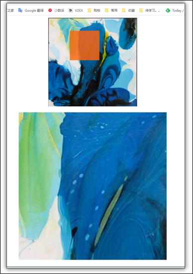

# 京东放大镜效果



效果:  当鼠标在小图中的时候, 显示一个遮罩, 同时在下面显示一个放大的图片 ;

思路:

* 分为两个部分: 遮罩层的移动 和 下方预览大图的移动

  * 遮罩层的移动 : 给遮罩层设置浮动，先获取鼠标的坐标, 计算出鼠标在盒子内的坐标 , 把这个坐标减去遮罩层的一半 ，设置给遮罩层的top和left  ，即可完成遮罩层的移动

    * 防止遮罩层移动出盒子边框： 检测遮罩层在盒子内的位置， 如果 <0或者 >盒子高度-遮罩层高度 那么就把数值设置为0 或者 盒子高度-遮罩层高度
  * 预览大图的移动: 大图的background-position等于-(遮罩层位置*放大倍数)

    * 倍数的计算方法 background-size的倍数 * 预览图比实际图片大的倍数

```JavaScript
<!DOCTYPE html>
<html lang="en">
    <head>
        <meta charset="UTF-8" />
        <meta http-equiv="X-UA-Compatible" content="IE=edge" />
        <meta
            name="viewport"
            content="width=device-width, initial-scale=1.0, maximum-scale=1.0, user-scalable=0;"
        />
        <title>Document</title>

        <style>
            body {
                overflow: hidden;
            }
            .box {
                position: relative;
                width: 300px;
                height: 300px;
                margin: 0 auto;
                background-color: #ccc;
                background-image: url(./img/2.jfif);
                background-size: cover;
                background-repeat: no-repeat;
            }
            .mask {
                position: absolute;
                top: 0;
                left: 0;
                display: none;
                width: 100px;
                height: 100px;
                background-color: rgba(255, 100, 17, 0.821);
            }
            .preview {
                display: none;
                width: 500px;
                height: 500px;
                margin: 0 auto;
                margin-top: 20px;
                background-color: #ccc;
                background-image: url(./img/2.jfif);

                background-repeat: no-repeat;
            }
        </style>
    </head>
    <body>
        <div class="box">
            <div class="mask"></div>
        </div>
        <div class="preview"></div>
        <p></p>
        <script>
            var img_box = document.querySelector(".box");
            var mask = img_box.children[0];
            var preview = document.querySelector(".preview");
            var p = document.querySelector("p");

            // 设置预览图的放大倍数
            var preview_multiple = 3;
            preview.style.backgroundSize = preview_multiple * 100 + "%";

            box_x = img_box.offsetLeft;
            box_y = img_box.offsetTop; //获取盒子位置

            document.addEventListener("touchmove", move);
            document.addEventListener("mousemove", move);

            function move(e) {
                // console.log("log");
                var x = e.pageX ? e.pageX : e.touches[0].clientX;
                var y = e.pageY ? e.pageY : e.touches[0].clientY;
                // x = e.pageX;
                // y = e.pageY; //获取鼠标位置
                mask.style.display = "block";
                preview.style.display = "block";

                cu_x = x - box_x; //获取鼠标在盒子内的位置 cu_x 鼠标坐标
                cu_y = y - box_y;

                if (
                    cu_x > img_box.offsetWidth - 10 || //出界隐蔽 为什么要-10: 因为事件触发的时候鼠标可能已经移出了盒子, 所以要留一点余量
                    cu_x < 10 ||
                    cu_y > img_box.offsetHeight - 10 ||
                    cu_y < 10
                ) {
                    mask.style.display = "none";
                    preview.style.display = "none";
                }

                mask_x = cu_x - 50; //mask_x 遮罩层的坐标
                mask_y = cu_y - 50;
                //防止遮罩层超出盒子, 如果坐标超出盒子, 就设置在边缘
                mask_x = mask_x < 0 ? 0 : mask_x;
                mask_x =
                    mask_x > img_box.offsetWidth - mask.offsetWidth
                        ? img_box.offsetWidth - mask.offsetWidth
                        : mask_x;
                mask_y = mask_y < 0 ? 0 : mask_y;
                mask_y =
                    mask_y > img_box.offsetHeight - mask.offsetHeight
                        ? img_box.offsetHeight - mask.offsetHeight
                        : mask_y;

                mask.style.left = mask_x + "px";
                mask.style.top = mask_y + "px";

                // 更新预览区域位置, 因为预览图放大了, 所以需要乘一个倍数
                //倍数的计算方法 background-size的倍数 * 预览图比实际图片大的倍数
                multiple = preview_multiple * (preview.offsetWidth / img_box.offsetWidth);
                preview.style.backgroundPosition = `-${mask.offsetLeft * multiple}px -${
                    mask.offsetTop * multiple
                }px`;
            }
        </script>
    </body>
</html>

```
