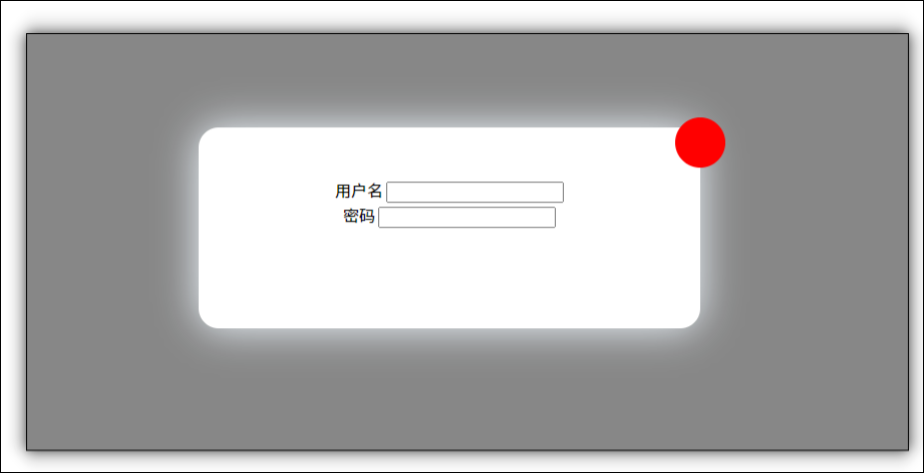

# 可以拖动的模态框 (登录框)



效果: 鼠标可以拖动模态框进行移动

思路: 要实现鼠标拖拽, 需要三个事件: 1 鼠标按下按下, 2 鼠标移动, 3 鼠标按钮抬起

* 注册鼠标按钮按下事件, mousedown , 获取鼠标在盒子内部的坐标 获取在盒子内的鼠标坐标
* 在mousedown内注册鼠标移动事件

  * 模态框的位置计算: 模态框的位置= 鼠标的文档坐标 - 鼠标在盒子内的坐标
* 注册鼠标按钮抬起的事件 mouseup, 在其中移除鼠标移动的事件,

```JavaScript
<!DOCTYPE html>
<html lang="en">
    <head>
        <meta charset="UTF-8" />
        <meta http-equiv="X-UA-Compatible" content="IE=edge" />
        <meta name="viewport" content="width=device-width, initial-scale=1.0" />
        <title>Document</title>
        <style>
            html,
            body {
                width: 100%;
                height: 100%;
            }
            .login {
                display: none;
                position: absolute;
                top: 0;
                left: 0;
                width: 100%;
                height: 100%;
                background-color: rgba(0, 0, 0, 0.475);
            }
            .login_area {
                position: relative;
                top: 50px;
                left: 100px;
                width: 500px;
                height: 200px;

                background-color: #fff;
                text-align: center;
                border-radius: 20px;
                box-shadow: aliceblue 0px 00px 40px;
            }
            .drag_bar {
                width: 100%;
                height: 50px;
                /* background-color: red; */
                cursor: move;
            }
            .close {
                position: absolute;
                top: -5%;
                left: 95%;
                width: 50px;
                height: 50px;
                border-radius: 25px;
                background-color: red;
                cursor: grab;
            }
        </style>
    </head>
    <body>
        <input type="button" value="login" class="btn_login" />
        <div class="login">
            <div class="login_area">
                <div class="drag_bar"></div>
                <div class="close"></div>
                用户名
                <input type="text" />
                <br />
                密码
                <input type="text" />
            </div>
        </div>
        <script>
            var btn_login = document.querySelector(".btn_login");
            var btn_close = document.querySelector(".close");
            var login = document.querySelector(".login");
            var drag_bar = document.querySelector(".drag_bar");
            var login_area = document.querySelector(".login_area");

            btn_login.addEventListener("click", function (e) {
                //显示登陆框
                login.style.display = "block";
            });
            btn_close.addEventListener("click", function (e) {
                //关闭登录框
                login.style.display = "none";
            });
            //要实现拖拽, 需要三个事件, 鼠标按下, 鼠标移动, 鼠标放开

            drag_bar.addEventListener("mousedown", function (e) {
                x = e.pageX - login_area.offsetLeft; //获取鼠标在盒子内部的坐标 ,注意这个只需要获取一次
                y = e.pageY - login_area.offsetTop;
                console.log(x);
                console.log(y);

                // 鼠标移动事件, 注意鼠标移动要写在鼠标按钮按下之内

                document.addEventListener("mousemove", fun);
            });
            //鼠标按钮松开, 就移除移动事件
            drag_bar.addEventListener("mouseup", function (e) {
                document.removeEventListener("mousemove", fun);
            });
            function fun(e) {
                //登陆框的位置等于鼠标位置减去鼠标在盒子内的坐标
                login_area.style.left = e.pageX - x + "px";
                login_area.style.top = e.pageY - y + "px";
            }
        </script>
    </body>
</html>

```
