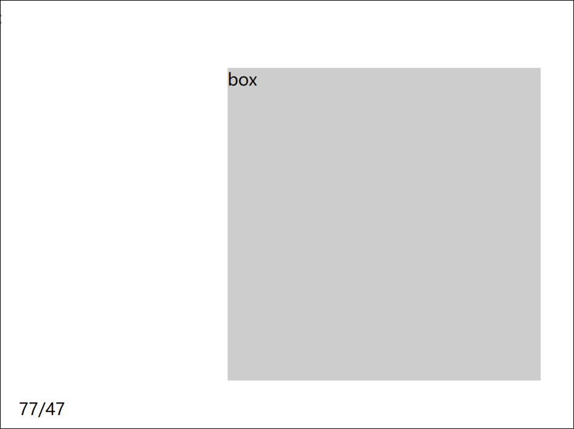

# 获取在盒子内的鼠标坐标

效果:



在盒子内部点击时, 获取鼠标在盒子内部的坐标值

思路: 先获取鼠标再页面内的坐标, 然后用offset属性获取盒子在页面内的坐标,然后用鼠标坐标减盒子坐标即可

代码:

```JavaScript
<!DOCTYPE html>
<html lang="en">
    <head>
        <meta charset="UTF-8" />
        <meta http-equiv="X-UA-Compatible" content="IE=edge" />
        <meta name="viewport" content="width=device-width, initial-scale=1.0" />
        <title>Document</title>

        <style>
            .box {
                width: 300px;
                height: 300px;
                background-color: #ccc;
                margin-left: 200px;
                margin-top: 100px;
            }
        </style>
    </head>
    <body>
        <div class="box">box</div>
        <p></p>
        <script>
            var div = document.querySelector(".box");
            var p = document.querySelector("p");
            div.addEventListener("click", function (e) {
                x = e.pageX;
                y = e.pageY;
                box_x = div.offsetLeft;
                box_y = div.offsetTop;
                x -= box_x;
                y -= box_y;
                p.innerHTML = "" + x + "/" + y;
            });
        </script>
    </body>
</html>

```
