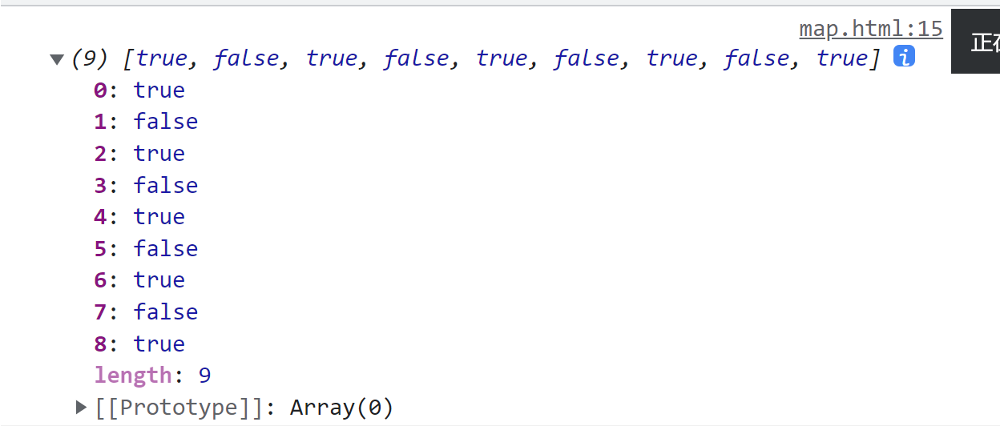

# ES5新增方法

# 数组方法

迭代(遍历)方法: forEach(), ma(), filter(), some(), every();

## forEach()

`arr.forEach(callback(val,index,array){})`

==无返回值==

callback: 回调函数

val: 当前数组元素值

index 数组元素索引号

array: 数组本身

## filter 筛选数组

​`arr.filter(callback(item,index,array){)`​

filter返回一个新==数组==, 

callback函数需要返回一个值, 如果该值为真, 则该值将被加入返回的新数组中

## map 返回回调函数的结果数组 

​`arr.map(callback(val,index,array){)`​

map返回一个==数组==

callback的返回值将被加入新数组内

## some 查找某个元素

`arr.some(callback(val,index,array){})`

返回==布尔值==

回调函数返回一个布尔值, 迭代完成后, 假如有true, 那么返回true, 否则返回false

==当查找到一个true时, 就停止迭代, 类似逻辑或运算的短路操作==

‍

## every 所有元素是否都符合某个条件

`arr.every(callback(val,index,array){})`

与some类似, 返回==布尔值==

回调函数返回一个布尔值, 迭代完成后, ==假如所有元素都为true==, 那么返回true, 否则返回false

==当查找到一个false时, 就停止迭代, 类似逻辑与运算的短路操作==

‍

# 字符串方法

`string.trim()`

返回一个处理后的新字符串, 去除源字符串两侧的空格

# 对象方法

## defineProperty

`object.defineProperty(obj,prop,descriptor)`

defineProperty定义新属性或修改原有属性

`obj`:对象

`prop`: 属性名

`descriptor ​`对象形式书写

	可以有如下属性

* `value  ​`属性值 默认为undefined
* `writeable ​`是否可以重写, true/false 默认为false
* `enumerable ​`是否可以被枚举 (遍历) ,true/false 默认为false
* `configurable ​`: 目标属性是否可以被删除或修改特性 (这四个特性) true/false 默认为false
* `getter`: get(){} 读取属性时执行
* `setter`: set(){} 修改属性时执行

‍
