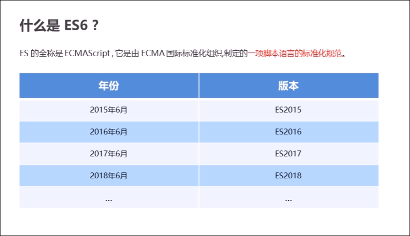
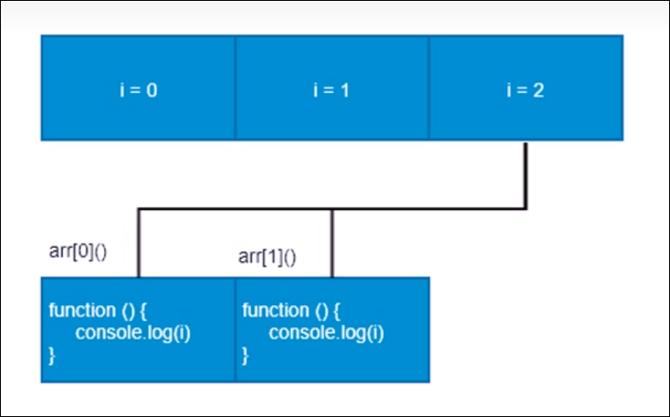
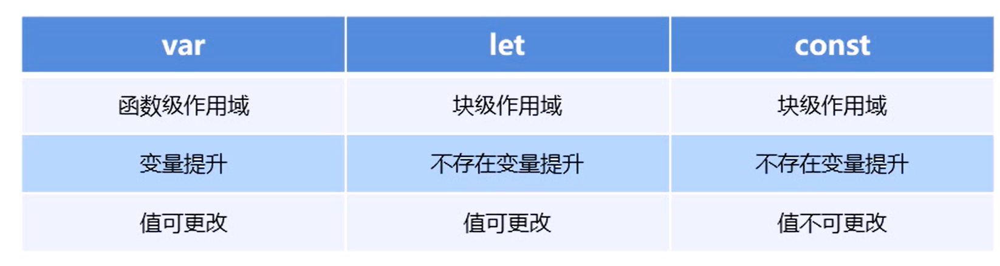
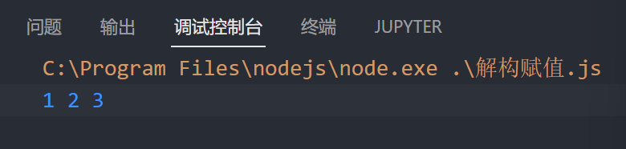
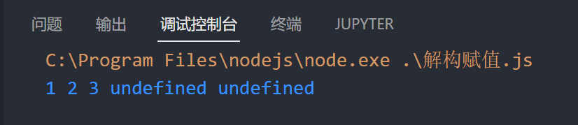
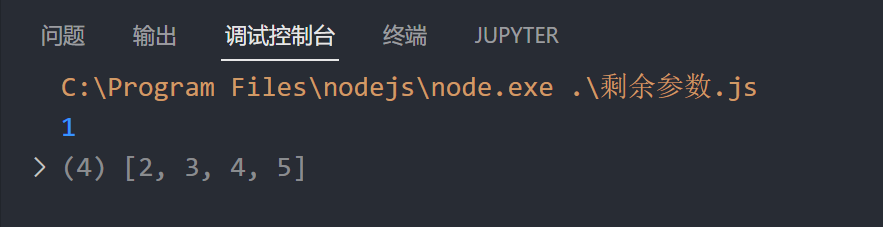

# ES6

目录: 

1. let 和 const 关键字[^1]
2. 解构赋值[^2]
3. 箭头函数[^3]
4. 剩余参数运算符[^4]
5. 扩展运算符[^5]
6. Array方法[^6]
7. 模板字符串[^7]

‍

[^1]: # let 和 const 关键字

    

    # 为什么要使用ES6

    每一次标准的单身都意味着语言的完善, 功能的加强, JavaScript语言本身也有一些令人不满意的地方

    * 变量提升增加了程序运行的不可预测性
    * 语法过于松散, 实现相同功能, 不同的人可能会写出不同的代码

    # let关键字

    ES6中新增的用于声明变量的关键字

    * let 声明的变量只有在所处于的块级作用域`{ }`有效

    ```js
    if(true){
    	let a=10;
    }
    console.log(a); // 报错, a未定义
    ```
    注意: 使用`let`关键字声明的变量才有块级作用域, 使用`var`声明的变量没有块级作用域

    * 不存在变量提升

    ```js
    console.log(a); //报错, a未定义
    let a = 20; 
    ```
    ==不能先调用再定义==

    * 暂时性死区

    ```js
    var num=10;
    if(true){
    	console.log(num); //报错, num未定义
    	let num=20;
    }
    ```
    假如在块级作用域内未定义就调用变量, 即使块级作用域外定义了该变量, 也会报错

    * 就像 [const]()`` 一样，`let` 不会在全局声明时（在最顶层的作用域）创建 [window]()`` 对象的属性。

    ## let经典面试题

    ```js
    var arr = [];
    for (var i = 0; i < 2; i++) {
        arr[i] = function () {
            console.log(i);
        };
    }
    arr[0]();
    arr[1]();
    ```
    输出: 

    `​2`

    `2`

    变量i是全局的, 函数执行时输出的都是全局作用域下的值

    ‍

    ‍

    

    ‍

    ```js
    let arr = [];
    for (let i = 0; i < 2; i++) {
        arr[i] = function () {
            console.log(i);
        };
    }
    arr[0]();
    arr[1]();
    ```
    输出: 

    `0`

    `1`

    每次循环都会产生一个块级作用域, 每个块级作用域中的变量都是不同的, 函数执行时输出的是自己上一级(循环产生的块级作用域)下的值

    # const关键字

    作用: 声明常量, 常量就是值(内存地址), 不能变化的值

    * 具有块级作用域

    ```js
    if(true){
    	const a=10;
    }
    console.log(a); //报错, a未定义
    ```
    * 声明常量必须赋初始值

    ```js
    const pi; //报错 常量使用必须赋初值 SyntaxError: Missing initializer in const declaration
    ```
    * 常量赋值后, 值不能修改

    ```js
    const pi = 3.14;
    // pi = 3; //Assignment to constant variable. 常量不能被赋值
    const arr = [];
    arr[1] = 1; //可以正常修改
    arr[2] = 2;
    console.log(arr);
    arr = [4, 3, 2, 1]; //报错 常量不能被修改, 引用类型可以修改, 因为const里面存的是内存地址
    ```
    常量值对应的内存地址不能改变, 值类型不能改变, 引用类型可以改变引用类型里面的值

    * 就像 `let`  一样，`const ​`不会在全局声明时（在最顶层的作用域）创建 [window]()`` 对象的属性。

    # let const var 的区别

    * var: 作用域为==该语句所在的==​==函数==​==内, 存在==​==变量==​==提升现象==
    * let: 作用域为==该语句所在的代码块, 不存在==​==变量==​==提升==  (必须先定义再使用)
    * 就像 [const]()`` 一样，`let` 不会在全局声明时（在最顶层的作用域）创建 [window]()`` 对象的属性。
    * const: 后面的代码==不能再修改常量的值==

    ​

    ‍


[^2]: # 解构赋值

    ES6允许从数组中提取值, 按照对应的位置, 对变量赋值. 对象也可以实现解构

    ## 数组解构

    语法: `let [变量1,变量2...]=数组`

    数组结构会按顺序将数组元素赋值给等号左边的变量

    注意: 数组结构左边的为方括号`​ [ ]`

    ```js
    let [a, b, c] = [1, 2, 3];
    console.log(a,b,c);
    ```
    ​

    ### 变量数量不对应的情况

    ```js
    let [a, b, c, d, e] = [1, 2, 3];
    console.log(a, b, c, d, e);
    ```
    如果解构赋值的变量和数组的数量不匹配, 多出来的变量会被赋值为`undefined`

    ​

    ## 对象解构

    语法: `let {变量名, 变量名...} = 对象;`

    对象结构会使用属性匹配的方法, 从对象中查找符合等号左边的变量名的属性赋值给变量

    ‍

    ```js
    // 对象解构
    obj = {
        oname: "niu",
        num: 20
    }
    let { oname, num } = obj;
    console.log(oname, num);
    ```
    ### 对象解构的别名

    语法: `let {属性名 : 变量名, 属性名 : 变量名...} = 对象;`

    对象结构会查找冒号左边的属性赋值问冒号右边的变量

    ```js
    // 对象解构 别名
    obj = {
        oname: "niu",
        num: 20,
    };
    let { oname: MyName, num: MyNum } = obj;
    console.log(MyName, MyNum);
    ```
    ‍


[^3]: # 箭头函数

    ES6新增的定义函数的方式

    语法: 

    `()=>{}`

    `const fn = () => {}`

    如果函数的代码只有一行且函数的返回值就是代码的运行结果, 那么可以省略箭头函数的大括号 `{ }`

    ```js
    function sum (num1,num2){
    	return num1+num2;
    }
    //箭头函数省略大括号
    const sum = (num1, num2) => num1 + num2;
    console.log(sum(1,2)); // 3
    ```
    如果箭头函数的形参只有一个参数, 那么可以省略小括号 `( )`

    ```js
    function fn(v){
    	return v;
    }
    //箭头函数省略小括号
    const fn = v => v ;
    ```
    ‍

    注意: 

    * 箭头函数中`this`无法修改, this继承父级作用域
    * 箭头函数内无法使用`arguments`对象, 需要使用 剩余参数

    ‍

    # 箭头函数中的this绑定

    ==箭头函数之中的this指向无法被修改==, 总是继承外层作用域的this

    ‍

    ```js
    // 箭头函数的this关键字
    const obj = { oname: "abc" };
    function fn() {
        console.log(this);
        return ()=>console.log(this);
    }
    const resFn = fn.call(obj);
    resFn(); //输出两个obj
    ```
    ### 面试题

    ```js
    var age = 30;
    var obj = {
        age: 20,
        say: () => {
            console.log(this);
        },
    };
    obj.say();
    ```
    会输出`30`, 因为箭头函数相当于定义在全局, 并且没有自己的`this`, 这里的`this`指向的是`window`,

    `var ​`定义的变量会成为`window`的属性, 所以输出`30`

    ‍


[^4]: # 剩余参数运算符

    剩余参数语法允许我们将一个不定数量的参数表示为一个数组

    语法: `(arg1, ...args)=>{}`

    args 可以收集所有的剩余参数

    ‍

    一个简单的计算数字和的程序 :

    ```js
    const sum = (...args) => {
        let total = 0;
        args.forEach((item) => (total += item));
        return total;
    };
    console.log(sum(1, 2, 3, 4, 5, 6, 7, 8, 9, 10));
    ```
    # 剩余参数和数组解构同时使用

    ```js
    let arr=[1,2,3,4,5]
    let [arg1, ...args] = arr;
    console.log(arg1);
    console.log(args);
    ```
    ​


[^5]: # 扩展运算符

    语法: 

    ```js
    let arr = [1, 2, 3, 4, 5]
    console.log(...arr);
    ```
    扩展运算符可以将数组或者对象转为用逗号分割的==参数序列==

    应用: 

    ## 扩展运算符可以用于合并数组

    ```js
    // 合并数组 方法1
    arr1 = [1, 2, 3, 4];
    arr2 = [5, 6, 7, 8];
    arr3 = [...arr1, ...arr2];
    console.log(...arr3);
    // 方法2
    arr1.push(...arr2);
    console.log(arr1);
    ```
    ## 将伪数组转换为真正的数组

    ```js
    let lis = document.getElementsByTagName("li");
    let arrLis = [...lis];
    ```

[^6]: # Array方法

    # 构造函数方法Array.from()

    将类数组或可遍历对象转换为真正的数组

    ```js
    let arrayLike = {
        0: "tim",
        1: "joke",
        2: "mom",
        length: 3
    }

    let arr = Array.from(arrayLike)
    console.log(arr);
    ```
    Array.from()还可以接受第二个参数, 第二个参数为处理函数, 用于对数据进行处理

    第二个参数为处理函数, 参数为数组成员, 返回值为处理后的值

    ```js
    let arrayLike = {
        0: "tim",
        1: "joke",
        2: "mom",
        length: 3
    }

    let arr = Array.from(arrayLike, item =>item+"处理")
    console.log(arr);
    ```
    # 查找实例方法 `find()` /`findIndex()`

    语法:

     `arr.find(callback(item,index))`

    `arr.findIndex(callback(item,index))​`

    参数: 

    `item ​`: 当前的数组成员 

    `index`: 当前的数组下标

    ‍

    `find`方法返回第一个回调函数返回值为真的数组成员

    `findIndex`方法返回第一个回调函数返回值为真的数组成员的==下标==

    ‍

    ```js
    let arr = [
        {
            name: "tim",
            age: 18,
        },
        {
            name: "jack",
            age: 10,
        },
    ];
    console.log(arr.find(item=>item.name=="jack")); //{name: 'jack', age: 10}
    console.log(arr.findIndex(item=>item.name=="jack")); //1
    ```
    # 判断数组内部是否有元素

    语法: `arr.includes(元素)`

    如果数组内部含有指定元素, 那么返回`true`, 如果没有, 返回`false`

    ```js
    let arr= [1,2,3,4,5,6,7,8,9]
    console.log(arr.includes(1)); //true
    console.log(arr.includes(0)); //false
    ```
    ‍

    # reduce方法

    语法: `arr.reduce((pre,current)=>{},initVal)`​

    参数: 

    * ​`pre`​ :上次迭代的结果
    * ​`current`​: 当前迭代的值
    * ​`initVal`​: 初始值

    执行过程: `reduce`​方法会迭代数组内所有值, 并且会把上次`return`的执行结果作为当前的`pre`​参数

    注意: `reduce`中一定要使用`return`返回值

    ```js
    // 累加值
    let arr = [1, 2, 3, 4, 5];

    let res = arr.reduce((sum, val) => {
        sum += val;
        return sum;
    }, 0);
    console.log(res);

    // 拼合字符串
    let arr2 = ["小明", "小红", "小强"];

    let res2 = arr2.reduce((sum, val) => {
        sum += val;
        return sum;
    }, "");
    console.log(res2);

    // 求每个人的年龄和

    let arr3 = [
        {
            name: "小明",
            age: 20,
        },
        {
            name: "小hs",
            age: 30,
        },
        {
            name: "小a",
            age: 50,
        },
    ];

    let res3 = arr3.reduce((sum, val) => {
        sum += val.age;
        return sum;
    }, 0);
    console.log(res3);

    ```

[^7]: # 模板字符串

    语法: ``hello, my name is ${name}```

    注意 模板字符串使用反引号包裹

    ‍

    模板字符串可以包括变量, 变量使用`${}` 包裹

    模板字符串还可以包含换行, 普通字符串不可以换行, 除非是用`\` 符号

    模板字符串可以调用函数, 在相应位置显示返回值

    ```js
    function fn (){
    	return "hello";
    }
    let greet = `hi ! ${fn()}`
    console.log(greet); //hi ! hello
    ```
