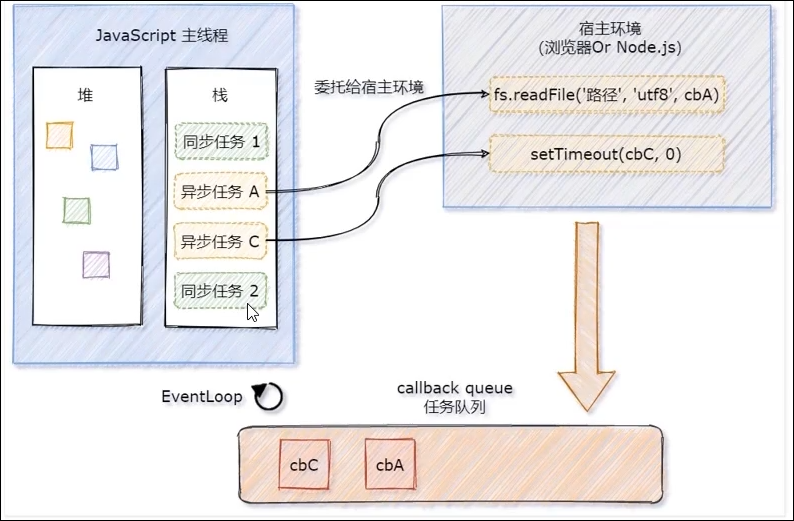
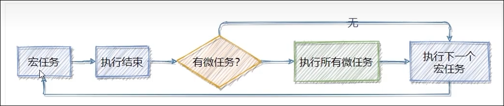

# EventLoop

JavaScript 是单线程语言, 也就是说, 同一时间只能执行一件任务

单线程执行任务队列的问题:

如果前一个任务非常耗时, 则后续的任务就不得不一直等待, 从而导致程序假死

‍

# 同步任务和异步任务

为了防止某个耗时任务导致程序假死的问题, JavaScript 把待执行的任务分为了两类

## 同步任务

* 又叫做非耗时任务, 指的是在主线程上排队执行的哪些任务
* 只有前一个任务执行完毕, 才能执行后一个任务

## 异步任务

* 又叫做耗时任务, 异步任务由 Javascript 委托给宿主环境进行执行
* 当异步任务执行完成后, 会通知 Javascript 准线程执行异步任务的回调函数

## 同步任务和异步任务的执行过程

​

1. 同步任务由 Javascript 主线程==次序执行==
2. 异步任务==委托给宿主环境==执行
3. 已完成的异步任务对应的回调函数, 会被加入到==任务队列==中等待执行
4. Javascript 主线程的执行栈被清空后, 会==读取任务队列中的回调函数, 次序执行==
5. Javascript 主线程不断重复上面的第四步

Javascript 主线程是从==​ 任务队列== 中读取异步任务的回调函数, 放到执行栈中依次执行, 这个过程是循环不断的, 所以整个的这种运行机制又称为 ==EventLoop==

‍

# 宏任务和微任务

JavaScript 把异步任务又做了进一步的划分, 异步任务又分为两类, 分别是:

## 宏任务 macrotask

* 异步Ajax请求
* setTimeout, setInternal
* 文件操作
* 其他宏任务

## 微任务 microtask

* Promise.then .catch .finallt
* process.nextTick
* 其他微任务

‍

## 宏任务和微任务的执行顺序

​

每一个宏任务执行完之后==, 都会检查是否存在待执行的微任务==, 如果有, 则执行完所有微任务之后, 再继续执行下一个宏任务

‍
