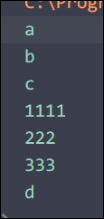

# Promise

# 回调地狱

```js
setTimeout(() => {
    console.log(1);
    setTimeout(() => {
        console.log(2);
        setTimeout(() => {
            console.log(3);
        }, 1000);
    }, 1000);
}, 1000);
```

缺点:

* 代码耦合性太强, 牵一发而动全身, 难以维护
* 大量冗余代码相互嵌套, 代码可读性变差

## 如何解决回调地狱的问题

为了解决回调地狱的问题, ES6新增了 `Promise ​`的概念

# Promise的基本概念

## Promise是一个构造函数

* 我们可以创建`Promise`的实例 `const p = new Promise()`
* `new ​`出来的 `Promise ​`实例对象, 代表一个异步操作

## Promise.prototype 上包含一个.then() 方法

每一次`new Promise() ​`构造函数得到的实例对象, 都可以通过原型链的方式访问到`​ .then()`方法, 例如 `p.then`

## .then() 方法用来预先指定成功和失败的回调函数

* `p.then(成功的回调, 失败的回调)`
* `p.then(result=>{},error=>{})`
* 调用 `.then() ​`方法时, 成功的回调函数是必选的, 失败的回调函数是可选的

‍

# .then的链式调用

## 使用回调函数的按顺序读取文件

```js
import fs from "fs";

fs.readFile("./txt/1.txt", "utf8", (err, res) => {
    if (err) {
        console.log(err.message);
    }
    console.log(res);
    fs.readFile("./txt/2.txt", "utf8", (err, res) => {
        if (err) {
            console.log(err.message);
        }
        console.log(res);

        fs.readFile("./txt/3.txt", "utf8", (err, res) => {
            if (err) {
                console.log(err.message);
            }
            console.log(res);
        });
    });
});

```

回调函数反复嵌套, 条例不很清晰

## 使用promise读取文件

使用then-fs读取文件, 基于promise

```js
import tfs from "then-fs";

tfs.readFile("./txt/1.txt", "utf8").then(
    result => {
        console.log(result);
    },
    err => {
        console.log(err);
    }
);
tfs.readFile("./txt/2.txt", "utf8").then(
    result => {
        console.log(result);
    },
    err => {
        console.log(err);
    }
);
tfs.readFile("./txt/3.txt", "utf8").then(
    result => {
        console.log(result);
    },
    err => {
        console.log(err);
    }
);

```

这种方法, 并不能保证按顺序读取

‍

### .then的链式调用

`promise`支持链式调用, 通过`return`一个`promise实例`来链式调用

```js

tfs.readFile("./txt/1.txt", "utf8")
    .then(result => {
        console.log(result);
        return tfs.readFile("./txt/2.txt", "utf8");
    })
    .then(result => {
        console.log(result);
        return tfs.readFile("./txt/3.txt", "utf8");
    })
    .then(result => {
        console.log(result);
    });
```

## 通过.catch捕获错误

在Promise的链式操作中, 可以通过`.catch`来捕获错误

```js
tfs.readFile("./txt/1.txt", "utf8")
    .then(result => {
        console.log(result);
        return tfs.readFile("./txt/12.txt", "utf8");
    })
    .then(result => {
        console.log(result);
        return tfs.readFile("./txt/3.txt", "utf8");
    })
    .then(result => {
        console.log(result);
    })
    .catch(err => {
        console.log(err);
    });
```

‍

## Promise.all()方法

`Promise.all()`方法可以并行执行多个任务, 并且等到所有任务都完成之后再执行`.then()`方法

```js
import tfs from "then-fs";

const promiseArr = [
    tfs.readFile("./txt/1.txt", "utf8"),
    tfs.readFile("./txt/2.txt", "utf8"),
    tfs.readFile("./txt/3.txt", "utf8"),
];

Promise.all(promiseArr)
    .then(([r1, r2, r3]) => {
        console.log(r1, r2, r3);
    })
    .catch(err => {
        console.log(err.message);
    });
```

注意: 

* `.then`返回值的顺序就是`promise`实例数组的顺序

## Promise.race() 方法

`Promise.race() ​`方法会发起并行的 `Promise`异步操作, 只要任何一个任务完成, 就立刻执行下一步的 `.then()`操作 (赛跑机制)

```js
Promise.race(promiseArr)
    .then(res => {
        console.log(res);
    })
    .catch(err => {
        console.log(err.message);
    });
```

‍

# 封装自己的Promise方法

`new Promise`的参数为一个回调, 回调的参数为成功的回调, 失败的回调

```js
import fs from "fs";

function getFile(filePath) {
    // 返回一个Promise实例对象
    // new Promise的参数为一个回调, 回调的参数为成功的回调, 失败的回调
    return new Promise(function (resolve, reject) {
        fs.readFile(filePath, "utf8", function (err, res) {
            if (err) {
                return reject(err.message);
            }
            resolve(res);
        });
    });
}

getFile("./txt/1.txt")
    .then(
        res => {
            console.log(res);
        },
        err => {
            console.log(err);
        }
    )
    .catch(err => {
        console.log(err);
    });
```

‍

# async/await

`async/await`是es8 (ECMA 2017)引入的新语法, 用来简化Promise的异步操作, 在`async/await`出现之前, 开发只能通过链式`.then`的方法处理Promise异步操作

链式 `.then ​`操作: 

```js

tfs.readFile("./txt/1.txt", "utf8")
    .then(result => {
        console.log(result);
        return tfs.readFile("./txt/2.txt", "utf8");
    })
    .then(result => {
        console.log(result);
        return tfs.readFile("./txt/3.txt", "utf8");
    })
    .then(result => {
        console.log(result);
    });

```

链式 `.then ​`操作的缺点: 

* 代码冗余, 阅读性差, 不易理解

‍

## async/await的基本使用

如果在一个`Promise`实例的前面加上await, 那么可以直接获取到该实例的返回值

```js
async function getallFile() {
    const r1 = await getFile("./txt/1.txt");
    console.log(r1);
    const r2 = await getFile("./txt/2.txt");
    console.log(r2);
    const r3 = await getFile("./txt/3.txt");
    console.log(r3);
}
getallFile();
```

## async/await的注意事项

* 如果`function`内部使用了`await`修饰, 那么`function`必须使用`async`修饰
* 在`async`方法中, 第一个`await`之前的代码会同步执行, `await`之后的代码会异步执行

  * ```js

    console.log("a");
    async function getallFile() {
        console.log("b");
        const r1 = await getFile("./txt/1.txt");
        console.log(r1);
        const r2 = await getFile("./txt/2.txt");
        console.log(r2);
        const r3 = await getFile("./txt/3.txt");
        console.log(r3);
        console.log("d");
    }
    getallFile();
    console.log("c");
    ```
  * ​

​

‍
