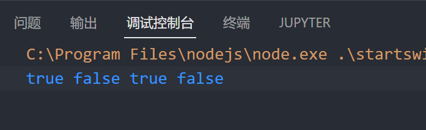

# String 方法

# startsWith()和endsWith()方法

`startsWith() ​`和 `endsWith()` 方法可以检测字符串是否以指定的参数开头或结尾

语法: 

`startsWith("str")`

`endsWith("str")`

‍

```js
let str = "hello world!";
let r1 = str.startsWith("he");
let r2 = str.startsWith("He");
let r3 = str.endsWith("!");
let r4 = str.endsWith("?");
console.log(r1, r2, r3, r4);
```

​

‍

# repeat() 方法

使用repeat()方法可以返回重复指定次数的新字符串

`str.repeat(次数);`

‍

```js
let str = "hello World! ";
let str2 = str.repeat(5);
console.log(str2); //hello World! hello World! hello World! hello World! hello World! 
```
