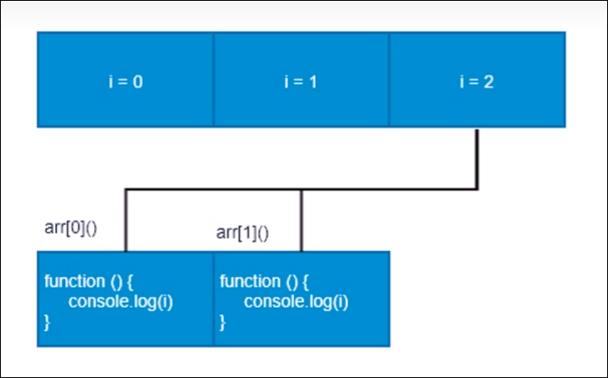
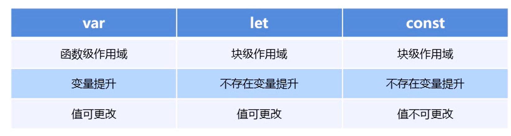

# let 和 const 关键字


# 为什么要使用ES6

每一次标准的单身都意味着语言的完善, 功能的加强, JavaScript语言本身也有一些令人不满意的地方

* 变量提升增加了程序运行的不可预测性
* 语法过于松散, 实现相同功能, 不同的人可能会写出不同的代码

# let关键字

ES6中新增的用于声明变量的关键字

* let 声明的变量只有在所处于的块级作用域`{ }`有效

```js
if(true){
	let a=10;
}
console.log(a); // 报错, a未定义
```

注意: 使用`let`关键字声明的变量才有块级作用域, 使用`var`声明的变量没有块级作用域

* 不存在变量提升

```js
console.log(a); //报错, a未定义
let a = 20; 
```

==不能先调用再定义==

* 暂时性死区

```js
var num=10;
if(true){
	console.log(num); //报错, num未定义
	let num=20;
}
```

假如在块级作用域内未定义就调用变量, 即使块级作用域外定义了该变量, 也会报错

* 就像 [const]()`` 一样，`let` 不会在全局声明时（在最顶层的作用域）创建 [window]()`` 对象的属性。

## let经典面试题

```js
var arr = [];
for (var i = 0; i < 2; i++) {
    arr[i] = function () {
        console.log(i);
    };
}
arr[0]();
arr[1]();
```

输出: 

`​2`

`2`

变量i是全局的, 函数执行时输出的都是全局作用域下的值

‍

‍



‍

```js
let arr = [];
for (let i = 0; i < 2; i++) {
    arr[i] = function () {
        console.log(i);
    };
}
arr[0]();
arr[1]();
```

输出: 

`0`

`1`

每次循环都会产生一个块级作用域, 每个块级作用域中的变量都是不同的, 函数执行时输出的是自己上一级(循环产生的块级作用域)下的值

# const关键字

作用: 声明常量, 常量就是值(内存地址), 不能变化的值

* 具有块级作用域

```js
if(true){
	const a=10;
}
console.log(a); //报错, a未定义
```

* 声明常量必须赋初始值

```js
const pi; //报错 常量使用必须赋初值 SyntaxError: Missing initializer in const declaration
```

* 常量赋值后, 值不能修改

```js
const pi = 3.14;
// pi = 3; //Assignment to constant variable. 常量不能被赋值
const arr = [];
arr[1] = 1; //可以正常修改
arr[2] = 2;
console.log(arr);
arr = [4, 3, 2, 1]; //报错 常量不能被修改, 引用类型可以修改, 因为const里面存的是内存地址
```

常量值对应的内存地址不能改变, 值类型不能改变, 引用类型可以改变引用类型里面的值

* 就像 `let`  一样，`const ​`不会在全局声明时（在最顶层的作用域）创建 [window]()`` 对象的属性。

# let const var 的区别

* var: 作用域为==该语句所在的==​==函数==​==内, 存在==​==变量==​==提升现象==
* let: 作用域为==该语句所在的代码块, 不存在==​==变量==​==提升==  (必须先定义再使用)
* 就像 [const]()`` 一样，`let` 不会在全局声明时（在最顶层的作用域）创建 [window]()`` 对象的属性。
* const: 后面的代码==不能再修改常量的值==

​

‍
