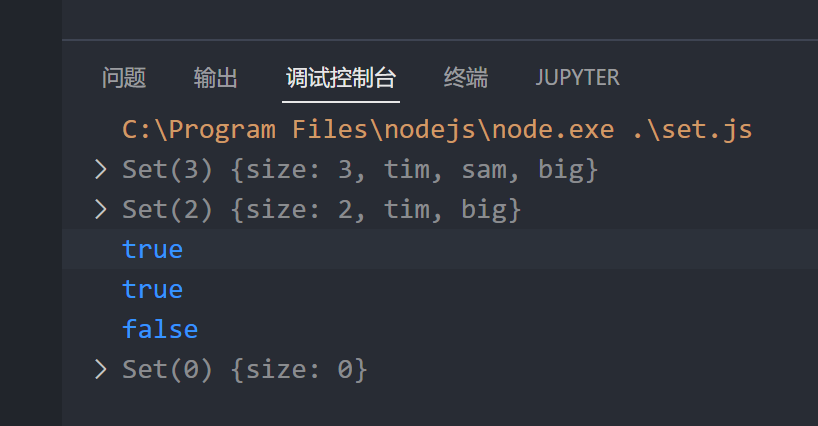

# set 数据结构

ES6提供了新的数据结构Set, 它类似于数组, 但是成员的值是唯一的, 没有重复的值

Set本身是一个构造函数, 用来生成Set数据结构

`const s = new Set();`

参数可以是数组

```js
const s = new Set([1, 1, 2, 3, 4]);
console.log(s);
```

输出: `Set(4) {size: 4, 1, 2, 3, 4}` 由此可见 Set没有重复的数据

# 利用Set进行数组去重

可以利用Set不含有重复数据的特性, 进行数组去重

```js
//用Set 数组去重
let arr1 = [1, 1, 2, 2, 3, 3];
let s = new Set(arr1);
let arr2 = [...s];
console.log(arr2);
```

# Set的系列方法

* add(value) 向Set中添加某个值, 返回Set数据解构本身
* delete(value): 删除某个值, 返回某个布尔值, 表示删除是否成功
* has(value): 检测Set中是否有某个值, 返回一个布尔值
* clear() : 清除所有成员, 没有返回值

  ```js
  //Set方法
  const s = new Set();
  s.add("tim")
  s.add("sam")
  s.add("big")
  console.log(s);
  let r=s.delete("sam")
  console.log(s);
  console.log(r);
  r=s.has("tim");
  console.log(r);
  r=s.has("wow");
  console.log(r);
  s.clear();
  console.log(s);
  ```

​

# 遍历Set数据结构

使用`forEach`方法可以遍历`Set`数据结构

```js
const s = new Set([1, 2, 3, 4, 5]);
s.forEach((items) => {
    console.log(items);
});
```
