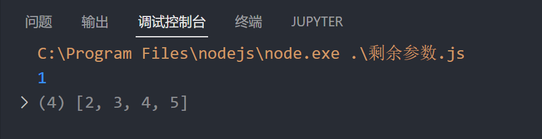

# 剩余参数运算符

剩余参数语法允许我们将一个不定数量的参数表示为一个数组

语法: `(arg1, ...args)=>{}`

args 可以收集所有的剩余参数

‍

一个简单的计算数字和的程序 :

```js
const sum = (...args) => {
    let total = 0;
    args.forEach((item) => (total += item));
    return total;
};
console.log(sum(1, 2, 3, 4, 5, 6, 7, 8, 9, 10));
```

# 剩余参数和数组解构同时使用

```js
let arr=[1,2,3,4,5]
let [arg1, ...args] = arr;
console.log(arg1);
console.log(args);
```

​
