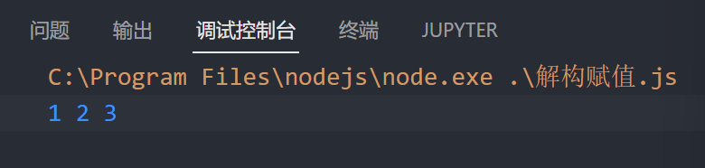
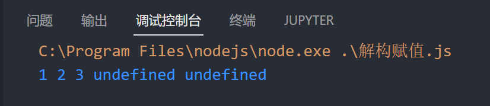

# 解构赋值

ES6允许从数组中提取值, 按照对应的位置, 对变量赋值. 对象也可以实现解构

## 数组解构

语法: `let [变量1,变量2...]=数组`

数组结构会按顺序将数组元素赋值给等号左边的变量

注意: 数组结构左边的为方括号`​ [ ]`

```js
let [a, b, c] = [1, 2, 3];
console.log(a,b,c);
```

​

### 变量数量不对应的情况

```js
let [a, b, c, d, e] = [1, 2, 3];
console.log(a, b, c, d, e);
```

如果解构赋值的变量和数组的数量不匹配, 多出来的变量会被赋值为`undefined`

​

## 对象解构

语法: `let {变量名, 变量名...} = 对象;`

对象结构会使用属性匹配的方法, 从对象中查找符合等号左边的变量名的属性赋值给变量

‍

```js
// 对象解构
obj = {
    oname: "niu",
    num: 20
}
let { oname, num } = obj;
console.log(oname, num);
```

### 对象解构的别名

语法: `let {属性名 : 变量名, 属性名 : 变量名...} = 对象;`

对象结构会查找冒号左边的属性赋值问冒号右边的变量

```js
// 对象解构 别名
obj = {
    oname: "niu",
    num: 20,
};
let { oname: MyName, num: MyNum } = obj;
console.log(MyName, MyNum);
```

‍
