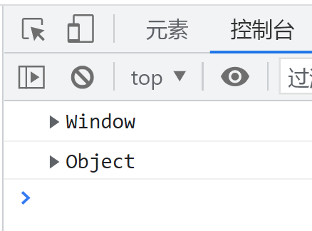

# 函数进阶

# 函数的定义和调用

## 函数的定义

### 1.函数声明方式(命名函数)

```js
function name(params) {
  
}
```

### 2.函数表达式(匿名函数)

```js
let fun = function () {
  
};
```

### 3.new Function()

```js
var f = new Function("参数1","参数2",..."函数体")
```

* 参数和函数体都必须是字符串形式的
* 执行效率低, 也不方便书写 , 因此较少使用
* 所有函数都是Function的实例对象
* 函数也属于对象

## 函数的调用

### 1. 普通函数

```js
          function fun() {
                console.log("hellow world");
            }
            fun();
            fun.call();
```

### 2. 对象的方法

```js
            let o = new Object();
            o.fun = function () {};
            o.fun();
```

### 3. 构造函数

```js
            function Person(name) {
                this.name = name;
            }
            let tom = new Person("tom");
```

### 4. 绑定事件函数

```js
            document.onclick = function () {
                console.log("hello");
            };
```

### 5. 定时器函数

```js
            setTimeout(function () {
                console.log("hello");
            }, 1000);
            setInterval(function () {
                console.log("hello");
            }, 1000);
```

### 6. 立即执行函数

```js
            (function fun() {
                console.log("hello");
            })();
```

‍

# this

## 函数内this的指向

this的指向, 是由调用函数时决定的, 调用方式的不同决定了this的指向

一般指向调用者

|调用方式|this指向|
| :------------: | ---------------------------------------------------------|
|普通函数调用|window|
|构造函数调用|实例化的对象, 对象原型prototype里面的也指向实例化的对象|
|对象方法调用|该方法所属的对象|
|事件绑定方法|绑定事件对象|
|定时器函数|window|
|立即执行函数|window|

### 改变函数内部的this指向

js为我们提供了一些函数方法来优雅的处理this指向的问题, 常用的有 bind(), call(), apply()

#### 1. call()

`fun.call(obj,arr1,arr2...)` 

返回值: 原始函数的返回值

call可以调用函数, 同时修改此函数的this指向, 第一个参数为this指向, 剩下的参数为形参

call一般用来实现继承

```js
            // call
            let o = {
                name: "tim",
            };

            function fun() {
                console.log(this);
            }

            fun(); //window
            fun.call(o);//object
```



call实现继承

‍

#### 2.apply

`fun.apply(this,[arg1,arg2...])`

返回值: 原函数的返回值

apply 第一个参数为this指向, 第二个参数为数组形式的参数列表, 但是传入函数的形式为字符串

apply可以处理数组, 比如直接利用Math.max对数组进行排序

```js
        //apply 第一个参数为this指向, 第二个参数为数组形式的参数列表, 但是传入函数的形式为字符串
            let o = {};
            function fun() {
                console.log(this);
            }
            fun();
            fun.apply(o);
            //apply 通常用来处理数组数据
            let arr=[1,2,34,14,23,12,45,2,3532,1];
            let max=Math.max.apply(null,arr)
            console.log(max);
```

#### 3.bind

`let newFun = fun.bind(obj,arr1,arr2...)`

  bind 返回一个新函数, 并不会调用执行函数

‍

```js
        //bind 返回一个新函数, 并不会调用执行函数
        let o={};
        function fun(){
            console.log(this);
        }
        let newFun=fun.bind(o);
        newFun();
```

bind一般用于不需要立刻执行但是还是需要修改this的场景

‍

```js
            //bind 的应用
            let btn = document.querySelector("input");
            btn.addEventListener("click", function () {
                this.disabled = true;
                let enable = function () {
                    this.disabled = false;
                };
                enable = enable.bind(this); //由于settimeout的this为window, 所以需要bind
                setTimeout(enable, 1000);
            });
```

#### call apply bind 三者的区别

相同点: 

* 都可以改变函数内部的this指向

区别点: 

* call和apply会调用函数, 并且改变函数内部的this指向
* call和apply传值的参数不一样, call是直接传递参数, apply是传递数组
* bind不会调用函数, 但是会改变this指向

主要应用场景

* call主要用来做继承
* apply一般用来处理数组
* bind不调用函数, 还能用来改变this指向, 比如改变定时器内部的this指向

# 严格模式

## 什么是严格模式

JavaScript除了提供正常模式外, 还提供了严格模式 (strict mode), es5的严格模式采用具有限制性Javascript变体的一种方式, 即在严格的条件下运行js代码

严格模式在IE10以上支持

严格模式对正常的Javascript语义做了一些更改

1. 消除了Javascript语法的一些不合理, 不严谨之处, 减少了一些怪异行为
2. 消除代码运行的一些不安全指出, 保证代码运行的安全
3. 提高编译效率, 增加运行效率
4. 禁用了在ECMAScript的未来版本中可能会定义的一些语法, 为未来新版本的Javascript做好铺垫, 例如class, enum,extends,import,super不能当变量名

## 开启严格模式

严格模式可以应用到整个脚本或个别函数中

### 为脚本开启严格模式

为整个脚本开启严格模式, 需要在所有语句之前放一个特定语句`"use strict";`

```js
        <script>
            "use strict";
        </script>
```

### 为某个函数开启严格模式

在函数内的所有语句之前添加`"use strict";`

```js
        <script>
            function fun(){
                "use strict"
            }
        </script>
```

## 严格模式的变化

### 变量规定

* 变量必须先声明再使用, 正常模式下不声明就使用会变成全局变量
* 严禁删除已生命的变量, `delete x; ​`会报错

### this指向问题

* 严格模式全局作用域下`this`指向`undefined`, 普通模式下指向`window`
* 严格模式下构造函数不能不加`new`就调用(因为`this`指向了`undefined`), 普通模式下构造函数不加`new`也能调用, `this`指向全局对象,
* 定时器还是会指向`window`, 因为定时器属于`window`
* 事件, 对象还是指向调用者

### 函数变化

* 函数不能有重名的参数
* 函数必须声明在顶层, 不能声明在if, for里面, 但是可以声明在函数之中

# 高阶函数

高阶函数是对其他函数进行操作的函数, 它接收函数或者将函数作为返回值

```js
            //高阶函数 : 将函数作为参数或者将函数作为返回值
            //将函数作为参数
            function fun(callback) {
                callback && callback();
            }
            function callback() {
                console.log("something");
            }
            fun(callback);

            //将函数作为返回值
            function fun2() {
                return function () {
                    console.log("hello");
                };
            }
            fun2();
```
