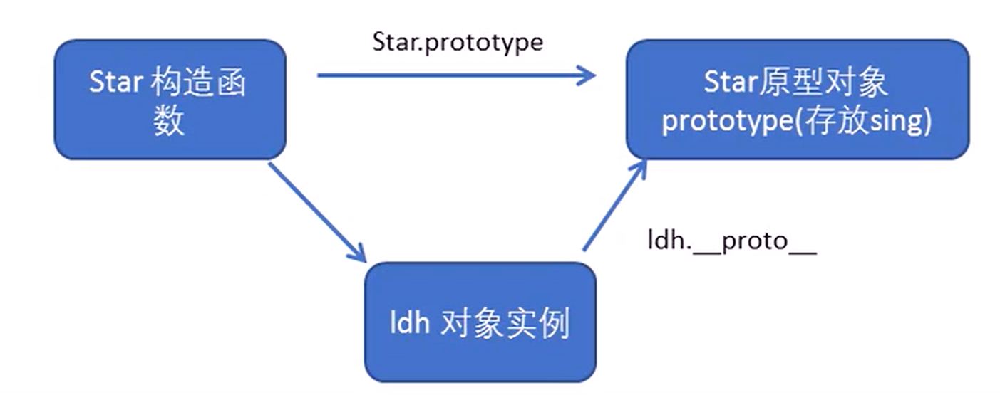
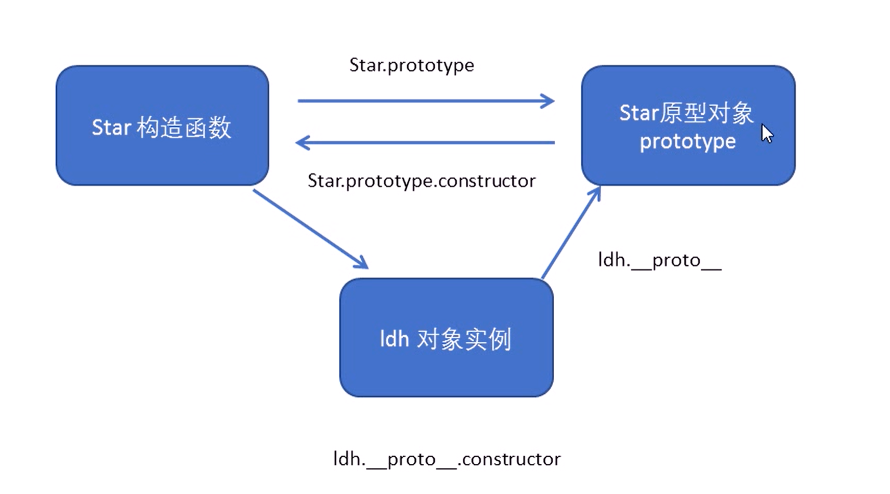
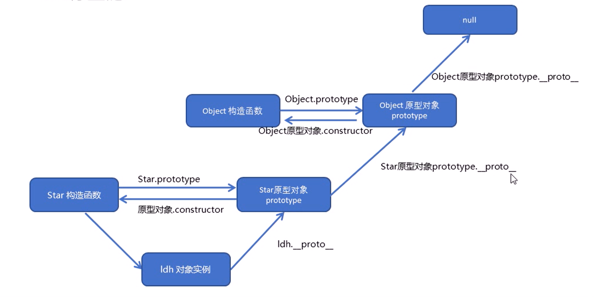

# 构造函数和原型

# 构造函数

构造函数是一种特殊的函数,   主要用来初始化对象, 即为对象成员变量赋初始值, 他总与 new 一起使用,  我们可以把对象中一些公共的属性和方法抽取出来, 然后封装到这个函数里面

‍

在 js 中, 使用构造函数要注意以下来吗:

1. 构造函数用于创建某一类对象, 首字母要大写
2. 构造函数要和 new 一起使用才有意义

‍

## new 在执行时会做四件事情

1. 在内存中创建一个新的空对象
2. 让 this 指向这个新的对象
3. 执行构造函数里面的代码, 给这个新对象添加属性和方法
4. 返回这个新对象(所以构造函数里面不需要 return)

‍

## 构造函数的实例成员和静态成员

实例成员:

1. 实例成员就是构造函数内部通过 this 添加的成员
2. 实例成员只能通过实例化的对象来访问

静态成员:

1. 在构造函数本身上添加的成员
2. 静态成员只能通过构造函数来访问

## 构造函数的问题

构造函数方法很好用, 但是存在浪费内存的问题

多个构造函数实例化出来的对象中的属性和方法蛔虫是生成

‍

# 构造函数原型 prototype

构造函数通过原型分配  函数是所有对象共享的

Javascript 规定, 每一个构造函数都有一个 prototype 属性, 指向另一个对象,

我们可以把那些不变的方法, 直接定义在 prototype 对象上, 这样所有对象的实例都可以共享该方法

```js
 function Person(name) {
                this.name = name;
            }
            Person.prototype.say = function () {
                console.log(this.name);
            }; //定义原型对象函数
            var p1 = new Person("xm");
            var p2 = new Person("lh");
            console.log(p1.say === p2.say);
            console.log(Person.prototype);
            p1.say(); //可以正常输出
```

## 

# 对象原型 ****proto****

对象都会有一个属性__proto__ 指向构造函数的 prototype 原型对象, 之所以对象也可以使用构造函数的 prototype 原型对象的属性和方法, 就是因为对象有__proto__原型的存在

* __proto__对象原型和原型对象 prototype 是等价的
* __proto__对象原型的意义就在于为对象的查找机制提供一个方向, 或者说一条路线, 但是它是一个非标准属性, 因此实际开发中, 不可以使用这个属性, 他只是内部只想原型对象 prototype.



# constructor 构造函数

对象原型__proto__和构造函数原型 prototype 里面都有一个属性, constructor, 称之为构造函数, 他只想构造函数本身.

```js
console.log(Person.prototype.constructor===Person);
//输出true
```

如果我们修改了原来的原型对象. 并且给原型对象赋值的是一个对象,则必须手动利用 constructor 指向原来的构造函数

# 构造函数, 实例, 原型对象三者之间的关系



# 原型链



# Javascript 的成员查找机制

1. 当访问一个成员的属性是, 首先查找这个对象自身有没有这个属性
2. 如果没有就查找他的原型, 也就是`__proto__`指向的 `prototype ​`原型对象
3. 如果还没有就查找原型对象的原型
4. 以此类推一直找到 `Object` 为止(null)
5. `__proto__`​对象原型的意义就在于为对象成员查找机制提供一个方向, 或者说一条路线

# 原型对象的 this 指向问题

1. 在构造函数中, 里面 `this ​`指向的是 实例化的对象
2. 原型对象​函数里面的 `this ​`指向的是 实例对象

# 拓展内置对象

可以通过原型对象, 给内置基本对象进行扩展自定义的方法, 比如给数字添加自定义求偶数和的方法

‍

注意:

数组和字符串内置对象不能给原型对象覆盖操作 Array.prototype=(), 只能是 Array.prototype.xxx=function(){} 的方式

# 继承

ES6 之前并没有给我们提供 extends 继承, 我们可以通过构造函数 + 原型对象模拟实现继承, 被称为组合继承

## call() 修改 this 指向

调用这个函数, 并且修改函数运行时的 this 指向

`fun.call(thisArg,arg1,arg2...)`

thisArg: 当前调用函数的 this 的指向对象

## 借用构造函数继承父类的属性

核心原理: 通过 call()把夫类型的 this 指向子类型的 this, 这样就实现了子类型继承父类型的属性

```js
        function Father(names,sex){
            this.names=names;
            this.sex=sex;
            this.say=function(){
                console.log("hello");
            }
        }
        function Son(names,sex){
            Father.call(this);
        }
        var p = new son;
        console.log(p)
```

## 使用原型对象继承父类的方法

核心原理: 给子类的原型对象设置为父类的实例

```js
            function Father(names, sex) {
                this.names = names;
                this.sex = sex;
            }
            function Son(names, sex) {
                Father.call(this);
            }
            Son.prototype = new Father(); //给子类的原型对象设置为父类的实例
            Son.prototype.say = function () {
                console.log("hello i'm son");
            };
            Son.prototype.constructor = Son;
            var p = new Son();
            console.log(p);
            console.log(Son.prototype);
            console.log(Father.prototype);
```

‍

# 类的本质

1. class本质还是function
2. 类的所有方法都定义在类的prototype属性上
3. 类创建的实例里面也有__prototype__,指向类的prototype原型对象
4. 所以es6的类的大部分功能, es5都能做到, 新的class写法只是让对象原型的写法更加清晰,  更像面向对象eyufa而已
5. es6的类其实是==语法糖==

    1. 语法糖: 语法糖就是一种便捷写法,  假如有两种方法可以实现相同的功能, 但另一种方法更加简单清晰, 那么这个方法就是语法糖
