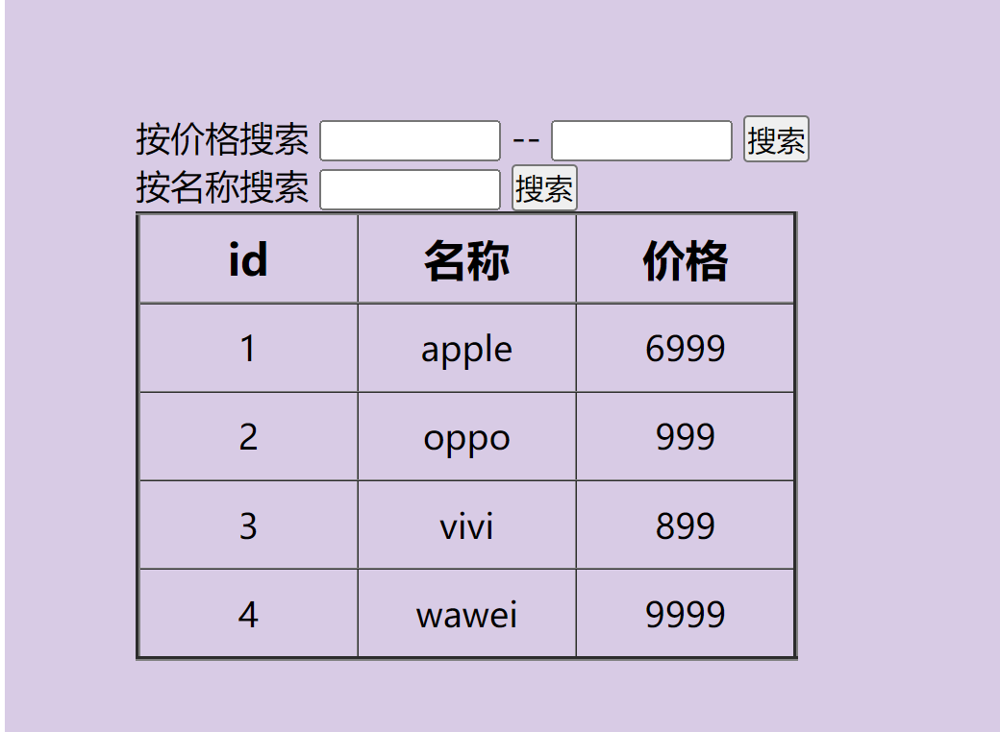

# 查询商品

需求: 可以根据价格和名称筛选商品

思路: 主要使用数组的forEach方法和some方法

```js
window.addEventListener("load", function () {
    //定义数据
    let date = [
        { id: 1, p_name: "apple", price: 6999 },
        { id: 2, p_name: "oppo", price: 999 },
        { id: 3, p_name: "vivi", price: 899 },
        { id: 4, p_name: "wawei", price: 9999 },
    ];
    //获取元素
    let tbody = document.querySelector(".content .table tbody");
    let price_start = document.querySelector(".search_area .price .price_start");
    let price_end = document.querySelector(".search_area .price .price_end");
    let price_search_btn = document.querySelector(".search_area .price .search");
    let inp_name = document.querySelector(".search_area .name .inp_name");
    let name_search_btn = document.querySelector(".search_area .name .search");
    // console.log(tbody, price_start, price_end, price_search_btn, inp_name, name_search_btn);

    //填充数据
    function initDate(Mydate) {
        tbody.innerHTML = "";
        Mydate.forEach(function (val) {
            let tr = `      <tr>
                        <td>${val.id}</td>
                        <td>${val.p_name}</td>
                        <td>${val.price}</td>
                    </tr>`;

            tbody.insertAdjacentHTML("beforeend", tr);
        });
    }

    initDate(date);

    price_search_btn.addEventListener("click", function () {
        pStart = price_start.value;
        pEnd = price_end.value;
        // console.log(pStart,pEnd);
        let newDate = date.filter(function (val) {
            return pStart < val.price && pEnd > val.price;
        });
        console.log(newDate);
        initDate(newDate);
    });
    name_search_btn.addEventListener("click", function () {
        let searchName = inp_name.value;
        let newDate = [];
        date.some(function (val) {
            if (searchName == val.p_name) {
                newDate.push(val);
            }
        });
        console.log(newDate);
        initDate(newDate);
    });
});

```
