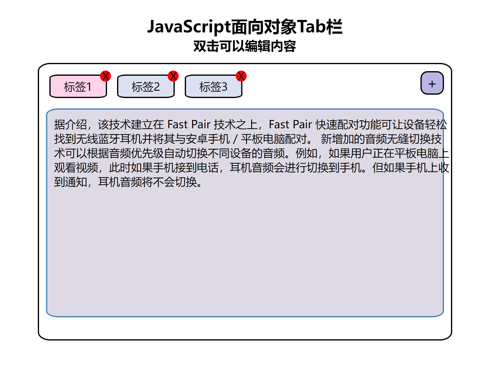

# 面向对象tab栏



功能要求: 

1. 点击tab栏可以进行切换
2. 点击关闭按钮可以关闭当前标签
3. 点击添加按钮可以添加一个tab
4. 双击标签或者内容可以进行编辑
5. 使用面向对象编写

‍

思路: 

1. 首先定义一个tab对象, 然后在构造函数内书写获取元素的方法.
2. 定义一个init方法, 用于每次更改之后初始化节点,给tab绑定事件
3. 定义toggle方法, 用于切换tab

    1. 使用排他思想, 去除其他所有tab的class, 给自己设置active的类名
4. 定义add方法, 用于新增tab

    1. 使用`insertAdjacentHTML ​` 方法, 在tab后面追加一个tab
5. 定义del方法, 用于删除tab及其对应的内容

    1. 直接调用`remove()` 方法,删除当前节点
6. 新建edit方法, 用于编辑

    1. 使用`ondbclick ​`双击事件, 绑定事件
    2. 在元素内部生成文本框
    3. 如果失去焦点, 那么将文本框的内容赋值给元素即可

‍

源代码:

```js
window.addEventListener("load", function () {
    var that;
    var num = 0;
    var sum = 0;
    var str;
    class tab {
        constructor(id) {
            //获取元素
            that = this;
            /**
             * @type {HTMLElement} main
             */
            this.main = document.querySelector(id);
            /**
             * @type {HTMLElement} tabNav
             */
            this.navBar = this.main.querySelector(".tabNav ul");
            this.tabContent = this.main.querySelector(".tabContent");
            this.addBtn = this.main.querySelector(".add");
            this.addBtn.onclick = this.add;
            this.init();
        }

        //实现功能

        //初始化对象, 绑定事件
        init() {
            this.lis = this.main.querySelectorAll(".tabNav ul li");
            /**
             * @type {HTMLElement} tabContent
             */
            this.tabContents = this.main.querySelectorAll(".tabContent section");
            for (var i = 0; i < this.lis.length; i++) {
                this.lis[i].index = i;
                this.lis[i].addEventListener("click", this.toggle);
                this.lis[i].children[0].addEventListener("click", this.edit);

                //给删除按钮绑定事件
                this.lis[i].children[1].onclick = this.del;

                this.tabContents[i].addEventListener("click", this.edit);
            }
        }
        //切换功能
        toggle(e) {
            //先去除其他元素的acitve类
            for (var i = 0; i < that.lis.length; i++) {
                that.lis[i].classList.remove("active");
                that.tabContents[i].classList.remove("active");
            }

            this.classList.add("active");
            that.tabContents[this.index].classList.add("active");
            console.log("切换到" + this.index);
        }
        //添加功能
        add(e) {
            var li = `<li>
                        <span>新标签${num++}</span>
                        <div class="remove">X</div>
                    </li>`;
            that.navBar.insertAdjacentHTML("beforeend", li);
            var section = `<section>新内容${Math.ceil(Math.random() * 100)}</section>`;
            that.tabContent.insertAdjacentHTML("beforeend", section);
            that.init();
        }
        // 删除功能
        del(e) {
            that.init();
            e.stopPropagation();
            var i = this.parentNode.index;
            var liSum = that.lis.length;
            if (i > 0) {
                i--;
            } else if (i === 0) {
                i++;
            }

            that.lis[i].click();
            if (liSum > 1) {
                that.navBar.removeChild(this.parentNode);
                that.tabContent.removeChild(that.tabContents[this.parentNode.index]);
            }
        }
        //修改功能
        edit(e) {
            // e.stopPropagation();
            //每点击一次计数器+1, 如果300ms之内计数器超过1, 那么就证明双击
            console.log(e);
            sum++;
            var timer = setTimeout(function () {
                sum = 0;
            }, 300);

            //必须双击
            if (sum > 1) {
                // var str = window.prompt("请输入名称:","new");
                //当前元素上生成一个输入框
                // var inp = `<input type="text" class="edit" value="${this.innerText}" multiple/>`;
                var inp = `<textarea class="edit">${this.innerText}</textarea>`;
                e.srcElement.insertAdjacentHTML("afterEnd", inp);
                e.srcElement.nextSibling.focus();
                e.srcElement.nextSibling.addEventListener("blur", function (obj) {
                    str = this.value;
                    str = str == "" ? "new" : str;
                    this.previousSibling.innerText = str;
                    this.remove();
                });
            }
        }
    }

    new tab(".tab");
});

```

‍
