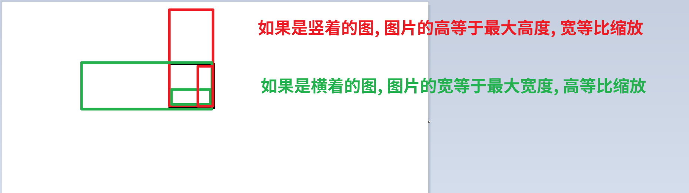

# 图片压缩

# 图片等比缩小的方法

​​

# 图片压缩的基本思路

压缩图片主要利用了`canvas`​的`toBlob`​方法, `toBlob`​方法可以将`canvas`​画布的画面转换成`Blob`​对象, 同时设置质量

‍

1. 获取`input`​数据, 使用`fileReader`​转换成dataUrl
2. 将`dataUrl`​的值赋给`image`​的`src`​
3. 将`image`​绘制进`canvas`​, 注意这里可以对图片尺寸进行控制
4. 使用`canvas.toBlob`​获取blob对象, 可以在其中设置压缩比例
5. 上传图片

# 完整代码

```ts
// 上传图片压缩的步骤
// 1. 获取input数据, 使用fileReader转换成dataUrl
// 2. 将dataUrl的值赋给image的src
// 3. 将image绘制进canvas
// 4. 使用canvas.toBlob获取blob对象, 可以在其中设置压缩比例
// 5. 上传图片

const fileToImg = (file: File): Promise<HTMLImageElement> => {
    return new Promise((resolve, reject) => {
        const reader = new FileReader();
        const img = new Image();
        // 将传进来的file转换成dataURl
        reader.readAsDataURL(file);
        reader.onload = () => {
            img.src = reader.result as string;
        };
        reader.onerror = (e) => {
            reject(e);
        };
        img.onload = () => {
            resolve(img);
        };
        img.onerror = (e) => {
            reject(e);
        };
    });
};

const imgToBlob = (
    img: HTMLImageElement,
    maxWidth: number,
    maxHeight: number,
    quality: number,
    type = "image/png",
): Promise<Blob> => {
    return new Promise((resolve, reject) => {
        const canvas = document.createElement("canvas");
        const ctx = canvas.getContext("2d");

        // 获取图片原始尺寸
        const { width: originWidth, height: originHeight } = img;
        // 确定目标尺寸
        let targetWidth = originWidth,
            targetHeight = originHeight;
        // 如果图片尺寸大于目标尺寸, 那么就进行等比缩放
        if (targetWidth > maxWidth || targetHeight > maxHeight) {
            // 等比缩小的算法
            // 如果是横着的图, 图片的宽等于最大宽度, 高等比缩放;
            // 如果是竖着的图, 图片的高等于最大高度, 宽等比缩放;
            // 先判断是横着的图还是竖着的图
            if (targetWidth > targetHeight) {
                //横着的
                targetWidth = maxWidth;
                targetHeight = targetHeight * (maxWidth / originWidth);
            } else {
                //竖着的
                targetHeight = maxHeight;
                targetWidth = targetWidth * (maxHeight / originHeight);
            }
        }
        try {
            // 把img绘制进canvas
            canvas.width = targetWidth;
            canvas.height = targetHeight;
            ctx?.clearRect(0, 0, targetWidth, targetHeight);
            ctx?.drawImage(img, 0, 0, targetWidth, targetHeight);
            // 获取blob对象
            canvas.toBlob(
                (blob) => {
                    if (blob) {
                        resolve(blob);
                    } else {
                        reject(new Error("转换失败"));
                    }
                },
                type,
                quality,
            );
        } catch (error) {
            reject(error);
        }
    });
};

const inp = document.querySelector("#input");
inp?.addEventListener("change", async (e) => {
    const inputEle = e.target as HTMLInputElement;
    if (inputEle.files?.length) {
        const img = await fileToImg(inputEle.files[0]);
        const blob = await imgToBlob(img, 1000, 1000, 0.2);
        console.log(blob);
    }
});
```

‍
