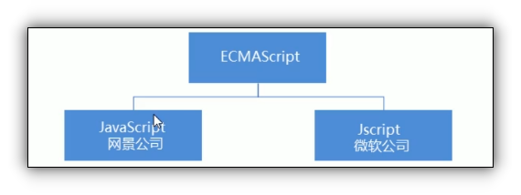

# JavaScript基础

## 目录

*   [JavaScript作用](#javascript作用)

*   [HTML / CSS / JavaScript 关系](#html--css--javascript-关系)

*   [JavaScript 的组成](#javascript-的组成)

# JavaScript作用

*   表单动态检验( 密码强度检测 ) \*\*\* js最初目的\*\*\*

*   网页特效

*   服务端开发 ( node.js )

*   桌面程序 ( Electron)

*   App ( Cordova )

*   控制硬件- 物联网 ( Ruff )

*   游戏开发 ( cocos2d-js )

# HTML / CSS / JavaScript 关系

&#x20;

*   [HTML](../HTML/HTML.md "HTML")决定网页结构和内容(决定看到什么) 相当于人的身体

*   [CSS](../CSS/CSS.md "CSS") 决定网页呈现给用户的模样, 决定好不好看&#x20;

*   JavaScript 实现业务逻辑和页面控制, 相当于人的各种动作

# JavaScript 的组成

*   ***ECMAScript***

    ECMAScript是由ECMA国际( 原欧洲计算机制造商协会 ) 进行标准化的一门编程语言, 这种语言再万维网上应用广泛, 他往往称为JavaScript或JScript, 但实际上后两者是ECMAScript语言的实现和拓展.

    

    ECMAScript:ECMAScript规定了JS的编程语法和基础核心知识, 是所有浏览器厂商共同遵守的一套JS语法工业标准

*   ***DOM: 文档对象模型***

    文档对象模型( Document Object Model , 简称DOM ) , 是W3C组织推荐的处理可拓展标记怨言的标准编程接口, 通过DOM提供的接口可以对页面上的各种元素进行操作 ( 大小 位置 颜色等).

*   ***BOM: 浏览器对象模型***

    BOM(Browser Object Model ,简称BOM) 是指浏览器对象模型, 它提供了若干独立于内容的, 可以与浏览器窗口进行互动的对象结构, 通过BOM可以操作浏览器窗口, 比如弹出框, 控制浏览器跳转, 获取分辨率等.

[技巧](技巧/技巧.md "技巧")

[执行过程](执行过程/执行过程.md "执行过程")

[书写位置](书写位置/书写位置.md "书写位置")

[注释](注释/注释.md "注释")

[输入输出语句](输入输出语句/输入输出语句.md "输入输出语句")

[变量](变量/变量.md "变量")

[数据类型](数据类型/数据类型.md "数据类型")

[堆和栈](堆和栈/堆和栈.md "堆和栈")

[标识符 关键字 保留字](<标识符 关键字 保留字/标识符 关键字 保留字.md> "标识符 关键字 保留字")

[表达式](表达式/表达式.md "表达式")

[返回值](返回值/返回值.md "返回值")

[运算符](运算符/运算符.md "运算符")

[流程控制](流程控制/流程控制.md "流程控制")

[命名规范](命名规范/命名规范.md "命名规范")

[数组](数组/数组.md "数组")

[函数](函数/函数.md "函数")

[作用域](作用域/作用域.md "作用域")

[预解析](预解析/预解析.md "预解析")

[对象](对象/对象.md "对象")

[es6](es6/es6.md "es6")
