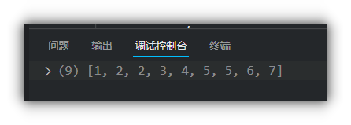

# Array 数组对象

## 目录

*   [创建数组对象的两种方式](#创建数组对象的两种方式)

*   [检测是否为数组](#检测是否为数组)

    *   [使用 instanceof  运算符](#使用-instanceof--运算符)

    *   [使用Array.isArray()方法](#使用arrayisarray方法)

*   [添加或删除数组元素](#添加或删除数组元素)

*   [数组排序](#数组排序)

    *   [reverse() 翻转数组](#reverse-翻转数组)

    *   [sort 数组排序](#sort-数组排序)

        *   [注意: ](#注意-)

        *   [比较函数](#比较函数)

*   [查找数组元素](#查找数组元素)

    *   [indexOf() ](#indexof-)

    *   [lastIndexOf()](#lastindexof)

    *   [注意:](#注意)

*   [数组转换为字符串](#数组转换为字符串)

    *   [toString()](#tostring)

    *   [join("分隔符")](#join分隔符)

*   [concat连接数组 ](#concat连接数组-)

*   [slice 截取数组](#slice-截取数组)

*   [splice 删除数组内部元素](#splice-删除数组内部元素)

# 创建数组对象的两种方式

利用数组字面量创建数组

利用new创建数组对象

# 检测是否为数组

## 使用 instanceof  运算符

&#x20;instanceof 可以判断原型是否处于原型链上

```javascript
        arr=[1,2,3];
        console.log(arr instanceof Array); //输出true
```

## 使用Array.isArray()方法

```javascript
        arr=[1,2,3];
        console.log(Array.isArray(arr)); //输出true
```

# 添加或删除数组元素

| 方法名                 | 说明              | 返回值        |
| ------------------- | --------------- | ---------- |
| push(参数1, 参数2...)   | 末尾添加一个或多个元素     | 返回新的长度     |
| pop()               | 删除数组末尾的元素       | 返回他删除的元素的值 |
| unshift(参数1,参数2...) | 向数组的开头添加一个或多个元素 | 返回新的长度     |
| shift()             | 删除数组开头的元素       | 返回删除的元素的值  |
| splice 删除数组内部元素     | 删除数组内部元素        |            |

```javascript
            //修改数组元素
            // 添加元素的两个方法 push unshift
            var arr = new Array();
            arr = [1, 2, 3, 4];
            console.log(arr);

            console.log(arr.push("red", "apple")); //返回数组长度
            console.log(arr);

            console.log(arr.unshift("a", "b")); //返回数组长度
            console.log(arr);

            // 删除元素的两个方法 pop shift

            console.log(arr.pop()); //返回删除的元素
            console.log(arr);

            console.log(arr.shift()); //返回删除的元素
            console.log(arr);
```


# 数组排序

## reverse() 翻转数组

```javascript
            var arr=[1,2,3,4,5];
            arr.reverse();
            console.log(arr);
```


## sort 数组排序

```javascript
            var arr = [2,1,5,4,3,7,5,6,2];
            arr.sort(compareFunction );
            console.log(arr);
```



### 注意:&#x20;

*   如果不给sort传入参数, 那么默认把数组元素转换为字符串后按照Unicode排序

*   如果想要按照数组数字大小排序, 那么需要传入一个比较函数

### 比较函数

```javascript
            var arr = [21,1,5,43,3,7,55,6,2];
            arr.sort(function(a,b){
                // return a-b; //升序
                return b-a; //降序

            });
            console.log(arr);
```

注意:&#x20;

*   如果没有指明`compareFunction` , 那么转换为字符串后按照Unicode排序

*   如果指明了 `compareFunction` ，那么数组会按照调用该函数的返回值排序。即 a 和 b 是两个将要被比较的元素：

*   如果 `compareFunction(a, b)` 小于 0 ，那么 a 会被排列到 b 之前；

*   如果 `compareFunction(a, b)` 大于 0 ， b 会被排列到 a 之前。

# 查找数组元素

## indexOf()&#x20;

在数组中查找给定元素的第一个索引

## lastIndexOf()

在数组中查找给定元素的最后一个索引

```javascript
            var arr = [1, 2, 3, 4, 5, 5, 6];
            console.log(arr.indexOf(5));
            console.log(arr.lastIndexOf(5));
```


## 注意:

*   如果查找不到, 那么返回-1

# 数组转换为字符串

## toString()

直接把数组转换为字符串, 没有参数, 以逗号分隔

## join("分隔符")

没有参数时以逗号分隔, 可以传入参数作为自定义分隔符&#x20;

```javascript
            var arr=["alpha", "beta", "charry"];
            console.log(arr.toString());
            console.log(arr.join());
            console.log(arr.join("-and-"));
```


# concat连接数组&#x20;

concat可以连接一个或多个数组

用法: 数组1 .concat(数组2,数组3.....)

```javascript
            var arr = ["alpha", "beta", "charry"];
            var arr1 = ["a", "b", "c"];
            var arr2= arr.concat(arr1);
            console.log(arr2);  //输出(6) ['alpha', 'beta', 'charry', 'a', 'b', 'c']
```

# slice 截取数组

用法: slice(开始下标,结束下标)

```javascript
            var arr=[1,2,3,4,5,6,7,8,9];
            var arr1=arr.slice(2,5);
            console.log(arr1); //输出(3) [3, 4, 5]
```

# splice 删除数组内部元素

用法 数组名.splice(开始删除的元素下标, 要删除几个)

```javascript
            var arr=[1,2,3,4,5,6,7,8,9];
            arr.splice(3,3);
            console.log(arr); //输出(6) [1, 2, 3, 7, 8, 9]
```
