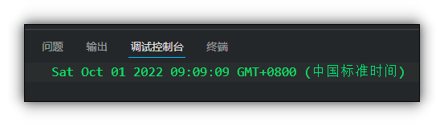

# Date 日期对象

## 目录

*   [Date对象的使用](#date对象的使用)

    *   [使用Data对象必须实例化](#使用data对象必须实例化)

    *   [无参数直接调用](#无参数直接调用)

    *   [初始化参数](#初始化参数)

        *   [数字型](#数字型)

        *   [字符串型](#字符串型)

*   [常用属性方法](#常用属性方法)

    *   [+new Date() 获取时间戳](#new-date-获取时间戳)

# Date对象的使用

## 使用Data对象必须实例化

`var data = new Data();`

## 无参数直接调用

```javascript
        var date = new Date();
        console.log(date);
```

没有参数直接调用, 返回当前系统的时间


## 初始化参数

### 数字型

`2022,10,01 年,月,日`

注意:

*   月份从0开始

```javascript
        var date1 = new Date(2022,10,1);
        console.log(date1); //输出Tue Nov 01 2022 00:00:00 GMT+0800 (中国标准时间) 
        //实际输出11月

```


### 字符串型

"2022-10-01 9:9:9"

```javascript
        var date2 = new Date("2022-10-01 9:9:9");
          console.log(date2); //输出Sat Oct 01 2022 09:09:09 GMT+0800 (中国标准时间)

```



# 常用属性方法

| 属性和方法               | 说明                   | 注意          |
| ------------------- | -------------------- | ----------- |
| getFullYear()       | 获取年份                 |             |
| getMonth()          | 获取月份                 | 从0开始        |
| getDay()            | 获取星期几                | 周日是0        |
| getDate()           | 获取当前的日期              |             |
| getHours()          | 获取当前小时               |             |
| getMinutes()        | 获取当前分钟               |             |
| getSeconds()        | 获取当前秒钟               |             |
| 以上这些get方法还有对应的set方法 | 设置时间                 |             |
| valueOf()           | 从1970-01-01到对象时间的毫秒数 |             |
| getTime()           | 从1970-01-01到对象时间的毫秒数 |             |
| Date.now()          | 从1970-01-01到当前的毫秒数   | 注意Date没有小括号 |
|                     |                      |             |

```javascript
        var date2 = new Date("2022-10-01 9:9:9");
        console.log(date2.getFullYear());
        console.log(date2.getMonth());
        console.log(date2.getDay());
        console.log(date2.getDate());
        console.log(date2.getHours());
        console.log(date2.getMinutes());
        console.log(date2.getSeconds());
```

## +new Date() 获取时间戳

`console.log(+new Date());` 也可使获取到对象时间的时间戳
