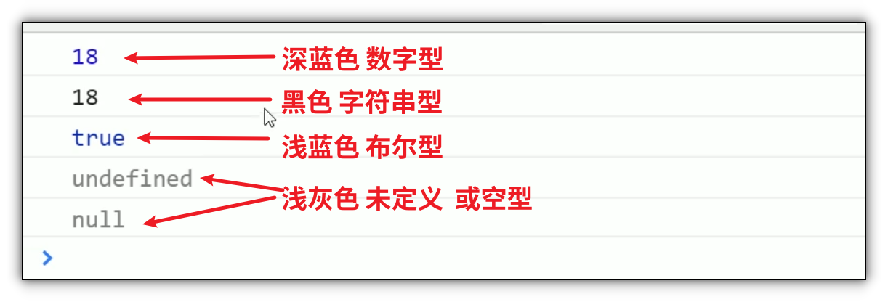

# 数据类型

## 目录

*   [数据类型的分类](#数据类型的分类)

*   [检测数据类型 typeof](#检测数据类型-typeof)

*   [Chrome控制台颜色判断数据类型](#chrome控制台颜色判断数据类型)

*   [数据类型转换](#数据类型转换)

    *   [转换成字符串型](#转换成字符串型)

        *   [toString()](#tostring)

        *   [String()](#string)

        *   [+拼接字符串](#拼接字符串)

    *   [转换为数字型](#转换为数字型)

        *   [parseInt(string)函数](#parseintstring函数)

        *   [parseFloat(string)函数](#parsefloatstring函数)

        *   [Number(string)函数](#numberstring函数)

        *   [js隐式转换 ( - / \*)](#js隐式转换-----)

    *   [转换为布尔型](#转换为布尔型)

*   [基本包装类型](#基本包装类型)

# 数据类型的分类

*   简单数据类型又叫做基本数据类型， 或者叫值类型(number string boolean undefined null)

    *   值类型： 在存储时变量存储的是值本身， 因此叫做值类型

*   复杂数据类型又叫做引用类型(object) [对象](../对象/对象.md "对象")

    *   在存储时变量中存储的仅仅是地址（引用）， 因此叫做引用数据类型

    *   通过new关键字创建的对象（系统对象， 自定义对象）， 如Object, Array, Date 等

# 检测数据类型 typeof

typeof 可以检测变量的数据类型

使用方法: typeof 变量 ;&#x20;

```javascript
age = 19;
typeof age; //number

str = prompt("请输入");
typeof str; //string
```

注意

*   prompt获取的数据类型是字符串型

    prompt(info) &#x20;

# Chrome控制台颜色判断数据类型



# 数据类型转换

## 转换成字符串型

### toString()

```javascript
            age=10;
            age=age.toString()
            console.log(age);
            console.log(typeof age);
```

### String()

```javascript
            age=10;
            age=String(age);
            console.log(age);
            console.log(typeof age);
```

### +拼接字符串

```javascript
            age=10;
            age=age+"";
            console.log(age);
            console.log(typeof age);
```

注意

*   toString() 和 String() 使用方法不一样

*   第三种方法更加常用, 我们称之为隐式转换

## 转换为数字型

### parseInt(string)函数

注意,:

*   parseInt会丢弃小数部分及末尾的非数字部分

```javascript
            str="123.123a";
            str=parseInt(str);
            console.log(str);
            console.log(typeof str);
```

### parseFloat(string)函数

注意,:

*   parseFloat会保留小数部分但是会丢弃末尾的非数字部分

```javascript
            str="123.123a";
            str=parseFloat(str);
            console.log(str);
            console.log(typeof str);
```

### Number(string)函数

注意:

*   number函数会保留小数部分,但是如果末尾有了非数字, 那么会输出NaN

```javascript
            str="123.123a";
            str=Number(str);
            console.log(str); //NaN
            console.log(typeof str); //number
```

### js隐式转换 ( - / \*)

通过- / \* 运算可以转换字符串为数字型, 但是要求字符串没有非数字

```javascript
            str="123.123";
            str=str-0;
            console.log(str);
            console.log(typeof str);
```

## 转换为布尔型

Boolean()函数

*   代表空, 否定的值会转换成false( 例如 "", 0 , NaN , null , undefined )

*   其余会被转换成true

# 基本包装类型

[数字型 number](<数字型 number/数字型 number.md> "数字型 number")

[字符串型 string](<字符串型 string/字符串型 string.md> "字符串型 string")

[布尔型 Boolean](<布尔型 Boolean/布尔型 Boolean.md> "布尔型 Boolean")

[未定义数据类型Undefined](未定义数据类型Undefined/未定义数据类型Undefined.md "未定义数据类型Undefined")

[空类型 null](<空类型 null/空类型 null.md> "空类型 null")
