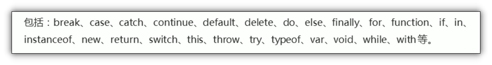
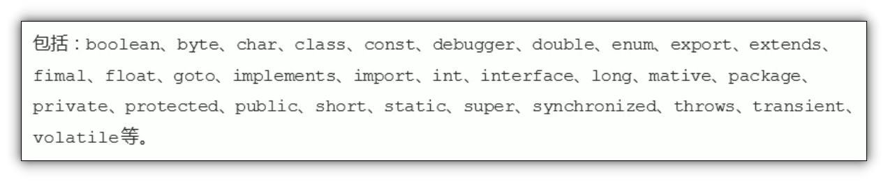

# 标识符 关键字 保留字

## 目录

*   [标识符](#标识符)

*   [关键字](#关键字)

*   [保留字](#保留字)

# 标识符

标识(zhi)符: 开发人员为变量, 属性, 函数, 参数取的名字

标识符不能是关键字或保留字

命名规范参见变量名(标识符)[命名规范](../命名规范/命名规范.md "命名规范")

# 关键字

关键字: js本身已经使用了的字, 不能再用他们充当变量名, 方法名

# 保留字

保留字 :保留字就是预留的关键字, 虽然现在还不是关键字, 但是未来可能成为关键字, 同样不能用他们来当变量名或方法名

