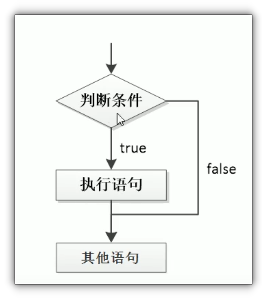
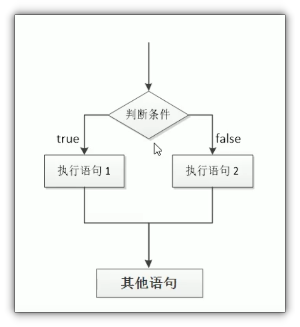
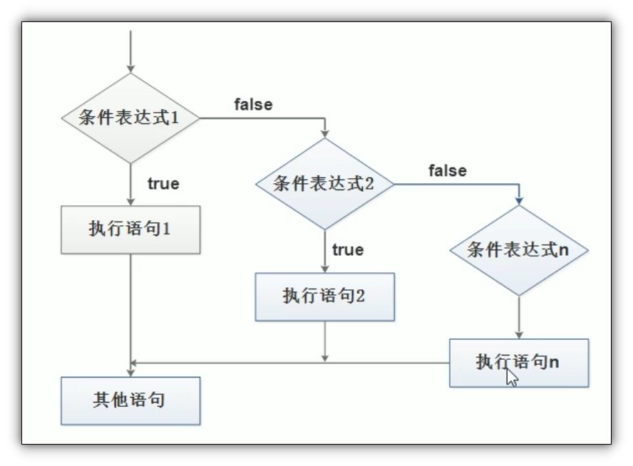

# if语句

## 目录

*   [语法结构](#语法结构)

    *   *   [if单分支语句 ](#if单分支语句-)

        *   [ if else 双分支语句](#-if-else-双分支语句)

    *   [if else if 多分支语句](#if-else-if-多分支语句)

# 语法结构

### if单分支语句&#x20;

```javascript
if(条件表达式){
  //do something
}
```

执行流程: 如果条件表达式为真, 执行if里面的语句, 如果为假, 那么执行if后面的语句



### &#x20;if else 双分支语句

```javascript
if(条件表达式){
  //do something 1
 }
 else {
  // do something 2
}

```

执行流程, 如果条件表达式为真, 那么执行语句1, 如果为假, 那么执行语句 2&#x20;



## if else if 多分支语句

```javascript
if(表达式1){
  //do something 1
}else if(表达式2){
  //do something 2
}else if{
...
}
```

执行过程: 先判断表达式1, 如果为真,那么执行语句1, 然后执行if后面的语句

如果为假, 判断表达式2 , .....&#x20;

注意:

*   if else if 最终只执行一个语句

*   else if 里面的条件理论上可以有任意多个


