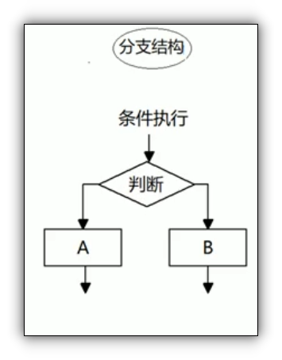

# 分支结构

由上到下执行的过程中, 根据不同的条件, 执行不同的路径代码, 从而得到不同的结果

JS提供了两种分支语句结构

*   [if语句](if语句/if语句.md "if语句")

*   [switch语句](switch语句/switch语句.md "switch语句")

也可使用三元表达式三元表达式来进行简单的条件选择, 由三元运算符组成的式子称为三元表达式

[if语句](if语句/if语句.md "if语句")

[switch语句](switch语句/switch语句.md "switch语句")
