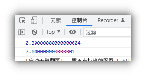

# 运算符

## 目录

*   [浮点数的精度问题](#浮点数的精度问题)

*   [表达式和返回值](#表达式和返回值)

*   [运算符优先级](#运算符优先级)

# 浮点数的精度问题

尽量不要用浮点数直接参与运算, 浮点数值的最高精度为17位,但在进行算数运算时精度远远不如整数

```javascript
console.log(0.1+0.2);
console.log(0.07*100);

```



**不要直接比较两个浮点数** `0.1+0.2 ≠ 0.3`

# 表达式和返回值

*   表达式: 是由数字, 运算符, 变量等的组合

*   返回值

# 运算符优先级

| 优先级 | 运算符   | 顺序                     |   |   |
| --- | ----- | ---------------------- | - | - |
| 1   | 小括号   | ( )                    |   |   |
| 2   | 一元运算符 | ++ — !                 |   |   |
| 3   | 算术运算符 | \*/+-                  |   |   |
| 4   | 关系运算符 | > , > = , < , < =      |   |   |
| 5   | 相等运算符 | == , ! = , === . ! = = |   |   |
| 6   | 逻辑运算符 | &&                     |   |   |
| 7   | 赋值运算符 | =                      |   |   |
| 8   | 逗号运算符 | ,                      |   |   |

*   一元运算符的逻辑非优先级很高

*   逻辑与比逻辑或优先级高

[算术运算符](算术运算符/算术运算符.md "算术运算符")

[递增递减运算符](递增递减运算符/递增递减运算符.md "递增递减运算符")

[比较运算符](比较运算符/比较运算符.md "比较运算符")

[逻辑运算符](逻辑运算符/逻辑运算符.md "逻辑运算符")

[赋值运算符](赋值运算符/赋值运算符.md "赋值运算符")

[其他运算符](其他运算符/其他运算符.md "其他运算符")
