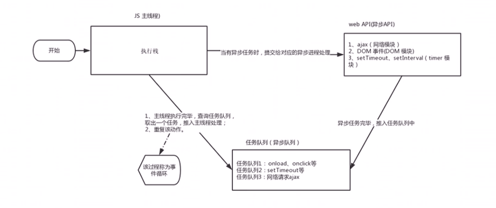

# JS执行队列

## 目录

*   [JS是单线程](#js是单线程)

*   [同步和异步](#同步和异步)

    *   [同步](#同步)

    *   [异步](#异步)

    *   [同步任务](#同步任务)

    *   [异步任务](#异步任务)

*   [JS执行机制](#js执行机制)

    *   [事件循环](#事件循环)

# JS是单线程

JavaScript语言的一大特点就是单线程, 也就是说, 同一时间只能做一件事, 这是因为JavaScript这门语言诞生的使命所致— JavaScript是为处理页面中用户的交互, 以及操作DOM而诞生的, 比如我们对某个DOM元素进行添加和删除操作, 不能同时进行, 应该先进行添加, 之后再删除&#x20;

单线程就意味着所有任务需要排队, 前一个任务结束, 才会执行后一个任务, 这样所导致的问题是: 如果JS执行的时间过长,这样会导致页面的渲染不连贯, 导致页面渲染阻塞的感觉

# 同步和异步

为了解决这个问题, 利用多核CPU的运算能力, HTML5提出web worker标准, 允许JavaScript脚本创建多个线程. 于是 JS中出现了同步和异步.

## 同步

前一个任务结束后才会执行后一个任务, 任务的执行顺序和任务的排列顺序是一致的,同步的

## 异步

在做某件耗费时间久的任务的同时去做另一个任务, 这就叫异步

他们的本质区别是: 这条流水线上各个流程的执行顺序不同

## 同步任务

同步任务都在主线程上执行. 形成了一个执行栈

## 异步任务

JS的异步是通过回调函数实现的

一般而言,异步任务有以下三种类型:

*   普通事件: 如click, resize等

*   资源加载: 如load, error等

*   定时器: 包括setInterval, setTimeout等

*   异步任务相关回调函数添加到任务队列中. (任务队列也成为消息队列)

# JS执行机制

1.  先执行执行栈中的同步任务

2.  异步任务(回调函数)放入任务队列中

3.  一旦执行栈中的所有同步任务执行完毕, 系统就会按次序读取任务队列中的异步任务, 于是被读取的异步任务结束等待状态, 进入执行栈, 开始执行

## 事件循环

由于主线程不断地重复获得任务, 执行任务, 再获得任务, 再执行,, 所以这种过程称为事件循环 (event loop)
