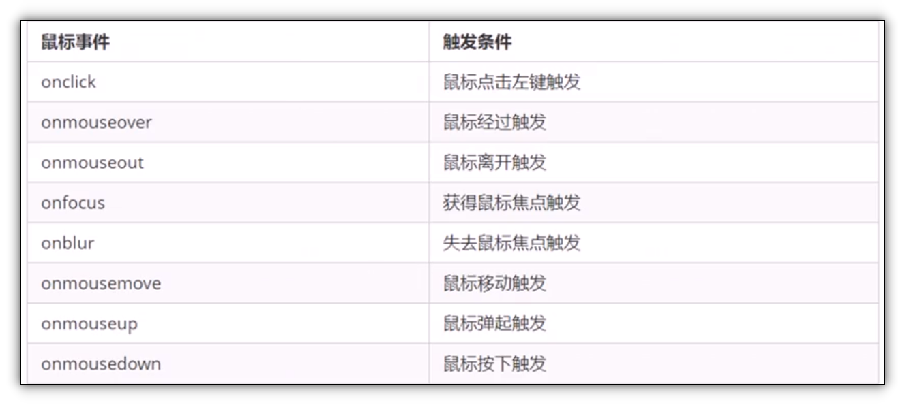

# 常见事件

## 目录

*   [常见的鼠标事件](#常见的鼠标事件)

    *   [mouseover和mouseenter的区别](#mouseover和mouseenter的区别)

*   [常见的键盘事件](#常见的键盘事件)

*   [禁止右键菜单](#禁止右键菜单)

*   [禁止选中](#禁止选中)

*   [滚动事件 scroll](#滚动事件-scroll)

*   [元素过度结束事件 transitionend](#元素过度结束事件-transitionend)

# 常见的鼠标事件



*   鼠标点击 onclick

*   获得焦点 onfocus

*   失去焦点onblur

*   鼠标进入 onmouseover

*   鼠标进入 (不冒泡) mouseenter

*   鼠标退出 onmouseout

*   鼠标退出(不冒泡) mouseleave

*   右键菜单 contxmenu

*   选中 selectstart

*   鼠标移动 mousemove

*   鼠标按下 mousedown

*   鼠标弹起 mouseup

*

## mouseover和mouseenter的区别

*   两者当鼠标移动到元素上方时都会触发事件

*   `mouseover`经过父盒子会触发,经过子盒子还会触发. 而`mouseenter`经过子盒子不会触发

*   之所以这样, 因为`mouseenter`不会冒泡

*   和`mouseenter`搭配的还有`mouseleave`也不会冒泡

# 常见的键盘事件

| 事件名        | 含义                            |
| ---------- | ----------------------------- |
| onkeyup    | 按键弹起触发                        |
| onkeydown  | 按键按下触发                        |
| onkeypress | 按键按下触发 但是功能键不触发, 比如ctrl shift |

注意:

*   `onkeydown`和`onkeypress`按下按键时会一直触发

*   三个时间的执行顺序: `keydown` → `keypress` → `keyup`

*   `onkeydown`和`onkeyup`不区分大小写, `onkeypress`区分大小写

# 禁止右键菜单

利用`contexmenu` 事件

```javascript
        document.addEventListener("contextmenu",function(e){ //组织右键菜单
            e.preventDefault();
        })
```

# 禁止选中

利用`selectstart`事件

```javascript
        document.addEventListener("selectstart",function(e){
            e.preventDefault();
        })
```

# 滚动事件 scroll

在滚动条滚动时, 会触发`scroll`事件

# 元素过度结束事件 transitionend

元素过渡结束时触发
