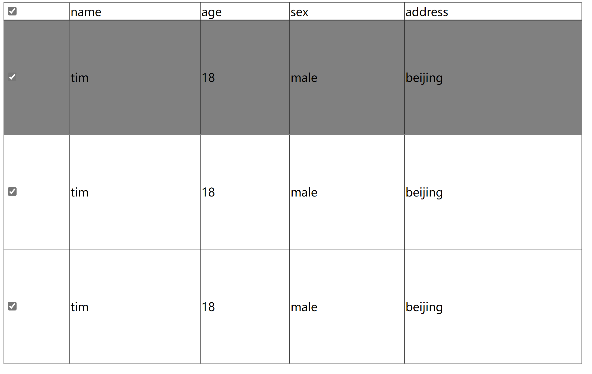

# 表格复选框控制全选

## 目录

*   [](#)

#



效果：&#x20;

*   如果点击表头的复选框， 那么每一行的都会跟随选中，

*   如果下面的每一行都选中了，那么总的复选框就会自动选中，如果有一个没有选中，那么总的复选框就不会选中

思路：

*   分为两个部分：总的复选框控制， 还有每一行的复选框控制

    *   总复选框控制： 设置一个点击事件，如果被选中就循环设置每行的复选框为选中或非选中

    *   每一行的控制： 给每一行的复选框设置一个点击事件， 每次点击就循环遍历每一行的复选框选中状态， 如果都为选中状态就改变总的复选框，如果有一个不是选中状态就取消总的选中状态

    ```javascript
    <!DOCTYPE html>
    <html lang="en">
        <head>
            <meta charset="UTF-8" />
            <meta http-equiv="X-UA-Compatible" content="IE=edge" />
            <meta name="viewport" content="width=device-width, initial-scale=1.0" />
            <title>Document</title>
            <style>
                table {
                    border-collapse: collapse;
                    width: 800px;
                    height: 500px;
                }
            </style>
        </head>
        <body>
            <table border="">
                <thead>
                    <tr>
                        <td><input type="checkbox" name="" id="chk_all" /></td>
                        <td>name</td>
                        <td>age</td>
                        <td>sex</td>
                        <td>address</td>
                    </tr>
                </thead>
                <tbody>
                    <tr>
                        <td><input type="checkbox" name="" id="chk" /></td>
                        <td>tim</td>
                        <td>18</td>
                        <td>male</td>
                        <td>beijing</td>
                    </tr>
                    <tr>
                        <td><input type="checkbox" name="" id="chk" /></td>
                        <td>tim</td>
                        <td>18</td>
                        <td>male</td>
                        <td>beijing</td>
                    </tr>
                    <tr>
                        <td><input type="checkbox" name="" id="chk" /></td>
                        <td>tim</td>
                        <td>18</td>
                        <td>male</td>
                        <td>beijing</td>
                    </tr>
                </tbody>
            </table>

            <script>
                var trs = document.querySelector("tbody").querySelectorAll("tr");
                // 添加底色逻辑
                for (var i = 0; i < trs.length; i++) {
                    trs[i].onmouseover = function () {
                        for (var j = 0; j < trs.length; j++) {
                            trs[j].style.backgroundColor = "";
                        }
                        this.style.backgroundColor = "gray";
                    };
                }
                // 复选框逻辑
                var chk_all = document.querySelector("#chk_all");
                var chks = document.querySelectorAll("#chk");
                //总的复选框逻辑
                chk_all.onclick = function () {
                    if (chk_all.checked == true) {
                        for (var i = 0; i < chks.length; i++) {
                            chks[i].checked = true;
                        }
                    } else {
                        for (var i = 0; i < chks.length; i++) {
                            chks[i].checked = false;
                        }
                    }
                };
                // 每一行的复选框逻辑
                for (var i = 0; i < chks.length; i++) {
                    chks[i].onclick = function () {
                        var chk_flag = true;
                        // 计算有多少个选中的
                        for (var j = 0; j < chks.length; j++) {
                            if (chks[j].checked == false) {
                                chk_flag = false;
                                break;
                            }
                        }
                        if (chk_flag) {
                            //如果选中的和所有的行数相等, 就是全部选中了 那么更改全选的复选框
                            chk_all.checked = true;
                        } else {
                            chk_all.checked = false;
                        }
                    };
                }
            </script>
        </body>
    </html>

    ```
