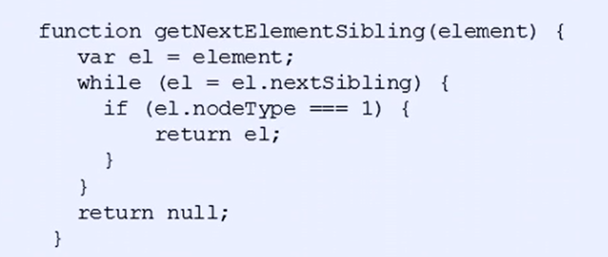

# 节点操作

## 目录

*   [为什么要使用节点操作](#为什么要使用节点操作)

*   [节点概述](#节点概述)

*   [获取节点](#获取节点)

    *   [父级节点](#父级节点)

    *   [子节点](#子节点)

        *   [所有节点](#所有节点)

        *   [元素节点](#元素节点)

    *   [兄弟节点](#兄弟节点)

        *   [所有节点](#所有节点-1)

        *   [元素节点](#元素节点-1)

*   [新增节点](#新增节点)

    *   [创建节点](#创建节点)

    *   [添加节点](#添加节点)

        *   [在父节点的子节点最后添加节点](#在父节点的子节点最后添加节点)

        *   [在父节点的指定子节点的前面添加节点](#在父节点的指定子节点的前面添加节点)

    *   [document.write()](#documentwrite)

*   [删除节点](#删除节点)

*   [复制节点 (克隆节点)](#复制节点-克隆节点)

*   [三种动态创建元素区别](#三种动态创建元素区别)

# 为什么要使用节点操作

获取元素主要有两种形式

利用dom提供的方法获取元素

*   document.getElementById()

*   document.querySelector()

*   等等

逻辑性不强， 繁琐

利用节点层级关系获取元素

*   利用父子兄关系获取元素

*   逻辑性强， 但是兼容性稍差

*   节点操作更加简单

# 节点概述

网页中的所有内容都是节点( 标签, 属性 ,文本, 注释等), DOM中用node表示

HTML DOM树中的所有节点均可通过JavaScript进行访问，所有HTML元素（节点）均可被创建，修改或删除


一般的， 节点至少拥有nodeType（节点类型），nodeName（节点名称），nodeValue（节点值）这三个基本属性

*   元素节点的nodeType为1

*   属性节点的nodeType为2

*   文字节点的nodeType为3，（文字节点包括文字，空格，换行）

实际开发中，节点操作主要操作的是元素节点

# 获取节点

利用DOM树可以把节点划分为不同的层级关系， 常见的是父子兄层级关系

## 父级节点

`node.parentNode`

*   parentNode属性可返回某节点的父节点，`注意是最近的父节点`

*   如果指定的节点没有父节点那么返回`null`

## 子节点

### 所有节点

`parentNode.childNode` (标准) 返回所有子节点

*   childNode返回包含指定节点的子节点的集合,该集合为即时更新的集合

*   返回值里面包含了所有的节点, 包括元素节点, 文本节点等,如果要获取里面的元素节点, 需要专门处理, 所以一般不推荐使用childNode

`parent.firstChild` 返回第一个子节点,如果找不到就返回null, 包括所有类型的节点

`parent.lastChild` 返回最后一个子节点,如果找不到就返回null, 包括所有类型的节点

### 元素节点

`parentNode.children` (非标准) 返回所有子元素节点

*   children是一个只读属性, 返回所有的子元素节点,其余节点不返回

*   虽然children是非标准, 但是得到了各个浏览器的支持, 所以可以放心使用

`parent.firstElementChild` 返回第一个子元素节点,如果找不到就返回null, 只返回元素节点

`parent.lastElementChild` 返回最后一个子元素节点,如果找不到就返回null, 只返回元素节点

*   `firstElementChild` /`lastElementChild` 有兼容性问题, ie9以上支持

`firstChild` 不能返回子元素节点,`firstElementChild` 有兼容性问题, 所以在实际开发中, 一般使用如下方法

```javascript
            var ol = document.querySelector("ol");
            console.log(ol.children[0]);
            console.log(ol.children[ol.children.length - 1]);
```

## 兄弟节点

### 所有节点

`element.nextSibling` 返回当前元素的下一个兄弟节点, 包括所有节点, 如果找不到就放回null&#x20;

`element.previousSibling` 返回当前元素的前一个兄弟节点, 同样包括所有节点, 如果找不到就返回null

&#x20;

### 元素节点

`element.nextElementSibling` 返回当前元素的下一个兄弟元素节点, 如果找不到返回null

`element.previousElementSibling` 返回当前元素的上一个兄弟元素节点, 如果找不到返回null

*   以上两个方法有兼容性问题, ie9以上才支持

如果想避免兼容性问题,需要自己封装一个函数



# 新增节点

新增节点的步骤如下:

1.  创建节点

2.  添加节点

注意:

*   新增节点需要先创建再添加

*   一个被创建的节点只能被添加一次

## 创建节点

语法:

`document.creatElement("tagName")`

`creatElement`可以动态创建由tagName指定的HTML元素

## 添加节点

### 在父节点的子节点最后添加节点

`node.appendChild(要添加的节点)`

### 在父节点的指定子节点的前面添加节点

`node.insertBefore(要添加的节点,指定子节点)`

## document.write()

直接将内容写入文档的内容流, 当文档执行完毕, 执行它会导致页面全部重绘

# 删除节点

语法:

`node.removeChild(要删除的节点)`

`removeChild`方法从DOM中删除一个子节点, 返回删除的节点

# 复制节点 (克隆节点)

语法:

`node.cloneNode()`

`cloneNode`返回调用该方法的节点的一个副本, 也称为克隆节点, 拷贝节点

注意:

*   如果`cloneNode`参数为空或false, 则为浅拷贝,只复制节点本身, 不复制里面的子节点

*   如果`cloneNode`参数为空或true, 则为深拷贝,复制节点及里面的子节点

# 三种动态创建元素区别

*   document.white()

*   element.innerHTML

*   document.creatElement

区别:

1.  直接将内容写入文档的内容流, 当文档执行完毕, 执行它会导致页面全部重绘

2.  innerHTMl直接将内容写入DOM节点, 不会导致页面重绘

3.  innerHTML创建多个元素效率更高, 前提是不使用拼接字符串, 使用数组方式, 但是结构略显复杂

4.  creatElement创建多个元素效率略低, 但是结构更加清晰

总结: 不同浏览器下, innerHTML效率比creatElement效率高
