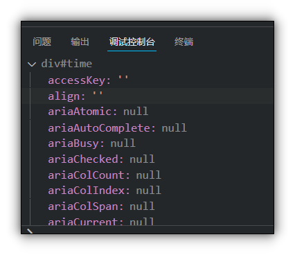
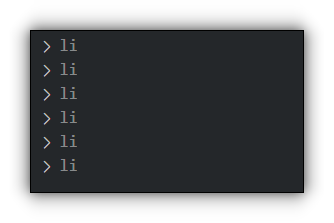
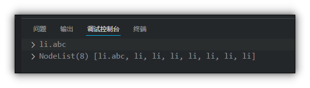
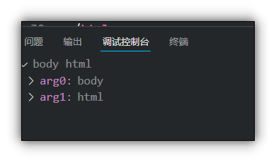

# 获取元素

## 目录

*   *   [通过ID获取 getElementById](#通过id获取-getelementbyid)

        *   [参数](#参数)

        *   [返回值](#返回值)

    *   [根据标签名获取getElementsByTagName](#根据标签名获取getelementsbytagname)

        *   [参数](#参数-1)

        *   [返回值](#返回值-1)

*   [HTML5新增的方法](#html5新增的方法)

    *   [通过类名获取元素getElementsByClassName](#通过类名获取元素getelementsbyclassname)

        *   [参数](#参数-2)

        *   [返回值](#返回值-2)

    *   [通过选择器选择第一个元素](#通过选择器选择第一个元素)

        *   [参数](#参数-3)

        *   [返回值](#返回值-3)

    *   [通过选择器选择所有符合条件的元素](#通过选择器选择所有符合条件的元素)

        *   [参数](#参数-4)

        *   [返回值](#返回值-4)

*   [获取body和html元素](#获取body和html元素)

*   [获取父元素内部的子元素](#获取父元素内部的子元素)

*   [打印元素对象的属性和方法](#打印元素对象的属性和方法)

## 通过ID获取 getElementById

使用`getElementById()`方法可以获取带有id的元素对象

### 参数

`getElementById()`的参数是大小写敏感的字符串

### 返回值

返回一个元素对象

```javascript
    <div id="time">2022/5/1 14:44</div>
    <script>
        var time = document.getElementById("time");
        console.dir(time);
    </script>
```



## 根据标签名获取getElementsByTagName

使用`getElementsByTagName()`方法可以返回带有指定标签名的对象的集合

### 参数

标签名的字符串

### 返回值

返回带有指定标签名的元素对象的集合, 以伪数组的形式存储

```javascript
            var lis = document.getElementsByTagName("li");
            for (var i = 0; i < lis.length; i++) {
                console.log(lis[i]);
            }
```



注意:

*   因为得到的是元素的集合, 所以想要操作里面的元素就要遍历

*   得到元素对象是动态的

*   如果只有一个符合要求的元素, 那么返回的还是数组

*   如果页面中没有这个元素, 那么返回一个空的伪数组

# HTML5新增的方法

## 通过类名获取元素getElementsByClassName

`document.getElementsByClassName()`&#x20;

### 参数

字符串的类名

### 返回值

符合条件的指定元素集合

## 通过选择器选择第一个元素

`document.querySelector()`

### 参数

参考css的[选择器](../../../CSS/选择器/选择器.md "选择器")

### 返回值

符合选择器条件的第一个元素

## 通过选择器选择所有符合条件的元素

`document.querySelectorAll ()`

### 参数

参考css的[选择器](../../../CSS/选择器/选择器.md "选择器")

### 返回值

所有符合选择器条件的元素集合

```javascript
<div id="time">2022/5/1 14:44</div>
        <ul id="ul">
            <li class="abc">1</li>
            <li>2</li>
            <li>3</li>
            <li>4</li>
            <li>5</li>
        </ul>
        <li>123</li>
        <li>123</li>
        <li>123</li>
        <script>
            var a=document.querySelector(".abc")
            var b= document.querySelectorAll("li")
            console.log(a);
            console.log(b);
```

输出



# 获取body和html元素

使用`document.body`和`document.documentElement` 可以获取body和html元素

```javascript
            var bodyEle = document.body;
            var htmlELe = document.documentElement;
            console.log(bodyEle,htmlELe);
```



***

# 获取父元素内部的子元素

注意: 必须指定父元素, 不能用集合

```javascript
ul id="ul">
            <li>1</li>
            <li>2</li>
            <li>3</li>
            <li>4</li>
            <li>5</li>
        </ul>
        <li>123</li>
        <li>123</li>
        <li>123</li>
        <script>
            var ul = document.getElementById("ul")
            var lis = ul.getElementsByTagName("li");
            for (var i = 0; i < lis.length; i++) {
                console.log(lis[i]);
            }
```

# 打印元素对象的属性和方法

可以使用console.dir(对象)方法
