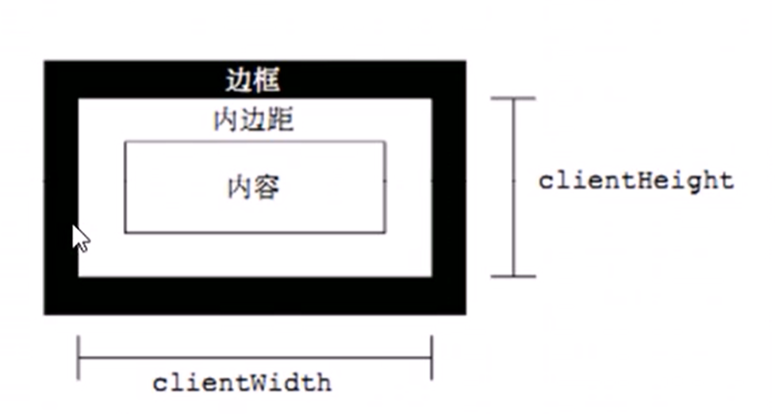

# 元素可视区 client系列属性

## 目录

*   [client概述](#client概述)

# client概述

通过client相关属性可以获得元素可视区的相关信息,  可以动态的获得元素的边框大小, 元素大小等

| client系列属性     | 说明                                  |
| -------------- | ----------------------------------- |
| e.clientTop    | 返回元素上边框的大小                          |
| e.clientLeft   | 返回元素左边框的大小                          |
| e.clientWidth  | 返回元素padding content区域的宽度, 不包括border |
| e.clientHeight | 返回元素padding content区域的高度, 不包括border |

注意:

*   `client`属性都不带单位

*   `clientWidth`和`clientHeight`得到的是不包括边框的大小, 包括padding和`content`, 设置`box-sizing`后, 则为设置的`width/height`减去`border`的大小
