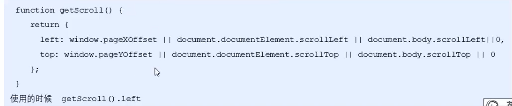

# 元素滚动scroll系列

## 目录

*   [滚动事件 scroll](#滚动事件-scroll)

*   [获取页面被卷去的部分](#获取页面被卷去的部分)

    *   [兼容性](#兼容性)

# 滚动事件 scroll

# 获取页面被卷去的部分

可以使用`document.documentElement.scrollTop/Left `

或者 `window.scrollX/scrollY` 来获取页面被卷去的部分

页面被卷去的部分scrollX scrollY

`document.documentElement.scrollTop window.scrollY window.pageYOffset `三者等价

## 兼容性

声明了doctype : 使用`document.documentElement.scrollTop/Left `

如果没有声明doctype 使用`document.body.scrollTop/Left `

新方法: `scrollX, scroolY`

兼容性函数:

