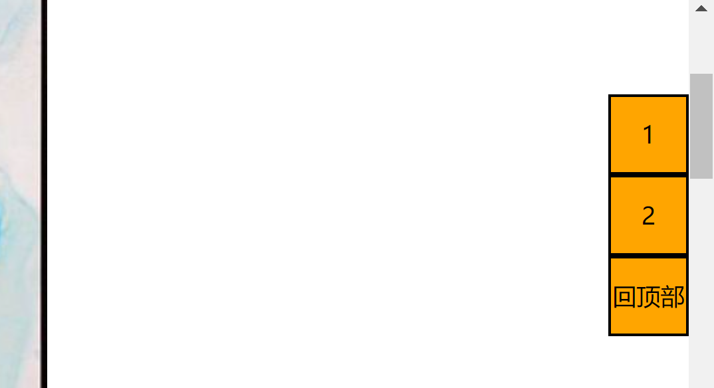

# 淘宝侧边栏效果



效果:  刚开始滚动时, 侧边栏随着页面一起滚动, 当到达一定阈值, 侧边栏变成固定定位, 显示回到顶部按钮

思路: 用window\.scrollY获取页面滚动的长度, 当到达一定阈值, 修改侧边栏的定位方式并且显示回到顶部按钮

代码:

```javascript
<!DOCTYPE html>
<html lang="en">
    <head>
        <meta charset="UTF-8" />
        <meta http-equiv="X-UA-Compatible" content="IE=edge" />
        <meta name="viewport" content="width=device-width, initial-scale=1.0" />
        <title>Document</title>
        <style>
            .aside {
                position: absolute;
                top: 300px;
                right: 0;
            }
            .aside ul {
                list-style: none;
            }
            .aside li {
                width: 50px;
                height: 50px;
                background-color: orange;
                border: black solid 2px;
                text-align: center;
                line-height: 50px;
            }
        </style>
    </head>
    <body>
        <div class="content">
            
            
            
            
            
            
            
        </div>
        <div class="aside">
            <ul>
                <li>1</li>
                <li>2</li>
                <li class="feedback">反馈</li>
                <li class="back2top">回顶部</li>
            </ul>
        </div>
        <script>
            /** @type{HTMLElement} */
            var asidebar = document.querySelector(".aside");
            /** @type{HTMLElement} */
            var feedback = document.querySelector(".feedback");
            /** @type{HTMLElement} */
            var back2top = document.querySelector(".back2top");

            back2top.style.display="none"
            document.addEventListener("scroll", function (e) {
                // var scroll_top = document.documentElement.scrollTop;
                var scroll_top = window.pageYOffset;

                console.log(document.documentElement.scrollTop);
                console.log(window.pageYOffset);
                console.log(window.scrollY);
                if (scroll_top > 250) {
                    console.log("设置为固定定位");
                    asidebar.style.position = "fixed";
                    asidebar.style.top = 50 + "px";
                    asidebar.style.right = 0 + "px";
                    // 显示回到顶部按钮
                    feedback.style.display="none"
                    back2top.style.display="block"
                } else {
                    // 设置回固定定位
                    asidebar.style.position = "absolute";
                    asidebar.style.top = 300 + "px";
                    asidebar.style.right = 0 + "px";
                    // 隐蔽回到顶部按钮
                    feedback.style.display="block"
                    back2top.style.display="none"
                }
            });
            back2top.addEventListener("click",function () {
                window.scrollTo(0,0)
            })
        </script>
    </body>
</html>


```
