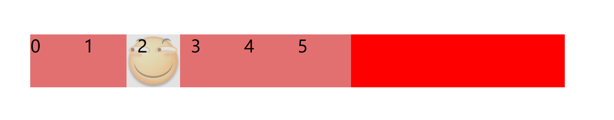

# 筋斗云效果



效果:

*   鼠标经过某个li, 图片跟随到这个li所在的位置

*   鼠标离开, 图片回到默认位置

*   点击某个li, 图片默认位置就更改到此位置

思路:&#x20;

*   设置一个全局变量base, 作为默认位置, 鼠标点击就更改这个base, 给li添加自定义属性来获取点击了哪个li

*   鼠标进入某个li , 就根据li的index计算出来移动距离, (移动距离=index\*width)调用动画函数即可

*   鼠标退出li, 就根据base回到默认位置 (distance=base\*width)

```javascript
<!DOCTYPE html>
<html lang="en">
    <head>
        <meta charset="UTF-8" />
        <meta http-equiv="X-UA-Compatible" content="IE=edge" />
        <meta name="viewport" content="width=device-width, initial-scale=1.0" />
        <title>筋斗云</title>
        <style>
            * {
                list-style: none;
                margin: 0;
                padding: 0;
            }
            ul {
                position: relative;
                background-color: red;
                width: 500px;
                margin: 100px auto;
                display: flex;
            }
            ul img {
                position: absolute;
                width: 50px;
                height: 50px;
            }
            ul li {
                z-index: 99;
                cursor: pointer;
                width: 50px;
                height: 50px;
                background-color: rgba(204, 204, 204, 0.549);
            }
            ul li.current {
                background-image: url(./img/funny.jpg);
                background-size: contain;
            }
        </style>
    </head>
    <body>
        <ul>
            
            <li>0</li>
            <li>1</li>
            <li>2</li>
            <li>3</li>
            <li>4</li>
            <li>5</li>
        </ul>
        <!-- 引入动画函数 -->
        <script>
            //获取所有li
            var lis = document.querySelectorAll("li");
            var img = document.querySelector("img");
            var base = 0; //图片默认位置
            //给li添加自定义属性index并绑定事件
            for (var i = 0; i < lis.length; i++) {
                lis[i].setAttribute("index", i);
                //鼠标进入li, 更改li的位置
                lis[i].addEventListener("mouseenter", function () {
                    console.log(this.getAttribute("index"));
                    //控制图片移动
                    var index = this.getAttribute("index");
                    var distance = index * 50;
                    animate(img, distance);
                });
                //鼠标退出li, 回到默认位置
                lis[i].addEventListener("mouseleave", function () {
                    var distance = base * 50;
                    animate(img, distance);
                });
                //点击, 更改初始位置base
                lis[i].addEventListener("click", function () {
                    base = this.getAttribute("index");
                });
            }
            /**
             *
             * @param {HTMLElement} obj
             * @param {HTMLElement} target
             */

            function animate(obj, target, callback) {
                clearInterval(obj.timer);
                obj.timer = setInterval(move, 15);
                function move() {
                    var box_x = obj.offsetLeft; //获取现在的位置
                    var step = (target - box_x) / 10; //计算步长
                    step = step > 0 ? Math.ceil(step) : Math.floor(step); //步长取整
                    obj.style.left = box_x + step + "px"; //进行移动
                    //到达位置取消定时器
                    if (box_x == target) {
                        clearInterval(obj.timer);
                        callback && callback();
                    }
                }
            }
        </script>
    </body>
</html>

```
