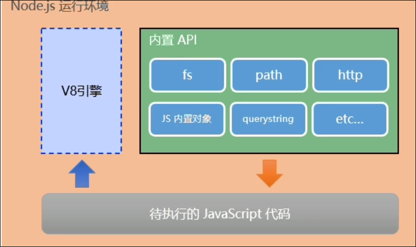

# Node.js

# 什么是Node.js

Node.js是一个基于Chrome V8引擎的javascript运行环境

# Node.js中的JS运行环境

​

注意: 

* 浏览器是JS的前端运行环境
* Node.js是JS的后端运行环境
* Node.js中无法调用DOM和BOM等浏览器内置api

# Node.js可以做什么

Node.js作为一个JS的运行环境, 仅仅是提供了基础的功能和api

* Express框架, 快速构建Web应用
* Electron框架, 可以创建跨平台的桌面应用
* restify, 快速创建api接口

‍
