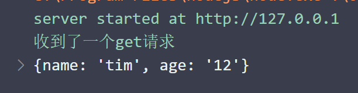

# Express的基本使用

# Express的基本使用

## 监听Get请求

通过`server.get()`方法, 可以监听客户端的Get请求, 语法格式如下

```js
server.get("/", function (req, res) {
    // 处理函数
    console.log("收到了一个get请求");
});
```

`get`方法的参数: 

* `url ​`: 需要处理的url
* `req ​`: 请求对象, 包含了需要处理请求所需要的属性和方法
* `res ​`: 响应对象, 包含了处理响应包含的属性和方法

## 监听post请求

通过`server.post()`方法, 可以监听客户端的post请求, 语法格式如下

```js
// 监听post请求
server.post("/", function (req, res) {
    // 处理函数
    console.log("收到了一个post请求");
});
```

`post`方法的参数:

* `url ​`: 需要处理的url
* `req ​`: 请求对象, 包含了需要处理请求所需要的属性和方法
* `res ​`: 响应对象, 包含了处理响应包含的属性和方法

‍

## 把内容响应给客户端

通过res.sned()方法, 可以把处理好的内容, 发送给客户端

`res.send("post请求成功");`

‍

## 获取URl中携带的查询参数

通过`req.query`对象, 可以以==对象形式==获取客户端提交的查询字符串

```js
server.get("/", function (req, res) {
    // 处理函数
    console.log("收到了一个get请求");
    console.log(req.query);

    res.send("get 请求成功);
});
```

访问 `http://127.0.0.1/?name=tim&age=12` , 控制台输出:

​

## 获取URL中的动态参数 params

可以通过`req.params`对象, 访问的`URl`中,通过`:`匹配到的动态参数

‍

```js
server.get("/user/:id", function (req, res) {
    res.send(req.params);
});
```

当访问`/user/123`时, 可以得到`{"id":"123"}`的对象

‍

动态参数也可以写多个,

```js
server.get("/user/:id/:name", function (req, res) {
    res.send(req.params);
});
```

当访问`/user/123/tim` 时, 可以得到

```js
{"id":"123","name":"tim"}
```

## 托管静态资源

### express.static()

`express`提供了一个`express.static()`函数, 通过他, 可以非常方便地创建一个静态资源服务器, 

```js
server.use(express.static("public"));
```

现在可以访问`public`目录下的所有文件了

### 托管多个静态目录

只需要多次执行`express.static()`函数即可

注意: 

* 会按照目录的添加顺序查找文件

‍

### 挂载路径前缀

如果希望在路径之前, 挂载路径前缀, 需要使用如下方法

```js
server.use("/public", express.static(path.join(__dirname, "public")));
```

在use函数前面, 添加一个字符串作为前缀即可, 这样访问的是脏前面必须加上public 才能访问静态资源`http://127.0.0.1/public/img.jpg`

‍
