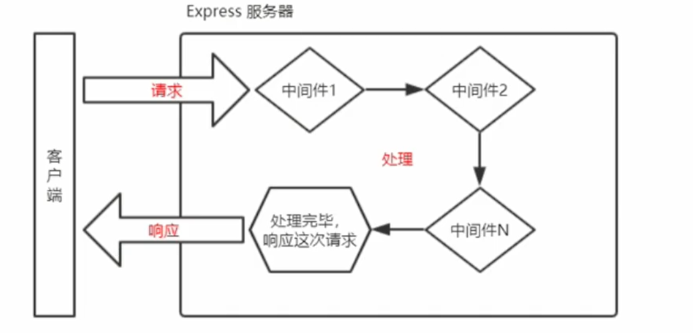
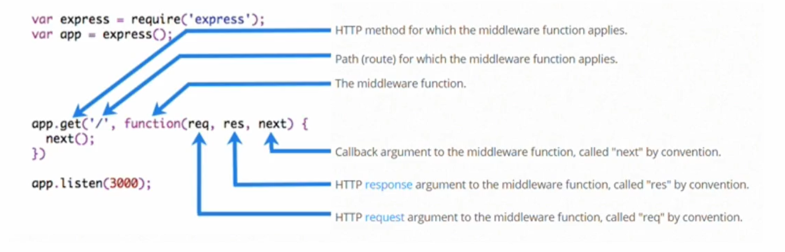
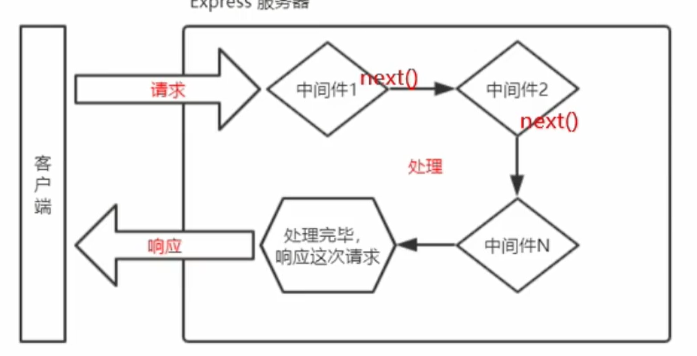
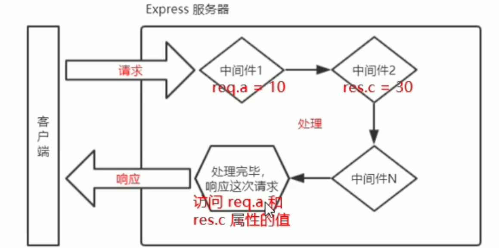

# 中间件

中间件(Middleware), 特指业务流程中的中间处理环节

# Express 中间件的调用流程

当一个请求到达 Express 的服务器之后, 可以连续调用多个中间件, 从而对这次请求进行预处理

​

# Express 中间件的格式

Express 的中间件, 本质上是一个 `function` 处理函数, Express 中间件的格式如下

​

注意:

* 中间件函数的形参列表中, 必须包含 `next` 参数, 而路由处理函数中只包含 `req` 和 `res`

# next 函数的作用

next 函数时实现多个中间件连续调用的关键, 他表示把流转关系转交给下一个中间件或路由​

# 定义中间件函数

可以通过如下方法, 定义中间件

‍

```js
const mw = function (req, res, next) {
    console.log("中间件处理中");
    next();
};
```

‍

# 定义全局中间件

客户端发起的任何请求, 到达服务器之后, 都会触发的中间件, 叫做全局生效的中间件

通过调用 app.use(中间件函数), 即可调用一个==全局生效==的中间件

‍

```js
const mw = function (req, res, next) {
    console.log("中间件处理中");
    next();
};

server.use(mw);
```

# 定义全局中间件的简化形式

可以直接将中间件函数放在 `use` 函数里面

```js
server.use(function (req, res, next) {
    console.log("中间件2");
    next();
});
```

‍

# 中间件的作用

==多个中间件之间, 共享同一 req 和 res==, 基于这样的特性, 我们可以在上游的中间件中, 统一为 `req` 和 `res` 添加属性和方法, 供下游的中间件或路由使用

​

‍

# 定义多个全局中间件

可以使用 app.use() 连续定义多个全局中间件, 客户端请求到达服务器之后, ==会按照中间件定义的先后顺序依次进行调用==

‍

‍

‍

# 定义局部中间件

不使用 app.use()定义的中间件, 叫做局部生效的中间件,

需要在路由中指定中间件

```js
const mw = function (req, res, next) {
    console.log("中间件执行中");
    next();
};

router.get("/", mw, function (req, res) {
    console.log("收到了get请求");
    res.send("get");
});
```

第二个参数即为中间件

# 定义多个全局中间件

可以在路由中, 通过如下两种等价的方式, 使用多个全局中间件

```js
router.get("/",mw1,mw2,(req,res)=>{res.send("hello get")})
router.get("/",[mw1,mw2],(req,res)=>{res.send("hello get")})
```

‍

# 中间件的使用注意事项

* ==一定要在路由之前注册中间件==, ==错误级别的中间件要注册在路由之后 !==
* 客户端发送过来的请求, 可以连续调用多个中间件进行处理
* 执行完中间件的业务代码之后, 不要忘记调用 `next()` 函数
* 为了防止代码逻辑混乱, 调用完 `next()` 之后不要再写其他代码
* 连续调用多个中间件的时候, 多个中间件共享 `req` 和 `res`

‍

# 中间件的分类

为了方便大家理解和记忆中间件的使用, Express 官方把常见的中间件用法, 分成了 5 大类

* 应用级别的中间件
* 路由级别的中间件
* 错误级别的中间件
* Express 内置的中间件
* 第三方中间件

## 应用级别的中间件

通过 `server.use()` 或 `server.get()` 或 `server.post()` 绑定到 `server` 实例上的中间件, 叫做应用级别的中间件

```js
应用程序中间件 全局中间件
server.use(function (req, res, next) {
    console.log("中间件2");
    next();
});

应用程序中间件 局部中间件
router.get("/", mw, function (req, res) {
    console.log("收到了get请求");
    res.send("get");
});
```

## 路由级别的中间件

绑定到 `express.Router()` 实例上的中间件, 叫做路由级别的中间件, 他的用法和应用程序级别中间件没有任何区别, 只不过, 应用级别中间件时绑定到 `server` 实例上, 路由级别中间件绑定到 `Router` 实例上

‍

```js
const router = express.Router();

//定义中间件
const mw = function (req, res, next) {
    console.log("中间件执行中");
    next();
};
//创建路由
router.get("/", mw, function (req, res) {
    console.log("收到了get请求");
    res.send("get");
});
```

‍

## 错误级别的中间件

错误级别的中间件的作用时专门用来捕获整个项目中发生的异常错误, 从而防止项目异常崩溃的问题

语法格式:

错误级别的中间件的 function 处理函数中, ==必须有 4 个形参==, 形参顺序从前到后, 分别是(==err==,req,res,next)

‍

```js
router.use(function (err, req, res, next) {
    console.log(err.message);
    res.send("发生了错误!" + err.message);
    next();
});
```

注意: ==错误级别的中间件, 必须注册在所有路由之后 !==

## Express 内置中间件

* `express.static ​` 快速托管静态资源的内置中间件
* `express.json` 解析 `JSON` 格式的请求体数据
* `express.urlencoded` 解析 `URL-encoded` 格式的请求体数据

‍

### `express.json` 的使用

```js
router.use(express.json());
```

之后便可以使用 `req.body` 获取通过 `post` 发送的信息

注意:

* 如果不配置解析表单的中间件, 那么 `req.body` 默认等于 `undefined`

‍

### `express.urlencoded` 的使用

‍

```js
router.use(express.urlencoded({ extended: false }));
```

‍

## 第三方的中间件

非 Express 官方内置的, 第三方开发出来的中间件, 叫做第三方中间件

‍

例如处理`from data`​格式的数据

### multer[^1]

‍

## 自定义中间件

自己写一个类似 express.urlencoded 这样的中间件, 解析 post 提交到服务器的表单数据

步骤:

1. 定义中间件
2. 监听 req.data 事件
3. 监听 req.end 事件
4. 使用 querystring 模块解析请求体数据
5. 将解析出来的数据对象挂载为 req.body
6. 将自定义中间件封装为模块

### 监听 req 的 data 事件

在中间件中, 需要监听 `req ​`对象的 `data ​`事件, 来获取客户端发送到服务器的数据

如果数据量比较大, 无法一次性发送完毕, 则客户端会把数据切割后, 分批发送到服务端, 所以 `data ​`事件可能会触发多次, 每一次触发 `data ​`事件时, 获取到的数据只是完整数据的一部分, 需要手动对接收到的数据进行拼接

```js
let str = "";

const mw = function (req, res, next) {
    req.on("data", chunk => {
        console.log(chunk);
        str += chunk;
    });
    next();
};
```

### 监听req的end事件

当请求体数据接收完毕之后, 会自动触发`req`的`end`事件

因此, 我们可以在`req`的`end`事件中, 拿到并处理完整的请求体数据

‍

```js
let str = "";
const mw = function (req, res, next) {
    req.on("data", chunk => {
        console.log(chunk);
        str += chunk;
    });
    req.on("end", () => {
        console.log(str);
        str = "";
    });
    next();
};
```

### 使用querystring模块解析请求体数据

Node.js内置了一个`querystring`模块, 专门用来处理查询字符串, 通过这个模块提供的`parse()`函数, 可以轻松的将查询字符串转换成对象的格式

‍

```js
const qs = require("querystring");
qs.parse(str)
```

‍

‍

[^1]: # Multer

    Multer 是一个 node.js 中间件，用于处理 `multipart/form-data`​ 类型的表单数据，它主要用于上传文件。它是写在 [busboy](https://github.com/mscdex/busboy) 之上非常高效。

    **注意**: Multer 不会处理任何非 `multipart/form-data`​ 类型的表单数据。

    ## 安装

    ```sh
    $ npm install --save multer
    ```
    ## 使用

    Multer 会添加一个 `body`​ 对象 以及 `file`​ 或 `files`​ 对象 到 express 的 `request`​ 对象中。  
    ​`body`​ 对象包含表单的文本域信息，`file`​ 或 `files`​ 对象包含对象表单上传的文件信息。

    基本使用方法:

    ```javascript
    const express = require('express')
    const multer  = require('multer')
    const upload = multer({ dest: 'uploads/' })

    const app = express()

    app.post('/profile', upload.single('avatar'), function (req, res, next) {
      // req.file 是 `avatar` 文件的信息
      // req.body 将具有文本域数据，如果存在的话
    })

    app.post('/photos/upload', upload.array('photos', 12), function (req, res, next) {
      // req.files 是 `photos` 文件数组的信息
      // req.body 将具有文本域数据，如果存在的话
    })

    const cpUpload = upload.fields([{ name: 'avatar', maxCount: 1 }, { name: 'gallery', maxCount: 8 }])
    app.post('/cool-profile', cpUpload, function (req, res, next) {
      // req.files 是一个对象 (String -> Array) 键是文件名，值是文件数组
      //
      // 例如：
      //  req.files['avatar'][0] -> File
      //  req.files['gallery'] -> Array
      //
      // req.body 将具有文本域数据，如果存在的话
    })
    ```
    如果你需要处理一个只有文本域的表单，你应当使用 `.none()`​:

    ```javascript
    const express = require('express')
    const app = express()
    const multer  = require('multer')
    const upload = multer()

    app.post('/profile', upload.none(), function (req, res, next) {
      // req.body 包含文本域
    })
    ```
    ## API

    ### 文件信息

    每个文件具有下面的信息:

    |Key|Description|Note|
    | ------| --------------------------| ------|
    |​`fieldname`​|Field name 由表单指定||
    |​`originalname`​|用户计算机上的文件的名称||
    |​`encoding`​|文件编码||
    |​`mimetype`​|文件的 MIME 类型||
    |​`size`​|文件大小（字节单位）||
    |​`destination`​|保存路径|​`DiskStorage`​|
    |​`filename`​|保存在 `destination`​ 中的文件名|​`DiskStorage`​|
    |​`path`​|已上传文件的完整路径|​`DiskStorage`​|
    |​`buffer`​|一个存放了整个文件的 `Buffer`​|​`MemoryStorage`​|

    ### `multer(opts)`​

    Multer 接受一个 options 对象，其中最基本的是 `dest`​ 属性，这将告诉 Multer 将上传文件保存在哪。如果你省略 options 对象，这些文件将保存在内存中，永远不会写入磁盘。

    为了避免命名冲突，Multer 会修改上传的文件名。这个重命名功能可以根据您的需要定制。

    以下是可以传递给 Multer 的选项。

    |Key|Description|
    | ------------| ------------------------------------|
    |​`dest`​ or `storage`​|在哪里存储文件|
    |​`fileFilter`​|文件过滤器，控制哪些文件可以被接受|
    |​`limits`​|限制上传的数据|
    |​`preservePath`​|保存包含文件名的完整文件路径|

    通常，一般的网页应用，只需要设置 `dest`​ 属性，像这样：

    ```javascript
    const upload = multer({ dest: 'uploads/' })
    ```
    如果你想在上传时进行更多的控制，你可以使用 `storage`​ 选项替代 `dest`​。Multer 具有 `DiskStorage`​ 和 `MemoryStorage`​ 两个存储引擎；另外还可以从第三方获得更多可用的引擎。

    #### `.single(fieldname)`​

    接受一个以 `fieldname`​ 命名的文件。这个文件的信息保存在 `req.file`​。

    #### `.array(fieldname[, maxCount])`​

    接受一个以 `fieldname`​ 命名的文件数组。可以配置 `maxCount`​ 来限制上传的最大数量。这些文件的信息保存在 `req.files`​。

    #### `.fields(fields)`​

    接受指定 `fields`​ 的混合文件。这些文件的信息保存在 `req.files`​。

    ​`fields`​ 应该是一个对象数组，应该具有 `name`​ 和可选的 `maxCount`​ 属性。

    Example:

    ```javascript
    [
      { name: 'avatar', maxCount: 1 },
      { name: 'gallery', maxCount: 8 }
    ]
    ```
    #### `.none()`​

    只接受文本域。如果任何文件上传到这个模式，将发生 "LIMIT_UNEXPECTED_FILE" 错误。这和 `upload.fields([])`​ 的效果一样。

    #### `.any()`​

    接受一切上传的文件。文件数组将保存在 `req.files`​。

    **警告:** 确保你总是处理了用户的文件上传。  
    永远不要将 multer 作为全局中间件使用，因为恶意用户可以上传文件到一个你没有预料到的路由，应该只在你需要处理上传文件的路由上使用。

    ### `storage`​

    #### 磁盘存储引擎 (`DiskStorage`​)

    磁盘存储引擎可以让你控制文件的存储。

    ```javascript
    const storage = multer.diskStorage({
      destination: function (req, file, cb) {
        cb(null, '/tmp/my-uploads')
      },
      filename: function (req, file, cb) {
        cb(null, file.fieldname + '-' + Date.now())
      }
    })

    const upload = multer({ storage: storage })
    ```
    有两个选项可用，`destination`​ 和 `filename`​。他们都是用来确定文件存储位置的函数。

    ​`destination`​ 是用来确定上传的文件应该存储在哪个文件夹中。也可以提供一个 `string`​ (例如 `'/tmp/uploads'`​)。如果没有设置 `destination`​，则使用操作系统默认的临时文件夹。

    **注意:** 如果你提供的 `destination`​ 是一个函数，你需要负责创建文件夹。当提供一个字符串，multer 将确保这个文件夹是你创建的。

    ​`filename`​ 用于确定文件夹中的文件名的确定。 如果没有设置 `filename`​，每个文件将设置为一个随机文件名，并且是没有扩展名的。

    **注意:** Multer 不会为你添加任何扩展名，你的程序应该返回一个完整的文件名。

    每个函数都传递了请求对象 (`req`​) 和一些关于这个文件的信息 (`file`​)，有助于你的决定。

    注意 `req.body`​ 可能还没有完全填充，这取决于向客户端发送字段和文件到服务器的顺序。

    #### 内存存储引擎 (`MemoryStorage`​)

    内存存储引擎将文件存储在内存中的 `Buffer`​ 对象，它没有任何选项。

    ```javascript
    const storage = multer.memoryStorage()
    const upload = multer({ storage: storage })
    ```
    当使用内存存储引擎，文件信息将包含一个 `buffer`​ 字段，里面包含了整个文件数据。

    **警告**: 当你使用内存存储，上传非常大的文件，或者非常多的小文件，会导致你的应用程序内存溢出。

    ### `limits`​

    一个对象，指定一些数据大小的限制。Multer 通过这个对象使用 busboy，详细的特性可以在 [busboy&apos;s page](https://github.com/mscdex/busboy#busboy-methods) 找到。

    可以使用下面这些:

    |Key|Description|Default|
    | ------| ----------------------------------------------------------| -----------|
    |​`fieldNameSize`​|field 名字最大长度|100 bytes|
    |​`fieldSize`​|field 值的最大长度|1MB|
    |​`fields`​|非文件 field 的最大数量|无限|
    |​`fileSize`​|在 multipart 表单中，文件最大长度 (字节单位)|无限|
    |​`files`​|在 multipart 表单中，文件最大数量|无限|
    |​`parts`​|在 multipart 表单中，part 传输的最大数量(fields + files)|无限|
    |​`headerPairs`​|在 multipart 表单中，键值对最大组数|2000|

    设置 limits 可以帮助保护你的站点抵御拒绝服务 (DoS) 攻击。

    ### `fileFilter`​

    设置一个函数来控制什么文件可以上传以及什么文件应该跳过，这个函数应该看起来像这样：

    ```javascript
    function fileFilter (req, file, cb) {

      // 这个函数应该调用 `cb` 用boolean值来
      // 指示是否应接受该文件

      // 拒绝这个文件，使用`false`，像这样:
      cb(null, false)

      // 接受这个文件，使用`true`，像这样:
      cb(null, true)

      // 如果有问题，你可以总是这样发送一个错误:
      cb(new Error('I don\'t have a clue!'))

    }
    ```
    ## 错误处理机制

    当遇到一个错误，multer 将会把错误发送给 express。你可以使用一个比较好的错误展示页 ([express标准方式](http://expressjs.com/guide/error-handling.html))。

    如果你想捕捉 multer 发出的错误，你可以自己调用中间件程序。如果你想捕捉 [Multer 错误](https://github.com/expressjs/multer/blob/master/lib/multer-error.js)，你可以使用 `multer`​ 对象下的 `MulterError`​ 类 (即 `err instanceof multer.MulterError`​)。

    ```javascript
    const multer = require('multer')
    const upload = multer().single('avatar')

    app.post('/profile', function (req, res) {
      upload(req, res, function (err) {
        if (err instanceof multer.MulterError) {
          // 发生错误
        } else if (err) {
          // 发生错误
        }

        // 一切都好
      })
    })
    ```
    ## 定制存储引擎

    如果你想要构建自己的存储引擎，请看 [这里](/StorageEngine.md) 。

    ## License

    [MIT](LICENSE)
