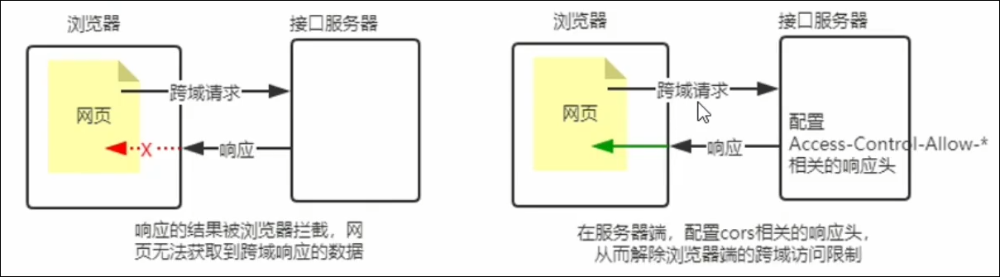
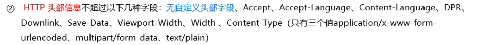

# 写接口

# 写一个 get 接口

‍

```js
const express = require("express");
const server = express();

server.get("/api/get", function (req, res) {
    res.send({
        status: 0,
        msg: "ok",
        data: req.query,
    });
});

server.listen(80, function () {
    console.log("http://127.0.0.1");
});
```

‍

# 写一个 post 接口

‍

```js
const express = require("express");
const server = express();

server.use(express.json());
server.post("/api/post", function (req, res) {
    res.send({
        status: 0,
        msg: "ok",
        data: req.body,
    });
});

server.listen(80, function () {
    console.log("http://127.0.0.1");
});
```

注意:

* 如果要获取 body 数据, 必须配置中间件

‍

# 接口的跨域问题

编写的 GET 和 POST 接口, 存在一个很严重的问题: 不支持跨域请求

## 使用 cors 中间件解决跨域问题

`cors` 是 Express 的一个第三方中间件, 通过安装和配置 `cors` 中间件, 可以方便的解决跨域问题

使用:

1. 运行 `npm install cors ​` 安装中间件
2. 使用 `const cors = require("cors")` 导入中间件
3. 在路由之前调用 `server.use(cors())` 配置中间件

‍

```js
const cors = require("cors");
server.use(cors());
```

‍

## CORS

CORS(Cross-Origin Resource Sharing, 跨域资源共享) 由一系列的 HTTP 响应头组成, 这些 HTTP 响应头决定了浏览器是否组织前端 JS 代码跨域获取资源

浏览器的同源安全策略默认会组织网页跨域获取资源, 但如果接口服务配置了 CORS 相关的 HTTP 响应头, 就可以解除浏览器端的跨域访问限制

​

‍

## CORS 的注意事项

* CORS 主要在浏览器端进行配置, 客户端浏览器无需进行任何额外配置, 即可请求开启了 CORS 的接口
* 注意兼容性问题(IE10+)

‍

## CORS 响应头

### Access-Control-Allow-Origin

响应头部可以携带一个 `Access-Control-Allow-Origin`,语法如下

```js
Access-Control-Allow-Origin: <origin> | *
```

其中， origin 参数的值指定了允许访问该资源的外域 URL

`* ​` 表示允许来自任何域的请求

### Access-Control-Allow-Headers

默认情况下， CORS 仅支持客户端向服务器发送如下的 9 个请求头

​

如果客户端向服务器发送了额外的请求头信息， 则需要在服务器端， 通过 `Access-Control-Allow-Headers` 对额外的请求头进行声明， 否则会请求失败

### Access-Control-Allow-Methods

默认情况下， CORS 仅支持客户端发起 GET，POST， HEAD 请求

如果客户端希望通过 put， Delete 等方法请求服务器的资源， 则需要在服务器端通过 `Access-Control-Allow-Methods` 来指明实际请求所允许使用的 HTTP 方法

‍

## CORS 请求的分类

客户端在请求 CORS 接口时， 根据请求方式和请求头的不同， 可以将 CORS 的请求分为两大类， 分别是：

* 简单请求
* 预检请求

### 简单请求

同时满足以下两大条件的请求， 就属于简单请求

* 请求方式： GET， POST， HEAD。 三者之一
* HTTP 头部信息，不超过以下几种字段， 无自定义头部字段​

### 预检请求

只要符合以下任何一个条件， 都需要进行预检请求

* 请求方式为 GET， POST， HEAD 之外的请求 method 类型
* 请求头中包含了自定义头部字段
* 向服务器发送了 application、json 格式的数据

在浏览器与服务器正式通信之前， 浏览器会先发送 OPTION 请求进行预检， 以获知服务器是否允许该实际请求，所以这一次的 OPTION 请求称为“预检请求”，服务器成功响应预检请求后， 才会发送真正的请求， 并且携带真实数据

‍

### 简单请求和预检请求的区别

简单请求： 客户端和服务器之间只会发生一次请求

预检请求： 客户端与服务器之间会发生两次请求

‍

## JSONP 接口

浏览器端通过 <script> 标签的 scr 属性， 请求服务器上的数据， 同时， 服务器返回一个函数的调用， 这种请求数据的方式叫做 JSONP

特点：

* JSONP 不属于真正的 Ajax 请求， 因为他没有使用 XHLHttpRequest 这个对象
* JSONP 仅支持 GET 请求， 不支持 POST，PUT，DELETE 等请求

### 注意事项

如果项目中已经部署了 CORS 跨域资源共享， 为了防止冲突， 必须在配置 CORS 中间件之前声明 JSONP 的接口， 否则 JSONP 接口会被处理成开启了 CORS 的接口

‍

# JSONP接口

实现JSONP接口的步骤

1. 获取客户端发送过来的回调函数的名字
2. 得到要通过JSONP形式发送给客户端的数据
3. 根据前两部得到的数据， 拼接处一个函数调用的字符串
4. 将上一步拼接的字符串，相应给客户端的<script>标签进行解析执行
