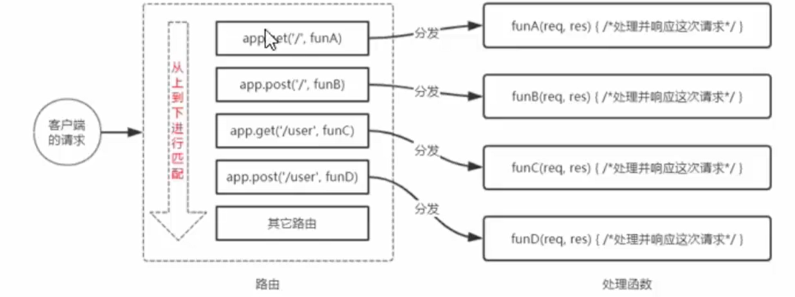

# 路由

# Express 中的路由

在 Express 中, 路由指的是客户端的请求与服务器处理函数之间的==映射关系==

Express 中的路由分 3 部分组成, 分别是请求类型, 请求的 URL 地址, 处理函数, 格式如下

```js
server.MTEHOD(PATH,HANDLER)
```

* METHOD: 请求方法
* PAHTH: 请求路径
* HANDLER: 处理函数

‍

路由的例子

```js
server.get("/", function (req, res) {
    // 处理函数
    console.log("收到了一个get请求");
    res.send("get 请求成功");
});
// 监听post请求
server.post("/", function (req, res) {
    // 处理函数
    console.log("收到了一个post请求");
    res.send("post请求成功");
});

// 获取动态参数
server.get("/user/:id/:name", function (req, res) {
    res.send(req.params);
});
```

# 路由的匹配过程

每当一个请求到达服务器之后, 需要先经过路由的匹配, 只有匹配成功之后, 才会调用对应的处理函数

在匹配时, 会按照路由的顺序进行匹配, 如果请求类型和请求 URL 同时匹配成功,则 Express 会把这次请求, 转交给对应的 function 函数进行处理

​

路由匹配的注意点:

* 按照定义的先后顺序进行匹配
* 请求类型和请求的 URL 同时匹配成功, 才会调用相应的处理函数

# 路由的使用

## 最简单的用法

在Express中使用路由最简单的用法, 就是把路由挂载到server上, 示例代码如下

```js
// 导入express
const express = require("express");
// 创建服务器
const server = express();
//监听get请求
server.get("/", function (req, res) {
    // 处理函数
    console.log("收到了一个get请求");
    res.send("get 请求成功");
});
// 监听post请求
server.post("/", function (req, res) {
    // 处理函数
    console.log("收到了一个post请求");
    res.send("post请求成功");
});

// 开启服务器
server.listen(80, () => {
    console.log("server started at http://127.0.0.1");
});
```

# 模块化路由

为了方便的对路由进行模块化的管理, Express不建议将路由直接挂载到`server`上, 而是建议将路由抽离为单独的模块

将路由抽离为单独模块的步骤如下:

1. 创建路由模块对应的`.js`文件
2. 调用`express.Router()`创建路由对象
3. 向路由对象上挂载具体的路由
4. 使用`module.exports`向外共享路由对象
5. 使用`server.use()`函数注册路由模块

‍

1-4 定义路由模块

```js
// 导入express
const express = require("express");

// 创建router对象
const router = express.Router();

// 开始定义路由
router.get("/", function (req, res) {
    console.log("get请求");
});
router.post("/", function (req, res) {
    console.log("post请求");
});

// 导出路由
module.exports = router;
```

注册路由模块

```js
// 导入express
const express = require("express");

// 创建服务器实例
const server = express();

// 导入路由模块
const router = require("./router");

// 注册路由模块
server.use(router);

// 开启服务器
server.listen(80, function (req, res) {
    console.log("http://127.0.0.1");
});
```

注意: 

* ==app.use()函数的作用, 就是用来注册全局中间件==

## 路由添加前缀

与静态资源添加前缀一样, 只需要给use前面加一个参数即可

‍

```js
server.use("/user", router);
```
