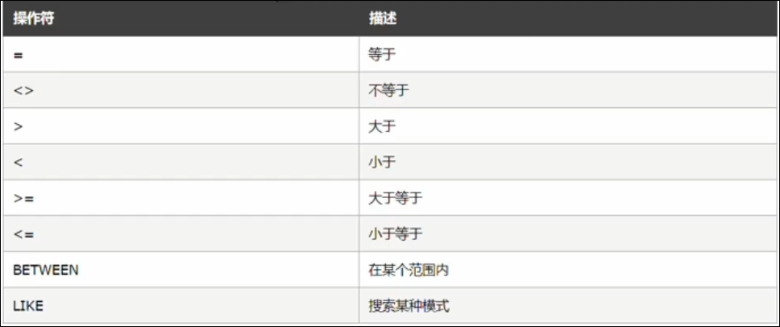

# SQL

什么是 SQL( Structured Query Language ) 是结构化查询语音, 专门用来访问和处理数据库的编程语言, 能够让我们已变成的形式, 操作数据库里面的数据

注意: 

* SQL是一门数据库编程语言
* 使用SQL编写出来的, 叫做SQL语句
* SQL语言只能在关系型数据库中使用, 非关系型数据库不支持SQL

‍

# SQL能做什么

* 从数据库中查询数据
* 向数据库插入新的数据
* 更新数据库中的数据
* 从数据库中删除数据
* 创建新数据库
* 创建新表
* 创建存储过程, 视图

### DataType

* `int ​`整数
* `varchar(len)`字符串
* `tinyint(1) ​`布尔值

### 字段的特殊标识

* `PK (primary key) ​`主键, 唯一标识
* `NN(not Null)` 不允许为空
* `UQ(Unique) ​`值唯一
* `AI (Auto Increment)` 值自动增长

# SELECT语句

`SELECT`语句用于从表中查询数据, 执行的结果被存储在一个结果表中(称为结果集)

```sql
查询所有数据
SELECT * FROM 表名称
查询特定列
SELECT 列名 FROM 表名称
```

注意: 

* SQL语句对大小写不敏感
* 多个列名之间用`,` 分隔

‍

# INSERT INTO 语句

`INSERT INTO`用于向数据表中插入新的数据行

语法: 

```sql
INSERT INTO table_name(列1,列2...) VALUES (val1,val2...)
```

注意: 

* 列与值要对应
* 用`,` 分隔

‍

# UPDATE语句

UPDATE语句用于修改表中的数据

```sql
UPDATE 表名 SET 列名 = 新值 WHERE 列名 = 旧值
UPDATE users SET username='timmmm' WHERE username='tim'
```

注意: 

* SET条件可以写多个, 用`,` 分隔

# DELETE语句

`DELETE`用于删除表中的数据行

```sql
DELETE FROM 表名称 WHERE 列名称 = 值
```

‍

# WHERE子句

`WHERE`子句用来现在看选择的标准, 在`SELECT`, `UPDATE`, `DELETE`语句中, 都可使用`WHERE`子句限定选择的标准

```sql

SELECT 列名 FROM 表名 WHERE 列 运算符 值

UPDATE 表名 SET 列 = 新值 WHERE 列 运算符 值

DELETE FROM 表名 WHERE 列 运算符 值
```

## 可以在WHERE子句中使用的运算符

​

注意: 

* 某些版本的SQL中, `<> ​`可以写成 `!=`

‍

# AND和OR运算符

`AND`和`OR`可在`WHERE`子句中把两个或多个条件结合起来

`AND`表示同时满足

`OR`表示只要满足任意一个即可

```sql
SELECT * FROM users WHERE id>2 AND status=0
```

‍

# ORDER BY 子句

`ORDER BY`语句用于按照指定的列对结果进行排序

默认按照升序进行排序, 如果想要降序, 需要使用 `DESC` 参数

## 多重排序

对`users`表中的数据, 先按照`status`自带进行降序排序, 再按照`username`的字母顺序, 进行升序排序

```sql
SELECT * FROM users ORDER BY status DESC, username ASC
```

‍

# COUNT(*) 函数

查询`user`表中`status`为0的总数据条数

```sql
SELECT COUNT(*) FROM users WHERE status=0
```

# 使用AS为列设置别名

如果希望给查询出来的列设置别名, 可以使用`AS ​`别名

```sql
SELECT COUNT(*) AS total FROM users WHERE status=0
```
