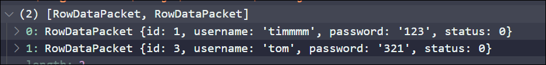

# 操作MySQL数据库

## 在项目中操作MySQL数据库

1. 安装操作MySQL数据库的第三方模块(`mysql`)
2. 通过`mysql`模块连接到MySQL数据库
3. 使用`mysql`模块执行SQL语句

### 安装mysql模块

```sql
npm i mysql
```

‍

### 配置mysql模块

使用mysql模块操作SQL数据库之前, 需要先对mysql模块进行必要的配置

```js
// 导入mysql
const mysql = require("mysql");

// 建立连接
const db = mysql.createPool({
    host: "127.0.0.1",
    user: "root",
    password: "pswd",
    database: "my_db_01",
});
```

‍

### 查询数据

```js
db.query("select * from users", (err, res) => {
    if (err) {
        console.log(err.message);
        return;
    }
    console.log(res);
});
```

结果即为含有查询结果的数组

​

‍

### 插入数据

```js
const user = {
    name: "guairen",
    password: "123",
};
const queryStr = "insert into users (username,password) values(?,?)";
db.query(queryStr, [user.name, user.password], (err, res) => {
    if (err) {
        console.log(err.message);
        return;
    }
    if (res.affectedRows === 1) {
        console.log("写入成功");
    }
});
```

注意:

* 查询字符串`queryStr`的参数使用`?`作为占位符
* 在`query()`方法的第二个参数提供一个数组, 作为占位符的值
* 如果执行的是`insert into`语句, 则`res`是一个对象
* 可以通过`res.affectedRows ​`来获取受影响的行数从而判断是否执行成功

#### 插入数据的便捷方式

如果数据对象的每个属性和数据表的字段一一对应, 那么可以通过以下方法快速插入数据

```js
const user = {
    name: "guairen",
    password: "123",
};
const queryStr = "insert into users SET ?"
db.query(queryStr,user, (err, res) => {
    if (err) {
        console.log(err.message);
        return;
    }
    if (res.affectedRows === 1) {
        console.log("写入成功");
    }
});

```

‍

### 更新信息

```js
const user = {
    id: 1,
    name: "tim",
    password: "12aaa",
};
const queryStr = "update users set username=?,password=? where id=?";
db.query(queryStr, [user.name, user.password, user.id], function (err, res) {
    if (err) {
        return console.log(err.message);
    }
    if (res.affectedRows === 1) {
        console.log("更新成功");
    }
});
```

#### 更新信息的便捷方式

```js
const user = {
    id: 1,
    name: "tim",
    password: "12aaa",
};
const queryStr = "update users set ? where id=?";
db.query(queryStr,user, function (err, res) {
    if (err) {
        return console.log(err.message);
    }
    if (res.affectedRows === 1) {
        console.log("更新成功");
    }
});

```

### 删除数据

‍

```js
const queryStr = "delete from users where id=?";
db.query(queryStr, 15, (err, res) => {
    if (err) {
        console.log(err.message);
        return;
    }
    if (res.affectedRows === 1) {
        console.log("删除成功");
    }
});
```

‍

# 修改数据库认证方式

```js
ALTER USER 'root'@'localhost' IDENTIFIED WITH mysql_native_password BY '123456';
```

‍
