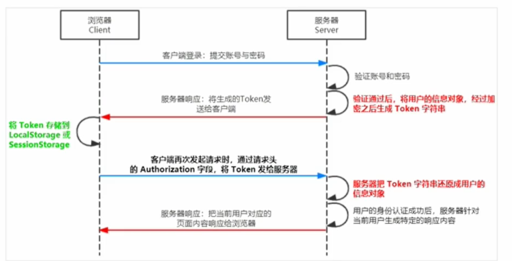
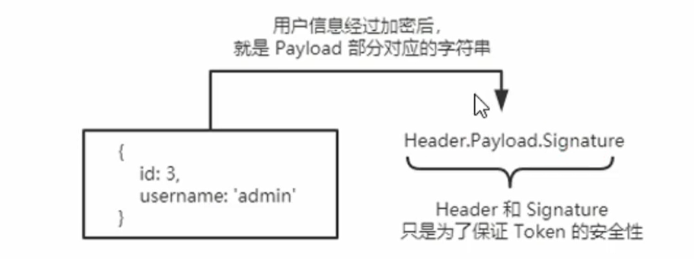

# JWT认证

# 了解 Session 认证的局限性

Session 认证机制需要配合 Cookie 才能实现, 由于 Cookie 默认不支持跨域访问, 所以, 当涉及到前端跨域请求后端裂口的时候, 需要做很多额外的配置, 才能实现跨域 Session 认证

‍

注意:

* 当前端请求后端接口不存在跨域问题的时候, 推荐使用 Session 身份认证机制
* 当前端需要跨域请求后端接口的时候,不推荐使用 Session 身份认证机制, 推荐使用 JWT 认证机制

‍

# 什么是 JWT

JWT(JSON Web Token) 是目前最流行的跨域认证解决方案

‍

# JWT 的工作原理

​

用户的信息通过 Token 字符串的形式, 保存在客户端浏览器中, 服务器速通过还原 Token 字符串的形式来认证用户身份

# JWT 的组成部分

JWT 通常由三部分组成, 分别是 `Header`(头部), `payload`(有效荷载), `signature`(签名)

三者之间使用英文 `.` 分隔

```js
Header.Payload.Signature
```

* `payload` 部分才是真正的用户信息, 他是用户信息经过加密之后生成的字符串
* `Header` 和 `Signature` 是安全性相关的部分, 只是为了保证 token 的安全性

​

‍

# JWT 的使用方式

客户端收到服务器返回的 JWT 之后, 通常会将他存储在 `localStorage` 或 `sessionStroage` 中

此后, 客户端每次与服务器通信, 都要带上这个 JWT 的字符串, 从而进行身份认证, 推荐的做法是把 JWT 放在 HTTP 请求头的 `Authorization` 字段中

```js
Authorization: Berarer <token>
```

‍

# 在Express中使用JWT

## 安装JWT相关的包

```js
npm i jsonwebtoken express-jwt
```

* jsonwebtoken 用于生成JWT字符串
* express-jwt 用于将JWT字符串解析还原成json对象

## 定义secret密钥

为了保证JWT字符串的安全性, 防止JWT字符串在网络传输过程中被别人破解, 我们需要专门定义一个用于加密与解密的`secret`密钥

* 当生成JWT字符串的时候, 需要使用`secret`密钥对用户的信息进行加密, 最终得到加密好的JWT字符串
* 当把JWT字符串解析还原成JSON对象的时候, 许村使用`secret`密钥进行解密

```js
const secretKey = "password"
```

## 生成JWT字符串

调用jsonwebtoken包提供的sign()方法, 将用户的信息加密成JWT字符串, 响应给客户端

```js
jwt.sign({json对象},secretKey,{配置对象})
```

```js
    const token = jwt.sign(req.body, secretKey, {
        expiresIn: "1000s",
    });
```

## 将JWT字符串还原为JSON对象

客户端妹子访问那些有权限的接口的时候, 都需要主动通过请求头中的Authorization字段, 将Token字符串发送到服务器进行验证

此时, 服务器可以通过express-jwt这个中间件, 自动将客户端发送过来的Token解析还原为JSON对象

‍

```js
app.use(expressjwt({ secret: secretKey, algorithms: ["hs256"] }).unless({path:[/^\/api/]}));
```

* unless: 用于指定那些路径不用身份认证
* 配置完jwt中间件后, 就会自动将token数据挂载到`req.auth`对象上
* 不要把密码放到token之中

## 捕获JWT解析失败的错误

当使用express-jwt解析Token字符串时, 如果客户端发送的Token字符串国企或者不合法, 会产生一个解析失败的粗我, 影响项目的正常运行, 我们可以使用Express的错误中间件, 捕获这个错误进行处理

‍

```js
app.use((err, req, res, next) => {
    console.log(err.message);
    res.send({
        status: 1,
        msg: err.message,
    });
    next();
});
```
