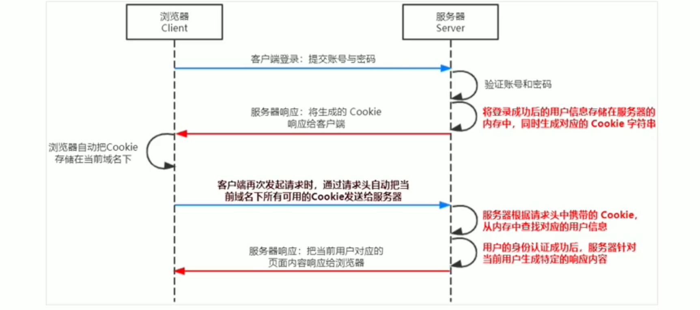

# Session认证机制

# HTTP协议的无状态性

客户端的每次HTTP请求都是独立的, 联讯多个请求之间没有直接的关系, 服务器不会主动保留每次HTTP请求的状态

# 什么是Cookie

Cookie是存储在用户浏览器中的一段不超过4KB的字符串, 它由一个名称(name), 一个值(value)和其他几个用于控制Cookie有效期, 安全性, 使用范围的可选属性组成

不同域名下的Cookie各自独立, ==每当客户端发起请求时, 会自动把当前域名下的所有未过期Cookie一同发送给服务器==

cookie的特性

* 自动发送
* 域名独立
* 过期时限
* 4KB限制

‍

# Cookie在身份认证中的作用

客户端第一次请求数据的时候, 服务器通过响应头的形式, 向客户端发送一个身份认证的Cookie, 客户端会自动将Cookie保存在浏览器中

当客户端浏览器每次请求服务器的时候, 浏览器会自动将身份认证的Cookie, 通过请求头的形式发送给服务器, 服务器即可验明客户端的身份

​

‍

## Cookie不具有安全性

由于Cookie是存储在浏览器中的, 而且浏览器也提供了读写Cookie的API,  因此Cookie容易被伪造, 不具有安全性, 因此不建议浏览器将重要的隐私数据, 通过Cookie的形式发送给服务器

## 提高身份认证的安全性

为了提高Cookie的安全性,  所以使用了Session方案, 将敏感数据存放在服务器端, 使用Cookie查找对应的Session

‍

# Session的工作原理

​

‍

# 在Express中使用Session认证

## 安装express-session中间件

```js
npm install express-session
```

## 配置express-session中间件

```js
//导入中间件
const session = require("express-session");
//配置中间件
server.use(
    session({
        // 配置
        secret: "pswd",
        resave: false,
        saveUninitialized: true,
    })
);
```

## 向Session中存数据

在express-session中间件配置成功后, 即可通过`req.session`来访问和使用session对象, 从而存储用户的关键信息

```js
server.post("/api/post", (req, res) => {
    if (req.body.user !== "admin" || req.body.pswd !== "123") {
        console.log("登陆失败");
        res.send({ status: 0, msg: "登陆失败" });
        return;
    }

    req.session.user = req.body;
    req.session.isLogin = true;

    res.send({ status: 1, msg: "登陆成功" });
    console.log(req.session);
});
```

## 从session中取数据

可以直接从req.session对象上获取之前存储的数据, 示例代码如下

```js
server.get("/api/user", (req, res) => {
    console.log(req.session);
    if (req.session.isLogin === false) {
        console.log("未登录");
        res.send({
            status: 1,
            msg: "未登录",
        });
        return;
    }

    res.send({ status: 0, msg: "登陆成功", data: req.session.user });
    console.log("登陆成功");
});
```

## 清空session

调用`req.session.destroy(),` 即可清空服务器保存的session信息

‍
