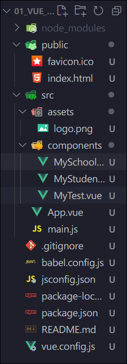

# Vue Cli

[Vue CLI](https://cli.vuejs.org/zh/) 是官方提供的基于 Webpack 的 Vue 工具链,  现在已被 Vite 取代

# 安装 Vue Cli

```html
npm i -g @vue/cli
```

安装完成后即可全局使用 `vue ​`​命令

# 初始化项目环境

```html
vue create 项目名
```

‍

​

# 文件结构

* public: 存放html, ico等公共文件
* src: 项目源代码

  * assets: 存放静态资源
  * components: 存放vue单文件组件
  * App.vue: 用于管理其他所有组件的组件
  * main.js: 项目入口文件, 在此处创建`vm`

‍

# main.js 入口文件语法

```js
import App from "./App.vue";
import Vue from "vue";

new Vue({
    el: ".root",
    render: h => h(App),
});
```

## 注意: 

* 如果使用 Vue runtime 运行时版本的Vue, 那么 `main.js`​ 中不能书写`template`​配置项, 必须使用`render`函数
* ==`render`==​==函数作用: ​==

‍

## 关于不同版本的Vue

* vue.js 与 vue.runtime.xxx.js的区别

  * vue.js是完整版vue, 包含核心功能和模板解析器
  * vue.runtime.xxx.js是运行时版的vue, 只包含核心功能, 没有模板解析器
* 因为vue.runtime.xxx.js没有模板解析器, 所以不能使用`template`配置项, 需要使用`render`函数接收到的`createElement`函数去指定具体内容

‍

‍

# vue.config.js

使用vue inspect > output.js 可以导出Vue脚手架的默认配置

使用vue.config.js可以对脚手架进行个性化定制
