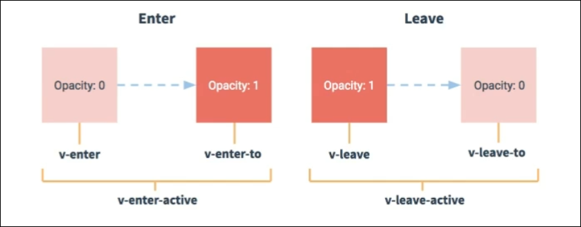

# 过渡与动画

作用: 在插入, 更新或移除DOM元素时, 在合适的时候给元素添加样式类名

​

# 语法

## 元素进入的样式

* ​`v-enter`​: 进入的起点

  * ==注意: vue3中改为了v-enter-from==
* ​`v-enter-active`​: 进入过程中
* ​`v-enter-to:`​ 进入的终点

## 元素离开的样式

* ​`v-leave`​: 离开的起点

  * ==注意: vue3中改为了v-leave-from==
* ​`v-leave-active`​: 离开过程中
* ​`v-leave-to`​: 离开的终点

```css

.todo-enter,
.todo-leave-to {
    transform: translateX(100%);
}
.todo-leave,
.todo-enter-to {
    transform: translateX(0);
}
.todo-enter-active,
.todo-leave-active {
    transition: 0.2s;
}
```

使用 `<transition>`​包裹要过渡的元素, 配置`name`​属性, 如果想要元素一开始就有过渡效果, 那么需要配置 `appear`​属性

```html
        <transition appear name="my">
            <h1 v-show="show">hello vue</h1>
        </transition>
```

注意: 如果有多个元素需要过渡, 那么需要使用`<transition-group>`​, 并且每个元素都要指定`key`​值

‍
