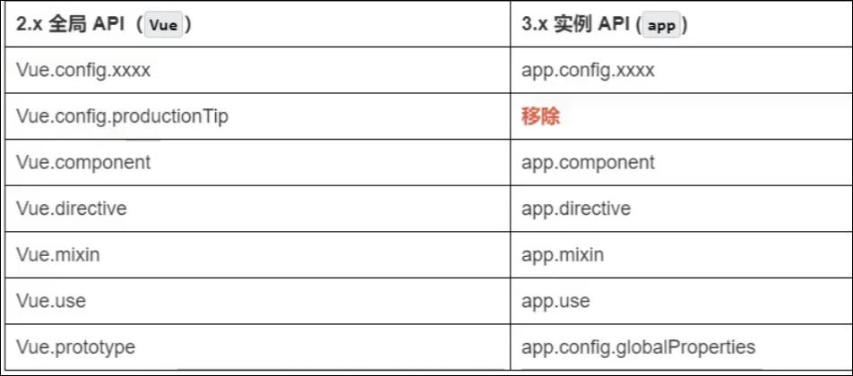

# Vue3

# Vue3带来了什么

* 性能提升

  * 打包大小减小
  * 初次渲染速度提升, 更新渲染速度提升
  * 内存占用减少
* 源码升级

  * 使用`proxy`​代替`defineProperty`​实现响应式
  * 重写虚拟DOM的实现和`Tree-Shaking`​
* 拥抱TS
* 新的特性

  * Composition APi (组合API)

    * ​`setup`​配置
    * ​`ref`​与`reactive`​
    * ​`watch`​与`watchEffect`​
    * ​`provide`​与`inject`​
    * ...
  * 新的内置组件

    * ​`Fragment`​
    * ​`Teleport`​
    * ​`Suspense`​
  * 其他改变

    * 新的生命周期钩子
    * ​`data`​选项应始终是函数
    * 移除`keyCode`​支持作为`v-on`​的修饰符

‍

# 其他改变

* 全局API的改变

  * ​
* data应始终为函数
* 过渡类名的更改 `v-enter-from`​ , `v-leave-from`​
* 移除`v-on`​的`keyCode`​以及`Vue.config.keyCodes`​
* 移除`v-on.native`​
* 移除过滤器(`filter`​)

​

‍
