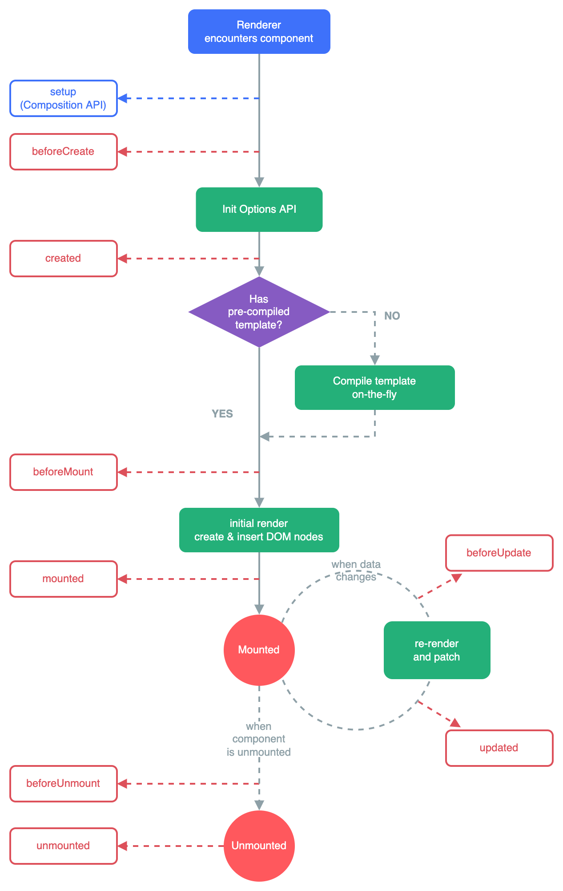

# 生命周期

​

在Vue3 中， 可以继续使用Vue2的选项式API, 只不过有以下改变

* ​`beforeDestroy ​`​==> `beforeUnmounte`​
* ​`destroyed ​`​==> `unmounted`​

也可以在`setup`​中使用全新的组合式API

	选项式API	==>	组合式API

* ​`beforeCreate ​`​==> `setup`​
* ​`created ​`​==> `setup`​
* ​`beforeMount`​==> `onBeforeMount`​
* ​`mounted`​==>`onMounted`​
* ​`beforeUpdate`​==>`onBeforeUpdate`​
* ​`updated`​==>`onUpdated`​
* ​`beforeDestroy`​==>`onBeforeUnmount`​
* ​`destroyed`​==>`onBeforeUnmount`​

注意: 

* 原有的`beforeCreate`​和`created`​被`setup`​取代
* 如果同时写了选项式API和组合式API, 那么组合式API先生效

‍

```js
export default {
    name: "TestDemo",
    beforeCreate() {
        console.log("-----beforeCreate-----");
    },
    created() {
        console.log("-----created-----");
    },
    beforeMount() {
        console.log("-----beforeMount-----");
    },
    mounted() {
        console.log("-----mounted-----");
    },
    beforeUpdate() {
        console.log("-----beforeUpdate-----");
    },
    updated() {
        console.log("-----updated-----");
    },
    beforeUnmount() {
        console.log("-----beforeUnmount-----");
    },
    unmounted() {
        console.log("-----unmounted-----");
    },
    setup() {
        console.log("----setup-----");

        let num1 = ref(0);

        onBeforeMount(() => {
            console.log("----onBeforeMount----");
        });
        onMounted(() => {
            console.log("----onMounted----");
        });
        onBeforeUpdate(() => {
            console.log("----onBeforeUpdate----");
        });
        onUpdated(() => {
            console.log("----onUpdated----");
        });
        onBeforeUnmount(() => {
            console.log("----onBeforeUnmount----");
        });
        onUnmounted(() => {
            console.log("----onUnmounted----");
        });
        return { num1 };
    },
};
```

​
