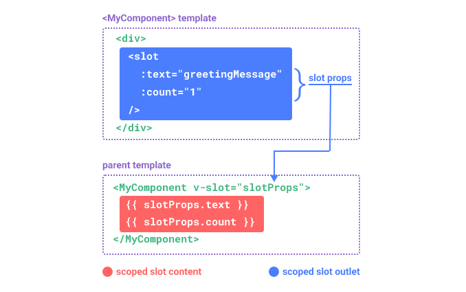

# 作用域插槽

​​

可以像对组件传递 props 那样，向一个插槽的出口上传递 attributes：

插槽子组件

```ts
<!-- <MyComponent> 的模板 -->
<div>
  <slot :text="greetingMessage" :count="1"></slot>
</div>
```

父组件

```ts
<MyComponent v-slot="slotProps">
  {{ slotProps.text }} {{ slotProps.count }}
</MyComponent>
```

‍
