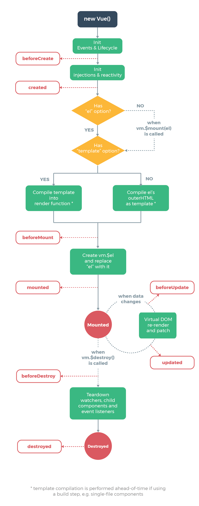

# 生命周期

生命周期又叫生命周期回调函数, 生命周期函数, 生命周期钩子

Vue 在某些特定时刻调用的一些特殊名称的函数

生命周期函数的名字不可更改, 但函数的具体内容是根据需求编写的

生命周期函数的 `this ​`指向 vm 或组件实例对象

​

‍

# 生命周期钩子

* beforeCreate

  * 此时==无法==访问到 data 中的数据， methods 中的方法
  * 此时还没有初始化数据监视， 数据代理
* created

  * 此时==可以==访问到 data 中的数据， methods 中的方法
* beforeMount

  * 页面呈现的是未经编译的 DOM 结构
  * 所有对 DOM 的操作，==最终==都不生效（Vue 介入之后会被真实 DOM 覆盖）
* mounted

  * 页面呈现的是经过 Vue 编译的 DOM
  * 对 DOM 的操作均有效， （但尽量避免）此时一般开启定时器， 发送网络请求， 订阅消息， 绑定自定义事件等==初始化操作==
* beforeUpdate

  * 此时数据是新的， 但页面尚未与数据保持同步
* updated

  * 根据新数据， 生成新的虚拟 DOM， 随后与旧的 DOM 进行比较， 最终完成页面更新， 既完成了 Model => View 的更新
* beforeDestroy

  * 此时, vm中所有的data, methods, 指令都处于可用拽太, 马上要执行销毁过程, 一般在此阶段: 关闭定时器, 取消订阅消息, 解绑自定义事件等==收尾操作==
* destroyed

‍

# 注意: 

* 销毁后Vue开发者工具看不到任何消息
* 销毁后自定义事件会失效, 但原生DOM事件仍然有效
* 一般不会在beforeDestroy操作数据, 因为即使操作数据, 也不会再触发更新流程了
